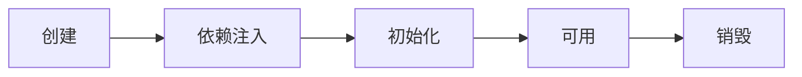

# Auto-Configuration

## Register Bean

1. `自己写的 Bean`: @Component, @Controller, @Service, @Repository

2. `快速导入 第三方组件`: @Import(调用无参构造)

3. `自定义 导入第三方组件`: @Configuration 配合 @Bean

```java
/**
proxyBeanMethods: 组件依赖使用 true 模式
- true: 使用代理, @Bean 方法会被增强, 调用时会检查返回对象是否在容器中，在就返回容器中的对象; 适用于类组件之间有依赖关系, 容器启动慢
- false: 不使用代理, 适用于类组件之间无依赖关系, 容器启动快
**/
@Configuration(proxyBeanMethods = true)
public class MyConfig {
    @Bean // 默认方法名为 bean name
    public User user(){
        User user = new User("zhangsan", 18);
        return user;
    }
}
```

4. `条件注入`: @ConditionalOnxxxx
5. `导入 XML 配置文件`: @ImportResource

## Property Binding

1. @ConfigurationProperties

```java
@Component
@ConfigurationProperties(prefix = "mycar")
public class Car {
}
```

2. @EnableConfigurationProperties: 

```java
/**
必须作用在配置类上
使用场景为: 对外部 Jar 中的对象进行属性绑定
作用为: 开启对应对象的配置绑定, 同时将这个对象注入到容器中
**/
@EnableConfigurationProperties(Car.class)
public class MyConfig {
}
```

## Auto-Configuration

@SpringBootApplication 由三部分组成:

- @SpringBootConfiguration: 就是@Configuration, 代表这是一个配置类
- @ComponentScan: 用于扫描包内的 bean 并注册, 也就是@Controller, @Service, @Component, @Configuration, @Bean 等
- @EnableAutoConfiguration: 用于将包外一系列 jar 包的 bean 注册

其中@EnableAutoConfiguration本质上由两个 @Import 组成:

 ```java
// 导入AutoConfigurationPackages对象作为 bean, 这个类存储了auto-configuration packages
@Import(AutoConfigurationPackages.Registrar.class)
// 主要研究该类的 getAutoConfigurationEntry 方法
@Import(AutoConfigurationImportSelector.class)
 ```

自动装配原理: 通过研究 getAutoConfigurationEntry 方法可以

- 读取 `META-INF/spring.factories 2.7为其他文件`中的内容: 各种auto-configuration类的全限定名称
- 将 Auto-Configuration 类加载进内存以后, 根据条件装配注解进行过滤得到最终需要进行注入 IOC 的对象

自定义配置: 

- SpringBoot默认会在底层配好所有的组件但是如果用户自己配置了以用户的优先, 原理如下

```java
@Bean
@ConditionalOnMissingBean
public CharacterEncodingFilter characterEncodingFilter() {
}
```

- Auto-Configuration 类默认都会绑定配置文件指定的值, 用户可以修改配置文件中的值来进行自定义

```java
@AutoConfiguration
// ...省略一大堆Conditional 注解
@EnableConfigurationProperties(MultipartProperties.class)
public class MultipartAutoConfiguration {
  private final MultipartProperties multipartProperties;
}

@ConfigurationProperties(prefix = "spring.servlet.multipart", ignoreUnknownFields = false)
public class MultipartProperties {
  
}
```

> 怎么证明 server.port 默认端口是 8080?

# IOC & Bean

## Container Interface

BeanFactory:

- 类型: 接口
- 主要方法: getBean, isSingleton等方法
- 实现类: DefaultListableBeanFactory, ConfigurableBeanFactory
- 意义: `Spring的核心容器`; 控制反转,基本的依赖注入, 直至 Bean 的生命周期的各种功能，都由它的实现类提供

ApplicationContext:

- 类型: 接口, 是 BeanFactory 的子接口, 同时ApplicationContext的子类也【组合】了 BeanFactory
- MessageSource: 处理国际化资源能力
- ResourcePatternResolver: 以通配符方式获取 Resource 资源能力
- ApplicationEventPublisher: 事件发布与监听
- EnvironmentCapable: 整合 Environment 环境（能通过它获取各种来源的配置信息）

```java
// 父接口
public interface ApplicationContext extends EnvironmentCapable, ListableBeanFactory, HierarchicalBeanFactory, MessageSource, ApplicationEventPublisher, ResourcePatternResolver
// ApplicationContext的子类 继承&组合 BeanFactory
public class GenericApplicationContext extends AbstractApplicationContext implements BeanDefinitionRegistry {
    private final DefaultListableBeanFactory beanFactory;
}
```

## Container implementation

主要实现类: 其中以ApplicationContext为后缀的, 继承自`ApplicationContext`, 组合了`DefaultListableBeanFactory` 

- DefaultListableBeanFactory: 是 BeanFactory 最重要的实现，实现了**IOC**和**DI**功能 
- ClassPathXmlApplicationContext: 从类路径查找 XML 配置文件，创建容器(旧)
- AnnotationConfigWebApplicationContext: 基于 java 配置类的容器（旧）
- AnnotationConfigServletWebServerApplicationContext: 基于配置类, Spring boot 中 servlet web 环境容器(新)
- AnnotationConfigReactiveWebServerApplicationContext: Spring boot 中 reactive web 环境容器（新）

BeanFactory 和 Application 使用上的区别:

- `注册 BeanDefinition`: BeanFactory 需手动注册, 而 ApplicationContext 实现类可以根据 XML, 注解的形式自动生成BeanDefinition, 自动注册BeanDefinition

```java
// BeanFactory 的方式: 
// BeanDefinition 描述了这个 bean 的创建蓝图：scope 是什么、用构造还是工厂创建、初始化销毁方法是什么，等等
AbstractBeanDefinition beanDefinition = BeanDefinitionBuilder.genericBeanDefinition(Config.class).setScope("singleton").getBeanDefinition();

beanFactory.registerBeanDefinition("config", beanDefinition);
```

- `添加后处理器(BeanFactory 和 Bean的)`: BeanFactory需要手动添加, 手动建立连接; ApplicationContext 实现类可以自动实现

```java
// 给BeanFactory 添加一些 和后处理相关的 BeanDefinition
AnnotationConfigUtils.registerAnnotationConfigProcessors(beanFactory);

 // 建立BeanFactory 和 BeanFactoryPostProcessor 后处理器的联系, 针对 Bean 定义, 例如@Bean、@ComponentScan
beanFactory.getBeansOfType(BeanFactoryPostProcessor.class).values().forEa ch(beanFactoryPostProcessor -> {
            beanFactoryPostProcessor.postProcessBeanFactory(beanFactory); 
        });
// 建立BeanFactory 和 Bean 后处理器的联系, 针对 bean 的生命周期的各个阶段提供扩展, 例如 @Autowired @Resource ...
beanFactory.getBeansOfType(BeanPostProcessor.class).values().forEach(beanPostProcessor -> {
            beanFactory.addBeanPostProcessor(beanPostProcessor);
        });
```

- BeanFactory 需要额外设置才能解析 ${} 与 #{}

## Bean Life Cycle




1. 基本生命周期:

- 创建：根据 bean 的构造方法或者工厂方法来创建 bean 实例对象

- 依赖注入：根据 @Autowired，@Value 或其它手段，为 bean 的成员变量填充值、建立关系

- 初始化：回调各种 Aware 接口，调用对象的各种 init 方法

- 销毁：在容器关闭时，会销毁所有单例对象(即调用它们的 destroy 方法); prototype 对象需要容器这边主动调用进行销毁

2. BeanPostProcessor: 常见的有InstantiationAwareBeanPostProcessor, DestructionAwareBeanPostProcessor

- InstantiationAwareBeanPostProcessor包含 创建前后 依赖注入前(如@Autowired, @Value), 初始化前(@PostConstruct、@ConfigurationProperties), 初始化后(代理增强)的增强
- DestructionAwareBeanPostProcessor包含销毁前的增加(如@preDestroy)

3. 模版方法: Bean 生命周期的大流程已经固定好了, 通过接口回调（bean 后处理器）在一些关键点前后提供扩展 

---

Bean factory implementations should support the standard bean lifecycle interfaces as far as possible. The full set of initialization methods and their standard order is:

- BeanNameAware's setBeanName
- BeanClassLoaderAware's setBeanClassLoader
- BeanFactoryAware's setBeanFactory
- EnvironmentAware's setEnvironment
- EmbeddedValueResolverAware's setEmbeddedValueResolver
- ResourceLoaderAware's setResourceLoader (only applicable when running in an application context)
- ApplicationEventPublisherAware's setApplicationEventPublisher (only applicable when running in an application context)
- MessageSourceAware's setMessageSource (only applicable when running in an application context)
- ApplicationContextAware's setApplicationContext (only applicable when running in an application context)
- ServletContextAware's setServletContext (only applicable when running in a web application context)
- postProcessBeforeInitialization methods of BeanPostProcessors
- InitializingBean's afterPropertiesSet
- a custom init-method definition
- postProcessAfterInitialization methods of BeanPostProcessors

On shutdown of a bean factory, the following lifecycle methods apply:

- postProcessBeforeDestruction methods of DestructionAwareBeanPostProcessors
- DisposableBean's destroy
- a custom destroy-method definition

## Bean PostProcessor

常见的 BeanPostProcessor

* AutowiredAnnotationBeanPostProcessor 解析 @Autowired 与 @Value
* CommonAnnotationBeanPostProcessor 解析 @Resource、@PostConstruct、@PreDestroy
* ConfigurationPropertiesBindingPostProcessor 解析 @ConfigurationProperties

AutowiredAnnotationBeanPostProcessor的`postProcessProperties`分析:

- findAutowiringMetadata: 用来获取 bean 上 加了@Value, @Autowired注解的成员变量和方法参数的信息, 然后封装为InjectionMetadata
- InjectionMetadata: 调用 inject()可以完成依赖注入

## BeanFactory PostProcessor

> 主要就是补充一些 Bean 的定义
>
> 我的理解就是 BeanFactory 后置处理器的作用就是去解析一系列资源,然后生成对应的 BeanDefinition

ConfigurationClassPostProcessor 可以解析:

- @ComponentScan
- @Bean
- @Import
- @ImportResource

MapperScannerConfigurer 可以解析

* @Mapper注释的接口


> Spring 操作元数据的工具类 CachingMetadataReaderFactory

## Aware Interface

## Initialize & Destroy

## Scope


# AOP

# Thread-Safe

## Scope

Spring 对每个 Bean 提供一个 scope 属性表示该 bean 的作用域(生命周期)

- singleton: 默认状态, 定义为单例对象, 第一次注入时创建, 然后复用到应用结束(适用于 stateless bean)
- prototype: 每次注入时都创建一个新的对象(适用于 stateful bean)
- request: 每个 HTTP 请求中创建一个单例对象, 也就是在单个请求中进行复用
- session: 在一个 session 周期内创建一个单例对象
- application: 在ServletContext的生命周期中复用一个单例对象
- websocket: 在websocket的生命周期中复用一个单例对象

Singleton 和 prototype 选择: 无状态对象适用于 singleton, 状态对象适用于 prototype

- State: is most commonly represented by field variable that is not autowired
- 无状态对象: 只有方法 和 自动注入的字段; 不会因为多线程而导致线程不安全, 适用于单例模式

如何保证线程安全:

- 背景: Spring 本身没有对 bean 的多线程安全问题作出任何保证
- 措施: 不要在bean中声明任何有状态的实例变量或类变量, 如果必须如此, 那么就使用ThreadLocal把变量变为线程私有的
- 措施: 如果bean的实例变量或类变量需要在多个线程之间共享, 那么就只能使用synchronized、lock、CAS等这些实现线程同步的方法

