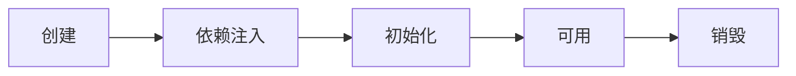

# 1. Container Interface


BeanFactory:

- 类型: 接口
- 主要方法: getBean, getBeanProvider, isSingleton等方法
- 实现类: DefaultListableBeanFactory
- 意义: `Spring的核心容器`; 控制反转、基本的依赖注入、直至 Bean 的生命周期的各种功能，都由它的实现类提供

ApplicationContext:

- 类型: 接口, 是 BeanFactory 的子接口, 同时ApplicationContext的子类也【组合】了 BeanFactory
- 继承接口: MessageSource, ResourcePatternResolver, ApplicationEventPublisher, EnvironmentCapable
- MessageSource: 处理国际化资源能力
- ResourcePatternResolver: 以通配符方式获取 Resource 资源能力
- ApplicationEventPublisher: 事件发布与监听
- EnvironmentCapable: 整合 Environment 环境（能通过它获取各种来源的配置信息）

```java
public interface ApplicationContext extends EnvironmentCapable, ListableBeanFactory, HierarchicalBeanFactory, MessageSource, ApplicationEventPublisher, ResourcePatternResolver
```

# 2. Container implementation

主要实现类: 其中以ApplicationContext为后缀的, 继承自`ApplicationContext`, 组合了`DefaultListableBeanFactory`

- DefaultListableBeanFactory: 是 BeanFactory 最重要的实现，实现了**控制反转**和**依赖注入**功能
- ClassPathXmlApplicationContext: 从类路径查找 XML 配置文件，创建容器(旧)
- XmlWebApplicationContext: 基于 XML 配置文件的容器（旧）
- AnnotationConfigWebApplicationContext: 基于 java 配置类的容器（旧）
- AnnotationConfigServletWebServerApplicationContext: 基于配置类, Spring boot 中 servlet web 环境容器（新）
- AnnotationConfigReactiveWebServerApplicationContext: Spring boot 中 reactive web 环境容器（新）

BeanFactory 和 Application 的区别:

- `注册 BeanDefinition`: BeanFactory 需手动注册, 而 ApplicationContext 实现类可以根据 XML, 注解的形式自动生成BeanDefinition, 自动注册BeanDefinition

```java
// BeanFactory 的方式: 
// BeanDefinition 描述了这个 bean 的创建蓝图：scope 是什么、用构造还是工厂创建、初始化销毁方法是什么，等等
AbstractBeanDefinition beanDefinition =               BeanDefinitionBuilder.genericBeanDefinition(Config.class).setScope("singleton").getBeanDefinition();

beanFactory.registerBeanDefinition("config", beanDefinition);
```

- `添加后处理器(BeanFactory 和 Bean的)`: BeanFactory需要手动添加, 手动建立连接; ApplicationContext 实现类可以自动实现

```java
// 给BeanFactory 添加一些 和后处理相关的 BeanDefinition
AnnotationConfigUtils.registerAnnotationConfigProcessors(beanFactory);

 // 建立BeanFactory 和 BeanFactoryPostProcessor 后处理器的联系, 针对 Bean 定义, 例如@Bean、@ComponentScan
beanFactory.getBeansOfType(BeanFactoryPostProcessor.class).values().forEach(beanFactoryPostProcessor -> {
            beanFactoryPostProcessor.postProcessBeanFactory(beanFactory);
        });
// 建立BeanFactory 和 Bean 后处理器的联系, 针对 bean 的生命周期的各个阶段提供扩展, 例如 @Autowired @Resource ...
beanFactory.getBeansOfType(BeanPostProcessor.class).values().forEach(beanPostProcessor -> {
            beanFactory.addBeanPostProcessor(beanPostProcessor);
        });
```

- BeanFactory 需要额外设置才能解析 ${} 与 #{}

# 3. Bean Life Cycle




1. 基本生命周期:

- 创建：根据 bean 的构造方法或者工厂方法来创建 bean 实例对象

- 依赖注入：根据 @Autowired，@Value 或其它手段，为 bean 的成员变量填充值、建立关系

- 初始化：回调各种 Aware 接口，调用对象的各种 init 方法

- 销毁：在容器关闭时，会销毁所有单例对象(即调用它们的 destroy 方法); prototype 对象需要容器这边主动调用进行销毁

2. BeanPostProcessor: 常见的有InstantiationAwareBeanPostProcessor, DestructionAwareBeanPostProcessor

- InstantiationAwareBeanPostProcessor包含`创建前后的增强`, `依赖注入前的增强`, `初始化前后的增强`
- DestructionAwareBeanPostProcessor包含`postProcessBeforeDestruction`

3. 模版方法: Bean 生命周期的大流程已经固定好了, 通过接口回调（bean 后处理器）在一些关键点前后提供扩展

# 4. Bean PostProcessor


# 5. BeanFactory PostProcessor

# 6. Aware Interface

# 7. Initialize & Destroy

# 8. Scope

