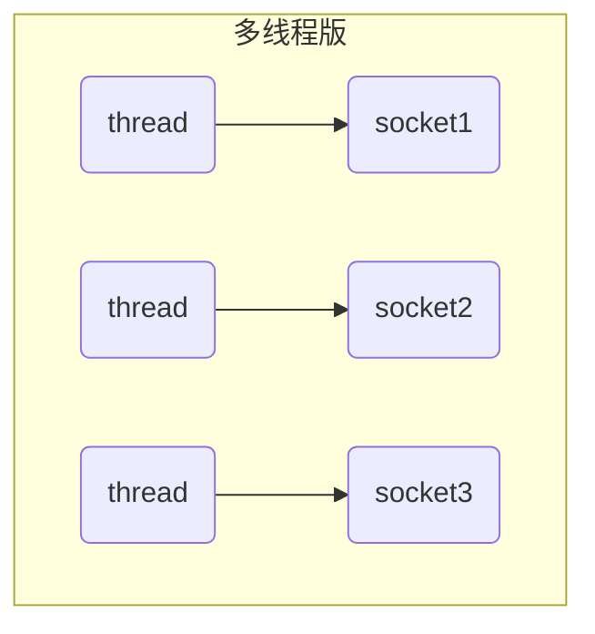
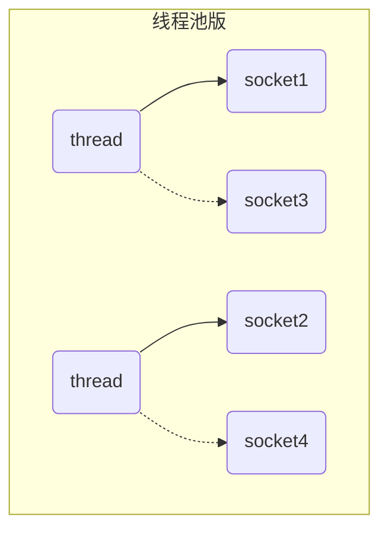
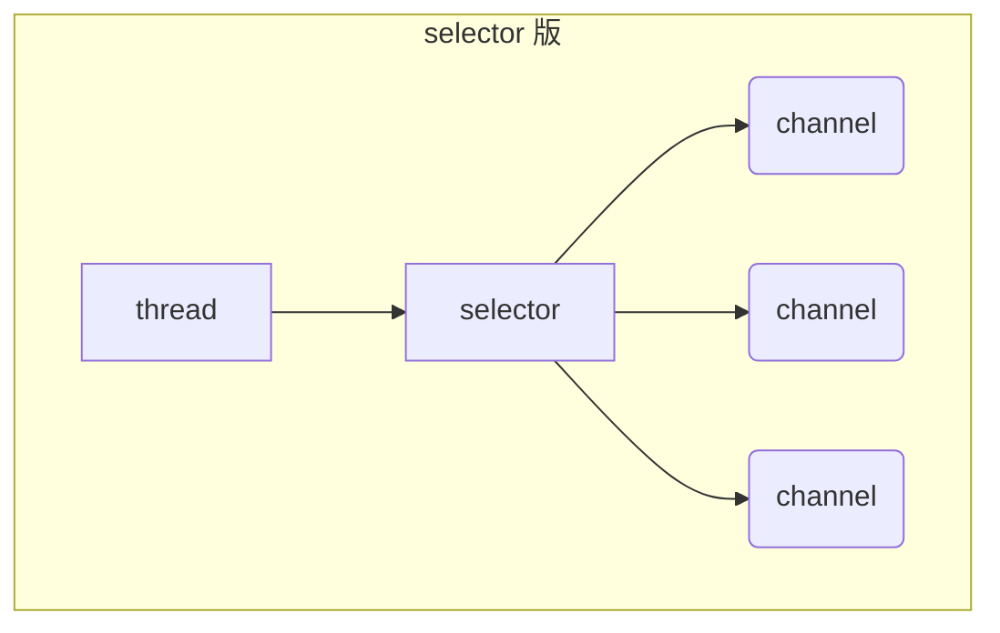

# ---------------BIO------------------

# 1. 通信技术整体解决的问题

* 局域网内的通信要求。
* 多系统间的底层消息传递机制。
* 高并发下，大数据量的通信场景需要。
* 游戏行业。无论是手游服务端，还是大型的网络游戏，Java语言都得到越来越广泛的应用。

# 2. Java的I/O演进之路

## 2.1 I/O 模型基本说明

I/O 模型：就是用什么样的通道或者说是通信模式和架构进行数据的传输和接收，很大程度上决定了程序通信的性能，Java 共支持 3 种网络编程的/IO 模型：**BIO、NIO、AIO**
实际通信需求下，要根据不同的业务场景和性能需求决定选择不同的I/O模型

## 2.2 I/O模型

###  2.2.1 Java BIO

Block IO

同步并阻塞(传统阻塞型)，服务器实现模式为`一个连接一个线程`，即客户端有连接请求时服务器端就需要启动一个线程进行处理，如果这个连接不做任何事情会造成不必要的线程开销 【简单示意图】


### 2.2.2 NIO

Java NIO ： 同步非阻塞，服务器实现模式为一个线程处理多个请求(连接)，即客户端发送的连接请求都会注册到多路复用器上，多路复用器轮询到连接有 I/O 请求就进行处理 【简单示意图】


### 2.2.3 AIO

Java AIO(NIO.2) ： `异步非阻`塞，服务器实现模式为`一个有效请求一个线程`，客户端的I/O请求都是由OS先完成了再通知服务器应用去启动线程进行处理，一般适用于连接数较多且连接时间较长的应用

## 2.3 BIO、NIO、AIO 适用场景分析

1、**BIO** 方式适用于连接数目比较小且固定的架构，这种方式对服务器资源要求比较高，并发局限于应用中，JDK1.4以前的唯一选择，但程序简单易理解。

2、**NIO** 方式适用于连接数目多且连接比较短（轻操作）的架构，比如聊天服务器，弹幕系统，服务器间通讯等。编程比较复杂，JDK1.4 开始支持。

3、AIO 方式使用于连接数目多且连接比较长（重操作）的架构，比如相册服务器，充分调用 OS 参与并发操作，编程比较复杂，JDK7 开始支持。

# 3. BIO

## 3.1 Java BIO 基本介绍

* Java BIO 就是传统的 java io  编程，其相关的类和接口在 java.io
* BIO(blocking I/O) ： 同步阻塞，服务器实现模式为一个连接一个线程，即客户端有连接请求时服务器端就需要启动一个线程进行处理，如果这个连接不做任何事情会造成不必要的线程开销，可以通过线程池机制改善(实现多个客户连接服务器).

## 3.2 BIO的工作机制


对 BIO  编程流程的梳理

1) 服务器端启动一个 **ServerSocket**，注册端口，调用accpet方法监听客户端的Socket连接。
2) 客户端启动 **Socket** 对服务器进行通信，默认情况下服务器端需要对每个客户 建立一个线程与之通讯

## 3.3 同步阻塞演示

  网络编程的基本模型是Client/Server模型，也就是两个进程之间进行相互通信，其中服务端提供位置信（绑定IP地址和端口），客户端通过连接操作向服务端监听的端口地址发起连接请求，基于TCP协议下进行三次握手连接，连接成功后，双方通过网络套接字（Socket）进行通信。

  传统的同步阻塞模型开发中，服务端ServerSocket负责绑定IP地址，启动监听端口；客户端Socket负责发起连接操作。连接成功后，双方通过输入和输出流进行同步阻塞式通信。 
​  基于BIO模式下的通信，客户端 - 服务端是完全同步，完全耦合的。	  

### 3.3.1 服务器端代码

```java
package com.itheima._02bio01;

import java.io.BufferedReader;
import java.io.InputStream;
import java.io.InputStreamReader;
import java.net.ServerSocket;
import java.net.Socket;

/**
 * 服务端
 */
public class ServerDemo {
    public static void main(String[] args) throws Exception {
        System.out.println("==服务器的启动==");
        // （1）注册端口
        ServerSocket serverSocket = new ServerSocket(8888);
        //（2）开始在这里暂停等待接收客户端的连接,得到一个端到端的Socket管道
        Socket socket = serverSocket.accept();
        //（3）从Socket管道中得到一个字节输入流。
        InputStream is = socket.getInputStream();
        //（4）把字节输入流包装成自己需要的流进行数据的读取。
        BufferedReader br = new BufferedReader(new InputStreamReader(is));
        //（5）读取数据
        String line ;
        while((line = br.readLine())!=null){
            System.out.println("服务端收到："+line);
        }
    }
}
```

### 3.3.2 客户端代码

```java
package com.itheima._02bio01;

import java.io.OutputStream;
import java.io.PrintStream;
import java.net.Socket;
/**
    目标: Socket网络编程。

    Java提供了一个包：java.net下的类都是用于网络通信。
    Java提供了基于套接字（端口）Socket的网络通信模式，我们基于这种模式就可以直接实现TCP通信。
    只要用Socket通信，那么就是基于TCP可靠传输通信。

    功能1：客户端发送一个消息，服务端接口一个消息，通信结束！！

    创建客户端对象：
        （1）创建一个Socket的通信管道，请求与服务端的端口连接。
        （2）从Socket管道中得到一个字节输出流。
        （3）把字节流改装成自己需要的流进行数据的发送
    创建服务端对象：
        （1）注册端口
        （2）开始等待接收客户端的连接,得到一个端到端的Socket管道
        （3）从Socket管道中得到一个字节输入流。
        （4）把字节输入流包装成自己需要的流进行数据的读取。

    Socket的使用：
        构造器：public Socket(String host, int port)
        方法：  public OutputStream getOutputStream()：获取字节输出流
               public InputStream getInputStream() :获取字节输入流

    ServerSocket的使用：
        构造器：public ServerSocket(int port)

    小结：
        通信是很严格的，对方怎么发你就怎么收，对方发多少你就只能收多少！！

 */
public class ClientDemo {
    public static void main(String[] args) throws Exception {
        System.out.println("==客户端的启动==");
        // （1）创建一个Socket的通信管道，请求与服务端的端口连接。
        Socket socket = new Socket("127.0.0.1",8888);
        // （2）从Socket通信管道中得到一个字节输出流。
        OutputStream os = socket.getOutputStream();
        // （3）把字节流改装成自己需要的流进行数据的发送
        PrintStream ps = new PrintStream(os);
        // （4）开始发送消息
        ps.println("我是客户端，我想约你吃小龙虾！！！");
        ps.flush();
    }
}
```

* 在以上通信中，服务端会一致等待客户端的消息，如果客户端没有进行消息的发送，服务端将一直进入阻塞状态。
* 同时服务端是按照行获取消息的，这意味着客户端也必须按照行进行消息的发送，否则服务端将进入等待消息的阻塞状态！
* 会报错是因为，当客户端执行完成以后，会回收客户端的socket；之后服务器的socket发现以后就会抛出异常

## 3.4 多发和多收消息

客户端代码

```java
package com.itheima._03bio02;

import java.io.OutputStream;
import java.io.PrintStream;
import java.net.Socket;
import java.util.Scanner;

/**
    目标: Socket网络编程。

    功能1：客户端可以反复发消息，服务端可以反复收消息

    小结：
        通信是很严格的，对方怎么发你就怎么收，对方发多少你就只能收多少！！

 */
public class ClientDemo {
    public static void main(String[] args) throws Exception {
        System.out.println("==客户端的启动==");
        // （1）创建一个Socket的通信管道，请求与服务端的端口连接。
        Socket socket = new Socket("127.0.0.1",8888);
        // （2）从Socket通信管道中得到一个字节输出流。
        OutputStream os = socket.getOutputStream();
        // （3）把字节流改装成自己需要的流进行数据的发送
        PrintStream ps = new PrintStream(os);
        // （4）开始发送消息
        Scanner sc = new Scanner(System.in);
        while(true){
            System.out.print("请说:");
            String msg = sc.nextLine();
            ps.println(msg);
            ps.flush();
        }
    }
}
```

服务器端代码

```java
package com.itheima._03bio02;

import java.io.BufferedReader;
import java.io.InputStream;
import java.io.InputStreamReader;
import java.net.ServerSocket;
import java.net.Socket;

/**
 * 服务端
 */
public class ServerDemo {
    public static void main(String[] args) throws Exception {
        System.out.println("==服务器的启动==");
        //（1）注册端口
        ServerSocket serverSocket = new ServerSocket(8888);
        //（2）开始在这里暂停等待接收客户端的连接,得到一个端到端的Socket管道
        Socket socket = serverSocket.accept();
        //（3）从Socket管道中得到一个字节输入流。
        InputStream is = socket.getInputStream();
        //（4）把字节输入流包装成  自己需要的流进行数据的读取。
        BufferedReader br = new BufferedReader(new InputStreamReader(is));
        //（5）读取数据
        String line ;
        while((line = br.readLine())!=null){
            System.out.println("服务端收到："+line);
        }
    }
}
```

* 本案例中确实可以实现客户端多发多收
* 但是服务端只能处理一个客户端的请求，因为服务端是单线程的。一次只能与一个客户端进行消息通信。

## 3.5 接收多个客户端

  在上述的案例中，一个服务端只能接收一个客户端的通信请求，**那么如果服务端需要处理很多个客户端的消息通信请求应该如何处理呢**，此时我们就需要在服务端引入线程了，也就是说客户端每发起一个请求，服务端就创建一个新的线程来处理这个客户端的请求，这样就实现了一个客户端一个线程的模型，图解模式如下：


客户端代码

```java
/**
    目标: Socket网络编程。

    功能1：客户端可以反复发，一个服务端可以接收无数个客户端的消息！！

    小结：
         服务器如果想要接收多个客户端，那么必须引入线程，一个客户端一个线程处理！！

 */
public class ClientDemo {
    public static void main(String[] args) throws Exception {
        System.out.println("==客户端的启动==");
        // （1）创建一个Socket的通信管道，请求与服务端的端口连接。
        Socket socket = new Socket("127.0.0.1",7777);
        // （2）从Socket通信管道中得到一个字节输出流。
        OutputStream os = socket.getOutputStream();
        // （3）把字节流改装成自己需要的流进行数据的发送
        PrintStream ps = new PrintStream(os);
        // （4）开始发送消息
        Scanner sc = new Scanner(System.in);
        while(true){
            System.out.print("请说:");
            String msg = sc.nextLine();
            ps.println(msg);
            ps.flush();
        }
    }
}
```

服务器代码

```java
/**
    服务端
 */
public class ServerDemo {
    public static void main(String[] args) throws Exception {
        System.out.println("==服务器的启动==");
        // （1）注册端口
        ServerSocket serverSocket = new ServerSocket(7777);
        while(true){
            //（2）开始在这里暂停等待接收客户端的连接,得到一个端到端的Socket管道
            Socket socket = serverSocket.accept();
            new ServerReadThread(socket).start();
            System.out.println(socket.getRemoteSocketAddress()+"上线了！");
        }
    }
}
```

线程代码

```java
class ServerReadThread extends Thread{
    private Socket socket;

    public ServerReadThread(Socket socket){
        this.socket = socket;
    }

    @Override
    public void run() {
        try{
            //（3）从Socket管道中得到一个字节输入流。
            InputStream is = socket.getInputStream();
            //（4）把字节输入流包装成自己需要的流进行数据的读取。
            BufferedReader br = new BufferedReader(new InputStreamReader(is));
            //（5）读取数据
            String line ;
            while((line = br.readLine())!=null){
                System.out.println("服务端收到："+socket.getRemoteSocketAddress()+":"+line);
            }
        }catch (Exception e){
            System.out.println(socket.getRemoteSocketAddress()+"下线了！");
        }
    }
}
```

## 3.6 伪异步IO

### 3.6.1 概述

  在上述案例中：客户端的并发访问增加时。服务端将呈现1:1的线程开销，访问量越大，系统将发生线程栈溢出，线程创建失败，最终导致进程宕机或者僵死，从而不能对外提供服务。

  接下来我们采用一个伪异步I/O的通信框架，采用线程池和任务队列实现，当客户端接入时，将客户端的Socket封装成一个Task(该任务实现java.lang.Runnable线程任务接口)交给后端的线程池中进行处理。JDK的线程池维护一个消息队列和N个活跃的线程，对消息队列中Socket任务进行处理，由于线程池可以设置消息队列的大小和最大线程数，因此，它的资源占用是可控的，无论多少个客户端并发访问，都不会导致资源的耗尽和宕机。


### 3.6.2 具体实现

线程池

```java
// 线程池处理类
public class HandlerSocketThreadPool {
   
   // 线程池 
   private ExecutorService executor;
   
   public HandlerSocketThreadPool(int maxPoolSize, int queueSize){
      
      this.executor = new ThreadPoolExecutor(
            3, // 8
            maxPoolSize,  
            120L, 
            TimeUnit.SECONDS,
            new ArrayBlockingQueue<Runnable>(queueSize) );
   }
   
   public void execute(Runnable task){
      this.executor.execute(task);
   }
}
```

Runnable

```java
class ReaderClientRunnable implements Runnable{

   private Socket socket ;

   public ReaderClientRunnable(Socket socket) {
      this.socket = socket;
   }

   @Override
   public void run() {
      try {
         // 读取一行数据
         InputStream is = socket.getInputStream() ;
         // 转成一个缓冲字符流
         Reader fr = new InputStreamReader(is);
         BufferedReader br = new BufferedReader(fr);
         // 一行一行的读取数据
         String line = null ;
         while((line = br.readLine())!=null){ // 阻塞式的！！
            System.out.println("服务端收到了数据："+line);
         }
      } catch (Exception e) {
         System.out.println("有人下线了");
      }

   }
}
```

服务器

```java
public class Server {
   public static void main(String[] args) {
      try {
         System.out.println("----------服务端启动成功------------");
         ServerSocket ss = new ServerSocket(9999);

         // 一个服务端只需要对应一个线程池
         HandlerSocketThreadPool handlerSocketThreadPool =
               new HandlerSocketThreadPool(3, 1000);

         // 客户端可能有很多个
         while(true){
            Socket socket = ss.accept() ; // 阻塞式的！
            System.out.println("有人上线了！！");
            // 每次收到一个客户端的socket请求，都需要为这个客户端分配一个
            // 独立的线程 专门负责对这个客户端的通信！！
            handlerSocketThreadPool.execute(new ReaderClientRunnable(socket));
         }

      } catch (Exception e) {
         e.printStackTrace();
      }
   }

}
```

客户端

```java
public class Client {
   public static void main(String[] args) {
      try {
         // 1.简历一个与服务端的Socket对象：套接字
         Socket socket = new Socket("127.0.0.1", 9999);
         // 2.从socket管道中获取一个输出流，写数据给服务端 
         OutputStream os = socket.getOutputStream() ;
         // 3.把输出流包装成一个打印流 
         PrintWriter pw = new PrintWriter(os);
         // 4.反复接收用户的输入 
         BufferedReader br = new BufferedReader(new InputStreamReader(System.in));
         String line = null ;
         while((line = br.readLine()) != null){
            pw.println(line);
            pw.flush();
         }
      } catch (Exception e) {
         e.printStackTrace();
      }
   }
}
```

## 3.7 文件上传

支持任意类型文件形式的上传。

客户端代码

```java
package com.itheima.file;

import java.io.DataOutputStream;
import java.io.FileInputStream;
import java.io.InputStream;
import java.net.Socket;

/**
    目标：实现客户端上传任意类型的文件数据给服务端保存起来。

 */
public class Client {
    public static void main(String[] args) {
        try(
                InputStream is = new FileInputStream("C:\\Users\\dlei\\Desktop\\BIO,NIO,AIO\\文件\\java.png");
        ){
            //  1、请求与服务端的Socket链接
            Socket socket = new Socket("127.0.0.1" , 8888);
            //  2、把字节输出流包装成一个数据输出流
            DataOutputStream dos = new DataOutputStream(socket.getOutputStream());
            //  3、先发送上传文件的后缀给服务端
            dos.writeUTF(".png");
            //  4、把文件数据发送给服务端进行接收
            byte[] buffer = new byte[1024];
            int len;
            while((len = is.read(buffer)) > 0 ){
                dos.write(buffer , 0 , len);
            }
            dos.flush();
			socket.shutdownOutput();//通知服务器端文件发送完毕
        }catch (Exception e){
            e.printStackTrace();
        }
    }
}
```

服务端代码

```java
package com.itheima.file;

import java.net.ServerSocket;
import java.net.Socket;

/**
    目标：服务端开发，可以实现接收客户端的任意类型文件，并保存到服务端磁盘。
 */
public class Server {
    public static void main(String[] args) {
        try{
            ServerSocket ss = new ServerSocket(8888);
            while (true){
                Socket socket = ss.accept();
                // 交给一个独立的线程来处理与这个客户端的文件通信需求。
                new ServerReaderThread(socket).start();
            }
        }catch (Exception e){
            e.printStackTrace();
        }
    }
}
```

```java
package com.itheima.file;

import java.io.DataInputStream;
import java.io.FileOutputStream;
import java.io.OutputStream;
import java.net.Socket;
import java.util.UUID;

public class ServerReaderThread extends Thread {
    private Socket socket;
    public ServerReaderThread(Socket socket){
        this.socket = socket;
    }
    @Override
    public void run() {
        try{
            // 1、得到一个数据输入流读取客户端发送过来的数据
            DataInputStream dis = new DataInputStream(socket.getInputStream());
            // 2、读取客户端发送过来的文件类型
            String suffix = dis.readUTF();
            System.out.println("服务端已经成功接收到了文件类型：" + suffix);
            // 3、定义一个字节输出管道负责把客户端发来的文件数据写出去
            OutputStream os = new FileOutputStream("C:\\Users\\dlei\\Desktop\\BIO,NIO,AIO\\文件\\server\\"+
                    UUID.randomUUID().toString()+suffix);
            // 4、从数据输入流中读取文件数据，写出到字节输出流中去
            byte[] buffer = new byte[1024];
            int len;
            while((len = dis.read(buffer)) > 0){//当客户端调用shutdownxxx，len会被赋值为-1
                os.write(buffer,0, len);
            }
            os.close();
            System.out.println("服务端接收文件保存成功！");

        }catch (Exception e){
            e.printStackTrace();
        }
    }
}
```

## 3.8 端口转发

需求：需要实现一个客户端的消息可以发送给所有的客户端去接收。（群聊实现）


服务器端代码

```java
public class Server {
    public static List<Socket> allSocketOnline=new ArrayList<>();

    public static void main(String[] args) throws IOException {
        ServerSocket ss = new ServerSocket(8888);
        while (true){
            Socket socket = ss.accept();
            allSocketOnline.add(socket);
            new ServerReaderThread(socket).start();
        }
    }
}

```

```java
public class ServerReaderThread extends Thread {
    private Socket socket;

    public ServerReaderThread(Socket socket) {
        this.socket = socket;
    }

    @Override
    public void run() {

        try {
            BufferedReader br = new BufferedReader(new InputStreamReader(socket.getInputStream()));
            String msg;
            while ((msg = br.readLine()) != null) {
                sendMsgToAllClient(msg);
            }
        } catch (IOException e) {
            System.out.println("下线了");
            Server.allSocketOnline.remove(socket);
            e.printStackTrace();
        }
    }

    private void sendMsgToAllClient(String msg) throws IOException {
        for (Socket sk : Server.allSocketOnline) {
            PrintStream ps = new PrintStream(sk.getOutputStream());
            ps.println(msg);
            ps.flush();
        }
    }
}

```

## 3.9 即时通信

基于BIO模式下的即时通信，我们需要解决客户端到客户端的通信，也就是需要实现客户端与客户端的端口消息转发逻辑。

### 3.9.1 项目功能

**1.客户端登陆功能**

* 可以启动客户端进行登录，客户端登陆只需要输入用户名和服务端ip地址即可。

**2.在线人数实时更新。**

* 客户端用户户登陆以后，需要同步更新所有客户端的联系人信息栏。

**3.离线人数更新**

* 检测到有客户端下线后，需要同步更新所有客户端的联系人信息栏。

**4.群聊**

* 任意一个客户端的消息，可以推送给当前所有客户端接收。

**5.私聊**

* 可以选择某个员工，点击私聊按钮，然后发出的消息可以被该客户端单独接收。

**6.@消息**

* 可以选择某个员工，然后发出的消息可以@该用户，但是其他所有人都能

**7.消息用户和消息时间点**

* 服务端可以实时记录该用户的消息时间点，然后进行消息的多路转发或者选择。

项目代码结构演示。


### 3.9.2 服务端设计

#### I 服务端接收多个客户端逻辑

- 服务端主体代码，主要进行端口注册，和接收客户端，分配线程处理该客户端请求

```java
public class ServerChat {

    /** 定义一个集合存放所有在线的socket  */
    public static Map<Socket, String> onLineSockets = new HashMap<>();

    public static void main(String[] args) {
        try {
            /** 1.注册端口   */
            ServerSocket serverSocket = new ServerSocket(Constants.PORT);

            /** 2.循环一直等待所有可能的客户端连接 */
            while(true){
                Socket socket = serverSocket.accept();
                /**3. 把客户端的socket管道单独配置一个线程来处理 */
                new ServerReader(socket).start();
            }
        } catch (Exception e) {
            e.printStackTrace();
        }
    }
}
```

- 服务端分配的独立线程类负责处理该客户端Socket的管道请求

```java
class ServerReader extends Thread {
   private Socket socket;
   public ServerReader(Socket socket) {
      this.socket = socket;
   }
   @Override
   public void run() {
      try {
       
      } catch (Exception e) {
            e.printStackTrace();
      }
   }
}
```

常量包负责做端口配置

```java
public class Constants {
   /** 常量 */
   public static final int PORT = 7778 ;

}
```

#### II 服务端接收登陆消息以及监测离线

实现步骤

* 需要在服务端处理客户端的线程的登陆消息。
* 需要注意的是，服务端需要接收客户端的消息可能有很多种。
  * 分别是登陆消息，群聊消息，私聊消息 和@消息。
  * 这里需要约定如果客户端发送消息之前需要先发送消息的类型，类型我们使用信号值标志（1，2，3）。
    * 1代表接收的是登陆消息
    * 2代表群发| @消息
    * 3代表了私聊消息
* 服务端的线程中有异常校验机制，一旦发现客户端下线会在异常机制中处理，然后移除当前客户端用户，把最新的用户列表发回给全部客户端进行在线人数更新。

**代码实现**

1. 读取消息的类型
2. 如果是1的话，代表了是登录信息。则需要进行将该socket添加到Map集合当中
3. 之后的话，将有人登录了这个信息发送给全部的客户端


1. 如果有人下线的话
2. 首先要在Map集合中移除掉该socket
3. 然后发送通知给所有socket

```java
public class ServerReader extends Thread {
	private Socket socket;
	public ServerReader(Socket socket) {
		this.socket = socket;
	}

	@Override
	public void run() {
		DataInputStream dis = null;
		try {
			dis = new DataInputStream(socket.getInputStream());
			/** 1.循环一直等待客户端的消息 */
			while(true){
				/** 2.读取当前的消息类型 ：登录,群发,私聊 , @消息 */
				int flag = dis.readInt();
				if(flag == 1){
					/** 先将当前登录的客户端socket存到在线人数的socket集合中   */
					String name = dis.readUTF() ;
					System.out.println(name+"---->"+socket.getRemoteSocketAddress());
					ServerChat.onLineSockets.put(socket, name);
				}
				writeMsg(flag,dis);
			}
		} catch (Exception e) {
			System.out.println("--有人下线了--");
			// 从在线人数中将当前socket移出去  
			ServerChat.onLineSockets.remove(socket);
			try {
				// 从新更新在线人数并发给所有客户端 
				writeMsg(1,dis);
			} catch (Exception e1) {
				e1.printStackTrace();
			}
		}

	}

	private void writeMsg(int flag, DataInputStream dis) throws Exception {
        // DataOutputStream dos = new DataOutputStream(socket.getOutputStream()); 
		// 定义一个变量存放最终的消息形式 
		String msg = null ;
		if(flag == 1){
			/** 读取所有在线人数发给所有客户端去更新自己的在线人数列表 */
			/** onlineNames = [波仔,zhangsan,波妞]*/
			StringBuilder rs = new StringBuilder();
			Collection<String> onlineNames = ServerChat.onLineSockets.values();
			// 判断是否存在在线人数 
			if(onlineNames != null && onlineNames.size() > 0){
				for(String name : onlineNames){
					rs.append(name+ Constants.SPILIT);
				}
				// 波仔003197♣♣㏘♣④④♣zhangsan003197♣♣㏘♣④④♣波妞003197♣♣㏘♣④④♣
				// 去掉最后的一个分隔符 
				msg = rs.substring(0, rs.lastIndexOf(Constants.SPILIT));

				/** 将消息发送给所有的客户端 */
				sendMsgToAll(flag,msg);
			}
		}else if(flag == 2 || flag == 3){
			
			}
		}
	}
	
	private void sendMsgToAll(int flag, String msg) throws Exception {
		// 拿到所有的在线socket管道 给这些管道写出消息
		Set<Socket> allOnLineSockets = ServerChat.onLineSockets.keySet();
		for(Socket sk :  allOnLineSockets){
			DataOutputStream dos = new DataOutputStream(sk.getOutputStream());
			dos.writeInt(flag); // 消息类型
			dos.writeUTF(msg);
			dos.flush();
		}
	}
}
```

#### III 服务端接收群聊消息

在上节实现了接收客户端的登陆消息，然后提取当前在线的全部的用户名称和当前登陆的用户名称发送给全部在线用户更新自己的在线人数列表。接下来要接收客户端发来的群聊消息推送给当前在线的所有客户端

实现步骤

> * 接下来要接收客户端发来的群聊消息。
> * 需要注意的是，服务端需要接收客户端的消息可能有很多种。
>   * 分别是登陆消息，群聊消息，私聊消息 和@消息。
>   * 这里需要约定如果客户端发送消息之前需要先发送消息的类型，类型我们使用信号值标志（1，2，3）。
>     * 1代表接收的是登陆消息
>     * 2代表群发| @消息
>     * 3代表了私聊消息

代码实现

```java
public class ServerReader extends Thread {
	private Socket socket;
	public ServerReader(Socket socket) {
		this.socket = socket;
	}

	@Override
	public void run() {
		DataInputStream dis = null;
		try {
			dis = new DataInputStream(socket.getInputStream());
			/** 1.循环一直等待客户端的消息 */
			while(true){
				/** 2.读取当前的消息类型 ：登录,群发,私聊 , @消息 */
				int flag = dis.readInt();
				if(flag == 1){
					/** 先将当前登录的客户端socket存到在线人数的socket集合中   */
					String name = dis.readUTF() ;
					System.out.println(name+"---->"+socket.getRemoteSocketAddress());
					ServerChat.onLineSockets.put(socket, name);
				}
				writeMsg(flag,dis);
			}
		} catch (Exception e) {
			System.out.println("--有人下线了--");
			// 从在线人数中将当前socket移出去  
			ServerChat.onLineSockets.remove(socket);
			try {
				// 从新更新在线人数并发给所有客户端 
				writeMsg(1,dis);
			} catch (Exception e1) {
				e1.printStackTrace();
			}
		}

	}

	private void writeMsg(int flag, DataInputStream dis) throws Exception {
        // DataOutputStream dos = new DataOutputStream(socket.getOutputStream()); 
		// 定义一个变量存放最终的消息形式 
		String msg = null ;
		if(flag == 1){
			/** 读取所有在线人数发给所有客户端去更新自己的在线人数列表 */
			/** onlineNames = [波仔,zhangsan,波妞]*/
			StringBuilder rs = new StringBuilder();
			Collection<String> onlineNames = ServerChat.onLineSockets.values();
			// 判断是否存在在线人数 
			if(onlineNames != null && onlineNames.size() > 0){
				for(String name : onlineNames){
					rs.append(name+ Constants.SPILIT);
				}
				// 波仔003197♣♣㏘♣④④♣zhangsan003197♣♣㏘♣④④♣波妞003197♣♣㏘♣④④♣
				// 去掉最后的一个分隔符 
				msg = rs.substring(0, rs.lastIndexOf(Constants.SPILIT));

				/** 将消息发送给所有的客户端 */
				sendMsgToAll(flag,msg);
			}
		}else if(flag == 2 || flag == 3){
			// 读到消息  群发的 或者 @消息
			String newMsg = dis.readUTF() ; // 消息
			// 得到发件人 
			String sendName = ServerChat.onLineSockets.get(socket);
	
			// 内容
			StringBuilder msgFinal = new StringBuilder();
			// 时间  
			SimpleDateFormat sdf = new SimpleDateFormat("yyyy-MM-dd HH:mm:ss EEE");
			if(flag == 2){
				msgFinal.append(sendName).append("  ").append(sdf.format(System.currentTimeMillis())).append("\r\n");
				msgFinal.append("    ").append(newMsg).append("\r\n");
				sendMsgToAll(flag,msgFinal.toString());
			}else if(flag == 3){
	
			}
		}
	}
	

	private void sendMsgToAll(int flag, String msg) throws Exception {
		// 拿到所有的在线socket管道 给这些管道写出消息
		Set<Socket> allOnLineSockets = ServerChat.onLineSockets.keySet();
		for(Socket sk :  allOnLineSockets){
			DataOutputStream dos = new DataOutputStream(sk.getOutputStream());
			dos.writeInt(flag); // 消息类型
			dos.writeUTF(msg);
			dos.flush();
		}
	}
}
```

#### IV 服务端接收私聊消息

```java
public class ServerReader extends Thread {
	private Socket socket;
	public ServerReader(Socket socket) {
		this.socket = socket;
	}

	@Override
	public void run() {
		DataInputStream dis = null;
		try {
			dis = new DataInputStream(socket.getInputStream());
			/** 1.循环一直等待客户端的消息 */
			while(true){
				/** 2.读取当前的消息类型 ：登录,群发,私聊 , @消息 */
				int flag = dis.readInt();
				if(flag == 1){
					/** 先将当前登录的客户端socket存到在线人数的socket集合中   */
					String name = dis.readUTF() ;
					System.out.println(name+"---->"+socket.getRemoteSocketAddress());
					ServerChat.onLineSockets.put(socket, name);
				}
				writeMsg(flag,dis);
			}
		} catch (Exception e) {
			System.out.println("--有人下线了--");
			// 从在线人数中将当前socket移出去  
			ServerChat.onLineSockets.remove(socket);
			try {
				// 从新更新在线人数并发给所有客户端 
				writeMsg(1,dis);
			} catch (Exception e1) {
				e1.printStackTrace();
			}
		}

	}

	private void writeMsg(int flag, DataInputStream dis) throws Exception {
		// 定义一个变量存放最终的消息形式 
		String msg = null ;
		if(flag == 1){
			/** 读取所有在线人数发给所有客户端去更新自己的在线人数列表 */
			/** onlineNames = [波仔,zhangsan,波妞]*/
			StringBuilder rs = new StringBuilder();
			Collection<String> onlineNames = ServerChat.onLineSockets.values();
			// 判断是否存在在线人数 
			if(onlineNames != null && onlineNames.size() > 0){
				for(String name : onlineNames){
					rs.append(name+ Constants.SPILIT);
				}
				// 波仔003197♣♣㏘♣④④♣zhangsan003197♣♣㏘♣④④♣波妞003197♣♣㏘♣④④♣
				// 去掉最后的一个分隔符 
				msg = rs.substring(0, rs.lastIndexOf(Constants.SPILIT));

				/** 将消息发送给所有的客户端 */
				sendMsgToAll(flag,msg);
			}
		}else if(flag == 2 || flag == 3){
			// 读到消息  群发的 或者 @消息
			String newMsg = dis.readUTF() ; // 消息
			// 得到发件人 
			String sendName = ServerChat.onLineSockets.get(socket);
	
			// 内容
			StringBuilder msgFinal = new StringBuilder();
			// 时间  
			SimpleDateFormat sdf = new SimpleDateFormat("yyyy-MM-dd HH:mm:ss EEE");
			if(flag == 2){
				msgFinal.append(sendName).append("  ").append(sdf.format(System.currentTimeMillis())).append("\r\n");
				msgFinal.append("    ").append(newMsg).append("\r\n");
				sendMsgToAll(flag,msgFinal.toString());
			}else if(flag == 3){
			msgFinal.append(sendName).append("  ").append(sdf.format(System.currentTimeMillis())).append("对您私发\r\n");
				msgFinal.append("    ").append(newMsg).append("\r\n");
				// 私发 
				// 得到给谁私发 
				String destName = dis.readUTF();
				sendMsgToOne(destName,msgFinal.toString());
			}
		}
	}
	/**
	 * @param destName 对谁私发 
	 * @param msg 发的消息内容 
	 * @throws Exception
	 */
	private void sendMsgToOne(String destName, String msg) throws Exception {
		// 拿到所有的在线socket管道 给这些管道写出消息
		Set<Socket> allOnLineSockets = ServerChat.onLineSockets.keySet();
		for(Socket sk :  allOnLineSockets){
			// 得到当前需要私发的socket 
			// 只对这个名字对应的socket私发消息
			if(ServerChat.onLineSockets.get(sk).trim().equals(destName)){
				DataOutputStream dos = new DataOutputStream(sk.getOutputStream());
				dos.writeInt(2); // 消息类型
				dos.writeUTF(msg);
				dos.flush();
			}
		}

	}
	

	private void sendMsgToAll(int flag, String msg) throws Exception {
		// 拿到所有的在线socket管道 给这些管道写出消息
		Set<Socket> allOnLineSockets = ServerChat.onLineSockets.keySet();
		for(Socket sk :  allOnLineSockets){
			DataOutputStream dos = new DataOutputStream(sk.getOutputStream());
			dos.writeInt(flag); // 消息类型
			dos.writeUTF(msg);
			dos.flush();
		}
	}
}
```

### 3.9.3 客户端设计

* 客户端界面主要是GUI设计，主体页面分为登陆界面和聊天窗口，以及在线用户列表。
* GUI界面读者可以自行复制使用。
* 登陆输入服务端ip和用户名后，要请求与服务端的登陆，然后立即为当前客户端分配一个读线程处理客户端的读数据消息。因为客户端可能随时会接收到服务端那边转发过来的各种即时消息信息。
* 客户端登陆完成，服务端收到登陆的用户名后，会立即发来最新的用户列表给客户端更新。


**客户端主体代码：**

```java
public class ClientChat implements ActionListener {
   /** 1.设计界面  */
   private JFrame win = new JFrame();
   /** 2.消息内容框架 */
   public JTextArea smsContent =new JTextArea(23 , 50);
   /** 3.发送消息的框  */
   private JTextArea smsSend = new JTextArea(4,40);
   /** 4.在线人数的区域  */
   /** 存放人的数据 */
   /** 展示在线人数的窗口 */
   public JList<String> onLineUsers = new JList<>();

   // 是否私聊按钮
   private JCheckBox isPrivateBn = new JCheckBox("私聊");
   // 消息按钮
   private JButton sendBn  = new JButton("发送");

   // 登录界面
   private JFrame loginView;

   private JTextField ipEt , nameEt , idEt;

   private Socket socket ;

   public static void main(String[] args) {
      new ClientChat().initView();

   }

   private void initView() {
      /** 初始化聊天窗口的界面 */
      win.setSize(650, 600);

      /** 展示登录界面  */
      displayLoginView();

      /** 展示聊天界面 */
      //displayChatView();

   }

   private void displayChatView() {

      JPanel bottomPanel = new JPanel(new BorderLayout());
      //-----------------------------------------------
      // 将消息框和按钮 添加到窗口的底端
      win.add(bottomPanel, BorderLayout.SOUTH);
      bottomPanel.add(smsSend);
      JPanel btns = new JPanel(new FlowLayout(FlowLayout.LEFT));
      btns.add(sendBn);
      btns.add(isPrivateBn);
      bottomPanel.add(btns, BorderLayout.EAST);
      //-----------------------------------------------
      // 给发送消息按钮绑定点击事件监听器
      // 将展示消息区centerPanel添加到窗口的中间
      smsContent.setBackground(new Color(0xdd,0xdd,0xdd));
      // 让展示消息区可以滚动。
      win.add(new JScrollPane(smsContent), BorderLayout.CENTER);
      smsContent.setEditable(false);
      //-----------------------------------------------
      // 用户列表和是否私聊放到窗口的最右边
      Box rightBox = new Box(BoxLayout.Y_AXIS);
      onLineUsers.setFixedCellWidth(120);
      onLineUsers.setVisibleRowCount(13);
      rightBox.add(new JScrollPane(onLineUsers));
      win.add(rightBox, BorderLayout.EAST);
      //-----------------------------------------------
      // 关闭窗口退出当前程序
      win.setDefaultCloseOperation(JFrame.EXIT_ON_CLOSE);
      win.pack();  // swing 加上这句 就可以拥有关闭窗口的功能
      /** 设置窗口居中,显示出来  */
      setWindowCenter(win,650,600,true);
      // 发送按钮绑定点击事件
      sendBn.addActionListener(this);
   }

   private void displayLoginView(){

      /** 先让用户进行登录
       *  服务端ip
       *  用户名
       *  id
       *  */
      /** 显示一个qq的登录框     */
      loginView = new JFrame("登录");
      loginView.setLayout(new GridLayout(3, 1));
      loginView.setSize(400, 230);

      JPanel ip = new JPanel();
      JLabel label = new JLabel("   IP:");
      ip.add(label);
      ipEt = new JTextField(20);
      ip.add(ipEt);
      loginView.add(ip);

      JPanel name = new JPanel();
      JLabel label1 = new JLabel("姓名:");
      name.add(label1);
      nameEt = new JTextField(20);
      name.add(nameEt);
      loginView.add(name);

      JPanel btnView = new JPanel();
      JButton login = new JButton("登陆");
      btnView.add(login);
      JButton cancle = new JButton("取消");
      btnView.add(cancle);
      loginView.add(btnView);
      // 关闭窗口退出当前程序
      loginView.setDefaultCloseOperation(JFrame.EXIT_ON_CLOSE);
      setWindowCenter(loginView,400,260,true);

      /** 给登录和取消绑定点击事件 */
      login.addActionListener(this);
      cancle.addActionListener(this);

   }

   private static void setWindowCenter(JFrame frame, int width , int height, boolean flag) {
      /** 得到所在系统所在屏幕的宽高 */
      Dimension ds = frame.getToolkit().getScreenSize();

      /** 拿到电脑的宽 */
      int width1 = ds.width;
      /** 高 */
      int height1 = ds.height ;

      System.out.println(width1 +"*" + height1);
      /** 设置窗口的左上角坐标 */
      frame.setLocation(width1/2 - width/2, height1/2 -height/2);
      frame.setVisible(flag);
   }

   @Override
   public void actionPerformed(ActionEvent e) {
      /** 得到点击的事件源 */
      JButton btn = (JButton) e.getSource();
      switch(btn.getText()){
         case "登陆":
            String ip = ipEt.getText().toString();
            String name = nameEt.getText().toString();
            // 校验参数是否为空
            // 错误提示
            String msg = "" ;
            // 12.1.2.0
            // \d{1,3}\.\d{1,3}\.\d{1,3}\.\d{1,3}\
            if(ip==null || !ip.matches("\\d{1,3}\\.\\d{1,3}\\.\\d{1,3}\\.\\d{1,3}")){
               msg = "请输入合法的服务端ip地址";
            }else if(name==null || !name.matches("\\S{1,}")){
               msg = "姓名必须1个字符以上";
            }

            if(!msg.equals("")){
               /** msg有内容说明参数有为空 */
               // 参数一：弹出放到哪个窗口里面
               JOptionPane.showMessageDialog(loginView, msg);
            }else{
               try {
                  // 参数都合法了
                  // 当前登录的用户,去服务端登陆
                  /** 先把当前用户的名称展示到界面 */
                  win.setTitle(name);
                  // 去服务端登陆连接一个socket管道
                  socket = new Socket(ip, Constants.PORT);

                  //为客户端的socket分配一个线程 专门负责收消息
                  new ClientReader(this,socket).start();

                  // 带上用户信息过去
                  DataOutputStream dos = new DataOutputStream(socket.getOutputStream());
                  dos.writeInt(1); // 登录消息
                  dos.writeUTF(name.trim());
                  dos.flush();

                  // 关系当前窗口 弹出聊天界面
                  loginView.dispose(); // 登录窗口销毁
                  displayChatView(); // 展示了聊天窗口了


               } catch (Exception e1) {
                  e1.printStackTrace();
               }
            }
            break;
         case "取消":
            /** 退出系统 */
            System.exit(0);
            break;
         case "发送":
            
            break;

      }

   }
}
```

客户端socket处理线程：

```java
class ClientReader extends Thread {

	private Socket socket;
	private ClientChat clientChat ;

	public ClientReader(ClientChat clientChat, Socket socket) {
		this.clientChat = clientChat;
		this.socket = socket;
	}

	@Override
	public void run() {
		try {
			DataInputStream dis = new DataInputStream(socket.getInputStream());
			/** 循环一直等待客户端的消息 */
			while(true){
				/** 读取当前的消息类型 ：登录,群发,私聊 , @消息 */
				int flag = dis.readInt();
				if(flag == 1){
					// 在线人数消息回来了
					String nameDatas = dis.readUTF();
					// 展示到在线人数的界面
					String[] names = nameDatas.split(Constants.SPILIT);

					clientChat.onLineUsers.setListData(names);
				}else if(flag == 2){
					//群发,私聊 , @消息 都是直接显示的。
					String msg = dis.readUTF() ;
					clientChat.smsContent.append(msg);
					// 让消息界面滾動到底端
					clientChat.smsContent.setCaretPosition(clientChat.smsContent.getText().length());
				}
			}
		} catch (Exception e) {
			e.printStackTrace();
		}
	}
}
```

# ---------------NIO------------------

# 1. NIO基本介绍

* Java NIO（New IO）是从Java 1.4版本开始引入的一个新的IO API，**可以替代标准的Java IO API**。NIO与原来的IO有同样的作用和目的，但是使用的方式完全不同，NIO支持**面向缓冲区的、基于通道的IO操作**。NIO将以更加高效的方式进行文件的读写操作。

* Java NIO系统的核心在于：**通道(Channel)和缓冲区(Buffer)**。通道表示打开到 IO 设备(例如：文件、套接字)的连接。若需要使用 NIO 系统，需要获取用于连接 IO 设备的通道以及用于容纳数据的缓冲区。然后操作缓冲区，对数据进行处理

  简而言之，**通道负责传输，缓冲区负责存储**

# 2. NIO 和 BIO 的比较

* BIO 以流的方式处理数据,而 NIO 以块的方式处理数据,块 I/O 的效率比流 I/O 高很多  
* BIO 是阻塞的，NIO 则是非阻塞的                                              
* BIO 基于字节流和字符流进行操作，而 NIO 基于 Channel(通道)和 Buffer(缓冲区)进行操作，数据总是从通道
  读取到缓冲区中，或者从缓冲区写入到通道中。Selector(选择器)用于监听多个通道的事件（比如：连接请求，数据到达等），因此使用单个线程就可以监听多个客户端通道

| NIO                       | BIO                 |
| ------------------------- | ------------------- |
| 面向缓冲区（Buffer）      | 面向流（Stream）    |
| 非阻塞（Non Blocking IO） | 阻塞IO(Blocking IO) |
| 选择器（Selectors）       |                     |

# 3. NIO 三大核心原理示意图

NIO 有三大核心部分：**Channel( 通道) ，Buffer( 缓冲区), Selector( 选择器)**

## 3.1 Buffer缓冲区

缓冲区本质上是一块可以写入数据，然后可以从中读取数据的内存。这块内存被包装成NIO Buffer对象，并提供了一组方法，用来方便的访问该块内存。相比较直接对数组的操作，Buffer API更加容易操作和管理。

## 3.2 Channel（通道）

Java NIO的通道类似流，但又有些不同：既可以从通道中读取数据，又可以写数据到通道。但流的（input或output)读写通常是单向的。 通道可以非阻塞读取和写入通道，通道可以支持读取或写入缓冲区，也支持异步地读写。


传统IO在传输数据时，根据输入输出的不同需要分别建立不同的链接，而且传输的数据是以流的形式在链接上进行传输的

就像自来水要通过水管将自来水厂和家连接起来一样

[](https://nyimapicture.oss-cn-beijing.aliyuncs.com/img/20201109084453.png)

**NIO**

NIO在传输数据时，会在输入输出端之间建立**通道**，然后将数据放入到**缓冲区**中。缓冲区通过通道来传输数据

这里通道就像是铁路，能够连通两个地点。缓冲区就像是火车，能够真正地进行数据的传输

[](https://nyimapicture.oss-cn-beijing.aliyuncs.com/img/20201109085054.png)

## 3.3 Selector选择器

Selector是 一个Java NIO组件，可以能够检查一个或多个 NIO 通道，并确定哪些通道已经准备好进行读取或写入。这样，一个单独的线程可以管理多个channel，从而管理多个网络连接，提高效率


* 每个 channel 都会对应一个 Buffer
* 一个线程对应Selector ， 一个Selector对应多个 channel(连接)
* 程序切换到哪个 channel 是由事件决定的
* Selector 会根据不同的事件，在各个通道上切换
* Buffer 就是一个内存块 ， 底层是一个数组
* 数据的读取写入是通过 Buffer完成的 , BIO 中要么是输入流，或者是输出流, 不能双向，但是 NIO 的 Buffer 是可以读也可以写。
* Java NIO系统的核心在于：通道(Channel)和缓冲区 (Buffer)。通道表示打开到 IO 设备(例如：文件、 套接字)的连接。若需要使用 NIO 系统，需要获取 用于连接 IO 设备的通道以及用于容纳数据的缓冲区。然后操作缓冲区，对数据进行处理。简而言之，Channel 负责传输， Buffer 负责存取数据

# 4. 缓冲区(Buffer)

一个用于特定基本数据类型的容器。由 java.nio 包定义的，所有缓冲区 都是 Buffer 抽象类的子类.。Java NIO 中的 Buffer 主要用于与 NIO 通道进行 交互，数据是从通道读入缓冲区，从缓冲区写入通道中的。


## 4.1 Buffer类及其子类


**Buffer** 就像一个数组，可以保存多个相同类型的数据。根 据数据类型不同 ，有以下 Buffer 常用子类： 

* ByteBuffer 
* CharBuffer 
* ShortBuffer 
* IntBuffer 
* LongBuffer 
* FloatBuffer 
* DoubleBuffer 

**各种类型的缓冲区中，都有一个对应类型的数组**，如

ByteBuffer

```java
final byte[] hb;                  // Non-null only for heap buffersCopy
```

IntBuffer

```java
final int[] hb;                  // Non-null only for heap buffers
```

上述 Buffer 类 他们都采用相似的方法进行管理数据，只是各自管理的数据类型不同而已。都是通过如下方法获取一个 Buffer 对象：

```java
static XxxBuffer allocate(int capacity) : 创建一个容量为capacity 的 XxxBuffer 对象
```

## 4.2 缓冲区的基本属性

Buffer 中的重要概念： 

* **容量 (capacity)** ：作为一个内存块，Buffer具有一定的固定大小，也称为"容量"，缓冲区容量不能为负，并且创建后不能更改。 
* **限制 (limit)**：表示缓冲区中可以操作数据的大小（limit 后数据不能进行读写）。缓冲区的限制不能为负，并且不能大于其容量。 **写入模式，limit等于buffer的容量。读取模式下，limit等于写入的数据量**。
* **位置 (position)**：下一个要读取或写入的数据的索引。缓冲区的位置不能为 负，并且不能大于其限制 
* **标记 (mark)与重置 (reset)**：标记是一个索引，通过 Buffer 中的 mark() 方法 指定 Buffer 中一个特定的 position，之后可以通过调用 reset() 方法恢复到这 个 position.
* **标记、位置、限制、容量遵守以下不变式： 0 <= mark <= position <= limit <= capacity**


### 4.4.3 字符串与ByteBuffer的相互转换

#### I 

**编码**：字符串调用getByte方法获得byte数组，将byte数组放入ByteBuffer中

**解码**：**先调用ByteBuffer的flip方法，然后通过StandardCharsets的decoder方法解码**

```java
public class Translate {
    public static void main(String[] args) {
        // 准备两个字符串
        String str1 = "hello";
        String str2 = "";


        ByteBuffer buffer1 = ByteBuffer.allocate(16);
        // 通过字符串的getByte方法获得字节数组，放入缓冲区中
        buffer1.put(str1.getBytes());
        ByteBufferUtil.debugAll(buffer1);

        // 将缓冲区中的数据转化为字符串
        // 切换模式
        buffer1.flip();
        
        // 通过StandardCharsets解码，获得CharBuffer，再通过toString获得字符串
        str2 = StandardCharsets.UTF_8.decode(buffer1).toString();
        System.out.println(str2);
        ByteBufferUtil.debugAll(buffer1);
    }
}
```

```JAVA
+--------+-------------------- all ------------------------+----------------+
position: [5], limit: [16]
         +-------------------------------------------------+
         |  0  1  2  3  4  5  6  7  8  9  a  b  c  d  e  f |
+--------+-------------------------------------------------+----------------+
|00000000| 68 65 6c 6c 6f 00 00 00 00 00 00 00 00 00 00 00 |hello...........|
+--------+-------------------------------------------------+----------------+
hello
+--------+-------------------- all ------------------------+----------------+
position: [5], limit: [5]
         +-------------------------------------------------+
         |  0  1  2  3  4  5  6  7  8  9  a  b  c  d  e  f |
+--------+-------------------------------------------------+----------------+
|00000000| 68 65 6c 6c 6f 00 00 00 00 00 00 00 00 00 00 00 |hello...........|
+--------+-------------------------------------------------+----------------+
```

#### II 

**编码**：通过StandardCharsets的encode方法获得ByteBuffer，此时获得的ByteBuffer为读模式，无需通过flip切换模式

**解码**：通过StandardCharsets的decoder方法解码

```java
public class Translate {
    public static void main(String[] args) {
        // 准备两个字符串
        String str1 = "hello";
        String str2 = "";

        // 通过StandardCharsets的encode方法获得ByteBuffer
        // 此时获得的ByteBuffer为读模式，无需通过flip切换模式
        ByteBuffer buffer1 = StandardCharsets.UTF_8.encode(str1);
        ByteBufferUtil.debugAll(buffer1);

        // 将缓冲区中的数据转化为字符串
        // 通过StandardCharsets解码，获得CharBuffer，再通过toString获得字符串
        str2 = StandardCharsets.UTF_8.decode(buffer1).toString();
        System.out.println(str2);
        ByteBufferUtil.debugAll(buffer1);
    }
}
```

```java
+--------+-------------------- all ------------------------+----------------+
position: [0], limit: [5]
         +-------------------------------------------------+
         |  0  1  2  3  4  5  6  7  8  9  a  b  c  d  e  f |
+--------+-------------------------------------------------+----------------+
|00000000| 68 65 6c 6c 6f                                  |hello           |
+--------+-------------------------------------------------+----------------+
hello
+--------+-------------------- all ------------------------+----------------+
position: [5], limit: [5]
         +-------------------------------------------------+
         |  0  1  2  3  4  5  6  7  8  9  a  b  c  d  e  f |
+--------+-------------------------------------------------+----------------+
|00000000| 68 65 6c 6c 6f                                  |hello           |
+--------+-------------------------------------------------+----------------+
```

#### III 

**编码**：字符串调用getByte()方法获得字节数组，将字节数组传给**ByteBuffer的wrap()方法**，通过该方法获得ByteBuffer。**同样无需调用flip方法切换为读模式**

**解码**：通过StandardCharsets的decoder方法解码

```java
public class Translate {
    public static void main(String[] args) {
        // 准备两个字符串
        String str1 = "hello";
        String str2 = "";

        // 通过StandardCharsets的encode方法获得ByteBuffer
        // 此时获得的ByteBuffer为读模式，无需通过flip切换模式
        ByteBuffer buffer1 = ByteBuffer.wrap(str1.getBytes());
        ByteBufferUtil.debugAll(buffer1);

        // 将缓冲区中的数据转化为字符串
        // 通过StandardCharsets解码，获得CharBuffer，再通过toString获得字符串
        str2 = StandardCharsets.UTF_8.decode(buffer1).toString();
        System.out.println(str2);
        ByteBufferUtil.debugAll(buffer1);
    }
}
```

```java
+--------+-------------------- all ------------------------+----------------+
position: [0], limit: [5]
         +-------------------------------------------------+
         |  0  1  2  3  4  5  6  7  8  9  a  b  c  d  e  f |
+--------+-------------------------------------------------+----------------+
|00000000| 68 65 6c 6c 6f                                  |hello           |
+--------+-------------------------------------------------+----------------+
hello
+--------+-------------------- all ------------------------+----------------+
position: [5], limit: [5]
         +-------------------------------------------------+
         |  0  1  2  3  4  5  6  7  8  9  a  b  c  d  e  f |
+--------+-------------------------------------------------+----------------+
|00000000| 68 65 6c 6c 6f                                  |hello           |
+--------+-------------------------------------------------+----------------+
```


## 4.3 Buffer状态方法

本质上就是对limit，position，mark三个数值进行操作

标记、位置、限制、容量遵守以下不变式： 0 <= mark <= position <= limit <= capacity


1. capacity():int    

```
返回这个buffer的容量
```


1. limit():int

```
Returns this buffer's limit.
```

2. limit(int newLimit):Buffer

```java
/**
	Sets this buffer's limit. If the position is larger than the new limit then it is set to the new limit. If the mark is defined and larger than the new limit then it is discarded.
**/
public final Buffer limit(int newLimit) {
    if ((newLimit > capacity) || (newLimit < 0))
        throw new IllegalArgumentException();
    limit = newLimit;
    if (position > limit) position = limit;
    if (mark > limit) mark = -1;
    return this;
}
```


1. position():int 

```
返回这个buffer的position
```

2. position(int newPosition):Buffer 	

```java
/**
Sets this buffer's position. If the mark is defined and larger than the new position then it is discarded.

Params:
	newPosition – The new position value; must be non-negative and no larger than the current limit
	**/
public final Buffer position(int newPosition) {
    if ((newPosition > limit) || (newPosition < 0))
        throw new IllegalArgumentException();
    position = newPosition;
    if (mark > position) mark = -1;
    return this;
}
```


1. mark():Buffer 		

> Sets this buffer's mark at its position.

2. reset():Buffer 	

```java
/**
	Resets this buffer's position to the previously-marked position.Invoking this method neither changes nor discards the mark's value.
**/
public final Buffer reset() {
    int m = mark;
    if (m < 0)
        throw new InvalidMarkException();
    position = m;
    return this;
}
```


1. clear():Buffer		

```java
/**
	Clears this buffer. The position is set to zero, the limit is set to the capacity, and the mark is discarded.This method does not actually erase the data in the buffer
**/
public final Buffer clear() {
    position = 0;
    limit = capacity;
    mark = -1;
    return this;
}
```

2. flip():Buffer		

```java
/**
	Flips this buffer. The limit is set to the current position and then the position is set to zero. If the mark is defined then it is discarded.
**/
public final Buffer flip() {
    limit = position;
    position = 0;
    mark = -1;
    return this;
}
```

3. compact()

```
1. 将[postion,limit)的复制到[0,limit-1-p]
2. postion = limit-p
3. limit = 为capacity
4. mark = -1
```

4. rewind()

```java
public final Buffer rewind() {
    position = 0;
    mark = -1;
    return this;
}
```


1. remaining():int 	

> Returns the number of elements between the current position and the limit.
>
> ==》
>
> limit-position

2. hasRemaing():boolean

## 4.4 Buffer数据操作方法

### 4.4.1 向Buffer中写入数据

BUffer本身的方法

- put(byte b)：将给定单个字节写入缓冲区的当前位置

> Writes the given byte into this buffer at the current position, and then increments the position.

- put(byte[] src)：将 src 中的字节写入缓冲区的当前位置

> this method copies length bytes from the given array into this buffer, starting at the given offset in the array and at the current position of this buffer. 
>
> The position of this buffer is then incremented by length.

- put(int index, byte b)：将指定字节写入缓冲区的索引位置(不会移动 position)

> Writes the given byte into this buffer at the given index.

```java
public ByteBuffer put(byte[] src, int offset, int length) {
    checkBounds(offset, length, src.length);
    if (length > remaining())
        throw new BufferOverflowException();
    int end = offset + length;
    for (int i = offset; i < end; i++)
        this.put(src[i]);
    return this;
}
```


Channel的方法

- 调用channel的read方法

### 4.4.2 从Buffer中读出数据

- get() ：byte

> Reads the byte at this buffer's current position, and then increments the position.

- get(byte[] dst)：Buffer 批量读取多个字节到 dst 中

> This method copies length bytes from this buffer into the given array, starting at the current position of this buffer and at the given offset in the array. The position of this buffer is then incremented by length.

- get(int index)：Buffer 读取指定索引位置的字节(不会移动 position)

```java
public ByteBuffer get(byte[] dst, int offset, int length) {
    checkBounds(offset, length, dst.length);
    if (length > remaining())
        throw new BufferUnderflowException();
    int end = offset + length;
    for (int i = offset; i < end; i++)
        dst[i] = get();
    return this;
}
```


**使用Buffer读写数据一般遵循以下四个步骤：**

* 1.写入数据到Buffer
* 2.调用flip()方法，转换为读取模式
* 3.从Buffer中读取数据
* 4.调用buffer.clear()方法或者buffer.compact()方法清除缓冲区

## 4.5 直接与非直接缓冲区

### 4.5.1 非直接缓冲区

通过**allocate()**方法获取的缓冲区都是非直接缓冲区。这些缓冲区是建立在JVM**堆内存**之中的。

```JAVA
public static ByteBuffer allocate(int capacity) {
    if (capacity < 0)
    throw new IllegalArgumentException();

    // 在堆内存中开辟空间
    return new HeapByteBuffer(capacity, capacity);
}

HeapByteBuffer(int cap, int lim) {        // package-private
    // new byte[cap] 创建数组，在堆内存中开辟空间
    super(-1, 0, lim, cap, new byte[cap], 0);
    /*
    hb = new byte[cap];
    offset = 0;
    */
}
```


通过非直接缓冲区，想要将数据写入到物理磁盘中，或者是从物理磁盘读取数据。**都需要经过JVM和操作系统**，数据在两个地址空间中传输时，会**copy**一份保存在对方的空间中。所以直接缓冲区的读取效率较低

从数据流的角度，非直接内存是下面这样的作用链：

```
本地IO-->直接内存-->非直接内存-->直接内存-->本地IO
```

### 4.5.2 直接缓冲区

**只有ByteBuffer可以获得直接缓冲区**，通过allocateDirect()获取的缓冲区为直接缓冲区，这些缓冲区是建立在**物理内存**之中的。

```java
public static ByteBuffer allocateDirect(int capacity) {
    return new DirectByteBuffer(capacity);
}

DirectByteBuffer(int cap) {                   // package-private
	...
    // 申请物理内存
	boolean pa = VM.isDirectMemoryPageAligned();
	...
}
```


直接内存是：

```
本地IO-->直接内存-->本地IO
```

直接缓冲区通过在操作系统和JVM之间创建**物理内存映射文件**加快缓冲区数据读/写入物理磁盘的速度。放到物理内存映射文件中的数据就不归应用程序控制了，操作系统会自动将物理内存映射文件中的数据写入到物理内存中


很明显，在做IO处理时，比如网络发送大量数据时，直接内存会具有更高的效率。直接内存使用allocateDirect创建，但是它比申请普通的堆内存需要耗费更高的性能。不过，这部分的数据是在JVM之外的，因此它不会占用应用的内存。所以呢，当你有很大的数据要缓存，并且它的生命周期又很长，那么就比较适合使用直接内存。只是一般来说，如果不是能带来很明显的性能提升，还是推荐直接使用堆内存。字节缓冲区是直接缓冲区还是非直接缓冲区可通过调用其 isDirect()  方法来确定。

**使用场景**

- 1 有很大的数据需要存储，它的生命周期又很长
- 2 适合频繁的IO操作，比如网络并发场景

## 4.6 粘包和半包

### 4.6.1 现象

网络上有多条数据发送给服务端，数据之间使用 \n 进行分隔
但由于某种原因这些数据在接收时，被进行了重新组合，例如原始数据有3条为

- Hello,world\n
- I’m Nyima\n
- How are you?\n

变成了下面的两个 byteBuffer (粘包，半包)

- Hello,world\nI’m Nyima\nHo
- w are you?\n

### 4.6.2 出现原因

**粘包**

发送方在发送数据时，并不是一条一条地发送数据，而是**将数据整合在一起**，当数据达到一定的数量后再一起发送。这就会导致多条信息被放在一个缓冲区中被一起发送出去

**半包**

接收方的缓冲区的大小是有限的，当接收方的缓冲区满了以后，就需要**将信息截断**，等缓冲区空了以后再继续放入数据。这就会发生一段完整的数据最后被截断的现象

### 4.6.3 解决办法

- 通过get(index)方法遍历ByteBuffer，遇到分隔符时进行处理。

  注意

  ：get(index)不会改变position的值

  - 记录该段数据长度，以便于申请对应大小的缓冲区
  - 将缓冲区的数据通过get()方法写入到target中

- 调用**compact方法**切换模式，因为缓冲区中可能还有未读的数据

```java
public class ByteBufferDemo {
    public static void main(String[] args) {
        ByteBuffer buffer = ByteBuffer.allocate(32);
        // 模拟粘包+半包
        buffer.put("Hello,world\nI'm Nyima\nHo".getBytes());
        // 调用split函数处理
        split(buffer);
        buffer.put("w are you?\n".getBytes());
        split(buffer);
    }

    private static void split(ByteBuffer buffer) {
        // 切换为读模式
        buffer.flip();
        for(int i = 0; i < buffer.limit(); i++) {

            // 遍历寻找分隔符
            // get(i)不会移动position
            if (buffer.get(i) == '\n') {
                // 缓冲区长度
                int length = i+1-buffer.position();
                ByteBuffer target = ByteBuffer.allocate(length);
                // 将前面的内容写入target缓冲区
                for(int j = 0; j < length; j++) {
                    // 将buffer中的数据写入target中
                    target.put(buffer.get());
                }
                // 打印查看结果
                ByteBufferUtil.debugAll(target);
            }
        }
        // 切换为写模式，但是缓冲区可能未读完，这里需要使用compact
        buffer.compact();
    }
}
```

## 4.7 Utils

需要先导入netty依赖

```java
<dependency>
  <groupId>io.netty</groupId>
  <artifactId>netty-all</artifactId>
  <version>4.1.51.Final</version>
</dependency>Copy
import java.nio.ByteBuffer;

import io.netty.util.internal.MathUtil;
import io.netty.util.internal.StringUtil;
import io.netty.util.internal.MathUtil.*;


/**
 * @author Panwen Chen
 * @date 2021/4/12 15:59
 */
public class ByteBufferUtil {
    private static final char[] BYTE2CHAR = new char[256];
    private static final char[] HEXDUMP_TABLE = new char[256 * 4];
    private static final String[] HEXPADDING = new String[16];
    private static final String[] HEXDUMP_ROWPREFIXES = new String[65536 >>> 4];
    private static final String[] BYTE2HEX = new String[256];
    private static final String[] BYTEPADDING = new String[16];

    static {
        final char[] DIGITS = "0123456789abcdef".toCharArray();
        for (int i = 0; i < 256; i++) {
            HEXDUMP_TABLE[i << 1] = DIGITS[i >>> 4 & 0x0F];
            HEXDUMP_TABLE[(i << 1) + 1] = DIGITS[i & 0x0F];
        }

        int i;

        // Generate the lookup table for hex dump paddings
        for (i = 0; i < HEXPADDING.length; i++) {
            int padding = HEXPADDING.length - i;
            StringBuilder buf = new StringBuilder(padding * 3);
            for (int j = 0; j < padding; j++) {
                buf.append("   ");
            }
            HEXPADDING[i] = buf.toString();
        }

        // Generate the lookup table for the start-offset header in each row (up to 64KiB).
        for (i = 0; i < HEXDUMP_ROWPREFIXES.length; i++) {
            StringBuilder buf = new StringBuilder(12);
            buf.append(StringUtil.NEWLINE);
            buf.append(Long.toHexString(i << 4 & 0xFFFFFFFFL | 0x100000000L));
            buf.setCharAt(buf.length() - 9, '|');
            buf.append('|');
            HEXDUMP_ROWPREFIXES[i] = buf.toString();
        }

        // Generate the lookup table for byte-to-hex-dump conversion
        for (i = 0; i < BYTE2HEX.length; i++) {
            BYTE2HEX[i] = ' ' + StringUtil.byteToHexStringPadded(i);
        }

        // Generate the lookup table for byte dump paddings
        for (i = 0; i < BYTEPADDING.length; i++) {
            int padding = BYTEPADDING.length - i;
            StringBuilder buf = new StringBuilder(padding);
            for (int j = 0; j < padding; j++) {
                buf.append(' ');
            }
            BYTEPADDING[i] = buf.toString();
        }

        // Generate the lookup table for byte-to-char conversion
        for (i = 0; i < BYTE2CHAR.length; i++) {
            if (i <= 0x1f || i >= 0x7f) {
                BYTE2CHAR[i] = '.';
            } else {
                BYTE2CHAR[i] = (char) i;
            }
        }
    }

    /**
     * 打印所有内容
     * @param buffer
     */
    public static void debugAll(ByteBuffer buffer) {
        int oldlimit = buffer.limit();
        buffer.limit(buffer.capacity());
        StringBuilder origin = new StringBuilder(256);
        appendPrettyHexDump(origin, buffer, 0, buffer.capacity());
        System.out.println("+--------+-------------------- all ------------------------+----------------+");
        System.out.printf("position: [%d], limit: [%d]\n", buffer.position(), oldlimit);
        System.out.println(origin);
        buffer.limit(oldlimit);
    }

    /**
     * 打印可读取内容
     * @param buffer
     */
    public static void debugRead(ByteBuffer buffer) {
        StringBuilder builder = new StringBuilder(256);
        appendPrettyHexDump(builder, buffer, buffer.position(), buffer.limit() - buffer.position());
        System.out.println("+--------+-------------------- read -----------------------+----------------+");
        System.out.printf("position: [%d], limit: [%d]\n", buffer.position(), buffer.limit());
        System.out.println(builder);
    }

    private static void appendPrettyHexDump(StringBuilder dump, ByteBuffer buf, int offset, int length) {
        if (MathUtil.isOutOfBounds(offset, length, buf.capacity())) {
            throw new IndexOutOfBoundsException(
                    "expected: " + "0 <= offset(" + offset + ") <= offset + length(" + length
                            + ") <= " + "buf.capacity(" + buf.capacity() + ')');
        }
        if (length == 0) {
            return;
        }
        dump.append(
                "         +-------------------------------------------------+" +
                        StringUtil.NEWLINE + "         |  0  1  2  3  4  5  6  7  8  9  a  b  c  d  e  f |" +
                        StringUtil.NEWLINE + "+--------+-------------------------------------------------+----------------+");

        final int startIndex = offset;
        final int fullRows = length >>> 4;
        final int remainder = length & 0xF;

        // Dump the rows which have 16 bytes.
        for (int row = 0; row < fullRows; row++) {
            int rowStartIndex = (row << 4) + startIndex;

            // Per-row prefix.
            appendHexDumpRowPrefix(dump, row, rowStartIndex);

            // Hex dump
            int rowEndIndex = rowStartIndex + 16;
            for (int j = rowStartIndex; j < rowEndIndex; j++) {
                dump.append(BYTE2HEX[getUnsignedByte(buf, j)]);
            }
            dump.append(" |");

            // ASCII dump
            for (int j = rowStartIndex; j < rowEndIndex; j++) {
                dump.append(BYTE2CHAR[getUnsignedByte(buf, j)]);
            }
            dump.append('|');
        }

        // Dump the last row which has less than 16 bytes.
        if (remainder != 0) {
            int rowStartIndex = (fullRows << 4) + startIndex;
            appendHexDumpRowPrefix(dump, fullRows, rowStartIndex);

            // Hex dump
            int rowEndIndex = rowStartIndex + remainder;
            for (int j = rowStartIndex; j < rowEndIndex; j++) {
                dump.append(BYTE2HEX[getUnsignedByte(buf, j)]);
            }
            dump.append(HEXPADDING[remainder]);
            dump.append(" |");

            // Ascii dump
            for (int j = rowStartIndex; j < rowEndIndex; j++) {
                dump.append(BYTE2CHAR[getUnsignedByte(buf, j)]);
            }
            dump.append(BYTEPADDING[remainder]);
            dump.append('|');
        }

        dump.append(StringUtil.NEWLINE +
                "+--------+-------------------------------------------------+----------------+");
    }

    private static void appendHexDumpRowPrefix(StringBuilder dump, int row, int rowStartIndex) {
        if (row < HEXDUMP_ROWPREFIXES.length) {
            dump.append(HEXDUMP_ROWPREFIXES[row]);
        } else {
            dump.append(StringUtil.NEWLINE);
            dump.append(Long.toHexString(rowStartIndex & 0xFFFFFFFFL | 0x100000000L));
            dump.setCharAt(dump.length() - 9, '|');
            dump.append('|');
        }
    }

    public static short getUnsignedByte(ByteBuffer buffer, int index) {
        return (short) (buffer.get(index) & 0xFF);
    }
}
```


# 5. 通道(Channel)

## 5.1 操作系统层面的Channel

1. 应用程序进行读写操作调用函数时，**底层调用的操作系统提供给用户的读写API**，调用这些API时会生成对应的指令，CPU则会执行这些指令。在计算机刚出现的那段时间，**所有读写请求的指令都有CPU去执行**，过多的读写请求会导致CPU无法去执行其他命令，从而CPU的利用率降低


2. 后来，**DMA**(Direct Memory Access，直接存储器访问)出现了。当IO请求传到计算机底层时，**DMA会向CPU请求，让DMA去处理这些IO操作**，从而可以让CPU去执行其他指令。DMA处理IO操作时，会请求获取总线的使用权。**当IO请求过多时，会导致大量总线用于处理IO请求，从而降低效率**

   

3. 于是便有了**Channel(通道)**，Channel相当于一个**专门用于IO操作的独立处理器**，它具有独立处理IO请求的能力，当有IO请求时，它会自行处理这些IO请求


## 5.2 Java中的Channel

Channel由java.nio.channels 包定义的。Channel 表示**IO 源与目标打开的连接**。Channel 类似于传统的“流”。只不过**Channel 本身不能直接访问数据，Channel 只能与Buffer 进行交互**

1、 NIO 的通道类似于流，但有些区别如下：

* 通道可以同时进行读写，而流只能读或者只能写

* 通道可以实现异步读写数据

* 通道可以从缓冲读数据，也可以写数据到缓冲:

2、BIO 中的 stream 是单向的，例如 FileInputStream 对象只能进行读取数据的操作，而 NIO 中的通道(Channel)
  是双向的，可以读操作，也可以写操作。

3、Channel 在 NIO 中是一个接口

```java
public interface Channel extends Closeable{}
```

## 5.3 常用的Channel实现类


* FileChannel：用于读取、写入、映射和操作文件的通道。
* DatagramChannel：通过 UDP 读写网络中的数据通道。
* SocketChannel：通过 TCP 读写网络中的数据。
* ServerSocketChannel：可以监听新进来的 TCP 连接，对每一个新进来的连接都会创建一个 SocketChannel。 【ServerSocketChanne 类似 ServerSocket , SocketChannel 类似 Socket

## 5.4 文件编程

> FileChannel只能工作在阻塞模式下，不能配合Selector。
>
> 只有网络Channel才能和Selector配合使用

### 5.4.1 获取通道

* 不能直接打开 FileChannel，**必须**通过 FileInputStream、FileOutputStream 或者 RandomAccessFile 来获取 FileChannel，它们都有 getChannel 方法
  - 通过 FileInputStream 获取的 channel **只能读**
  - 通过 FileOutputStream 获取的 channel **只能写**
  - 通过 RandomAccessFile 是否能读写**根据构造 RandomAccessFile 时的读写模式决定**

获取通道的其他方式是使用 Files 类的静态方法 newByteChannel() 获取字节通道。或者通过通道的静态方法 open() 打开并返回指定通道

```java
public static void main(String[] args) throws IOException {
   FileChannel open = FileChannel.open(Paths.get(""));
   
   SocketChannel open1 = SocketChannel.open();
   
   ...
}
```

### 5.4.2 常用方法

```java
int read(ByteBuffer dst) 从Channel 到 中读取数据到  ByteBuffer  返回值为读到的字节数，-1表示结束
long  read(ByteBuffer[] dsts) 将Channel 到 中的数据“分散”到  ByteBuffer[]
    
int  write(ByteBuffer src) 将ByteBuffer 到 中的数据写入到  Channel
long write(ByteBuffer[] srcs) 将ByteBuffer[] 到 中的数据“聚集”到  Channel
    
long position() 返回此通道的文件位置
FileChannel position(long p) 设置此通道的文件位置
    
long size() 返回此通道的文件的当前大小
    
FileChannel truncate(long s) 将此通道的文件截取为给定大小
void force(boolean metaData) 强制将所有对此通道的文件更新写入到存储设备中
```


写入的正确姿势如下， SocketChannel

```java
ByteBuffer buffer = ...;
buffer.put(...); // 存入数据
buffer.flip();   // 切换读模式

while(buffer.hasRemaining()) {
    channel.write(buffer);
}
```

在 while 中调用 channel.write 是因为 write 方法并不能保证一次将 buffer 中的内容全部写入 channel

### 5.4.3 本地文件写

将 "hello,黑马Java程序员！" 写入到 data.txt 中.

```java
package com.itheima;


import org.junit.Test;

import java.io.FileNotFoundException;
import java.io.FileOutputStream;
import java.io.OutputStream;
import java.nio.ByteBuffer;
import java.nio.channels.FileChannel;

public class ChannelTest {
    @Test
    public void write(){
        try {
            // 1、字节输出流通向目标文件
            FileOutputStream fos = new FileOutputStream("data01.txt");
            // 2、得到字节输出流对应的通道Channel
            FileChannel channel = fos.getChannel();
            // 3、分配缓冲区
            ByteBuffer buffer = ByteBuffer.allocate(1024);
            buffer.put("hello,黑马Java程序员！".getBytes());
            // 4、把缓冲区切换成写出模式
            buffer.flip();
            channel.write(buffer);
            channel.close();
            System.out.println("写数据到文件中！");
        } catch (Exception e) {
            e.printStackTrace();
        }
    }
}
```

### 5.4.4 本地文件读

将 data01.txt 中的数据读入到程序，并显示在控制台屏幕

```java
public class ChannelTest {

    @Test
    public void read() throws Exception {
        // 1、定义一个文件字节输入流与源文件接通
        FileInputStream is = new FileInputStream("data01.txt");
        // 2、需要得到文件字节输入流的文件通道
        FileChannel channel = is.getChannel();
        // 3、定义一个缓冲区
        ByteBuffer buffer = ByteBuffer.allocate(1024);
        // 4、读取数据到缓冲区
        channel.read(buffer);
        buffer.flip();
        // 5、读取出缓冲区中的数据并输出即可
        String rs = new String(buffer.array(),0,buffer.remaining());
        System.out.println(rs);

    }
```

### 5.4.5 文件复制

使用 FileChannel(通道) ，完成文件的拷贝。

```java
@Test
public void copy() throws Exception {
    // 源文件
    File srcFile = new File("C:\\Users\\dlei\\Desktop\\BIO,NIO,AIO\\文件\\壁纸.jpg");
    File destFile = new File("C:\\Users\\dlei\\Desktop\\BIO,NIO,AIO\\文件\\壁纸new.jpg");
    // 得到一个字节字节输入流
    FileInputStream fis = new FileInputStream(srcFile);
    // 得到一个字节输出流
    FileOutputStream fos = new FileOutputStream(destFile);
    // 得到的是文件通道
    FileChannel isChannel = fis.getChannel();
    FileChannel osChannel = fos.getChannel();
    // 分配缓冲区
    ByteBuffer buffer = ByteBuffer.allocate(1024);
    while(true){
        // 必须先清空缓冲然后再写入数据到缓冲区
        buffer.clear();
        // 开始读取一次数据
        int flag = isChannel.read(buffer);
        if(flag == -1){
            break;
        }
        // 已经读取了数据 ，把缓冲区的模式切换成可读模式
        buffer.flip();
        // 把数据写出到
        osChannel.write(buffer);
    }
    isChannel.close();
    osChannel.close();
    System.out.println("复制完成！");
}
```

### 5.4.6 分散(Scatter)和聚集(Gather)

分散读取（Scatter ）:是指把Channel通道的数据读入到多个缓冲区中去

聚集写入（Gathering ）是指将多个 Buffer 中的数据“聚集”到 Channel。

```java
//分散和聚集
@Test
public void test() throws IOException{
		RandomAccessFile raf1 = new RandomAccessFile("1.txt", "rw");
	//1. 获取通道
	FileChannel channel1 = raf1.getChannel();
	
	//2. 分配指定大小的缓冲区
	ByteBuffer buf1 = ByteBuffer.allocate(100);
	ByteBuffer buf2 = ByteBuffer.allocate(1024);
	
	//3. 分散读取
	ByteBuffer[] bufs = {buf1, buf2};
	channel1.read(bufs);
	
	for (ByteBuffer byteBuffer : bufs) {
		byteBuffer.flip();
	}
	
	System.out.println(new String(bufs[0].array(), 0, bufs[0].limit()));
	System.out.println("-----------------");
	System.out.println(new String(bufs[1].array(), 0, bufs[1].limit()));
	
	//4. 聚集写入
	RandomAccessFile raf2 = new RandomAccessFile("2.txt", "rw");
	FileChannel channel2 = raf2.getChannel();
	
	channel2.write(bufs);
}
```

### 5.4.7 transferFrom()和transferTo

底层使用了操作系统的零拷贝

```java
@Test
public void test02() throws Exception {
    // 1、字节输入管道
    FileInputStream is = new FileInputStream("data01.txt");
    FileChannel isChannel = is.getChannel();
    // 2、字节输出流管道
    FileOutputStream fos = new FileOutputStream("data03.txt");
    FileChannel osChannel = fos.getChannel();
    // 3、复制
    osChannel.transferFrom(isChannel,isChannel.position(),isChannel.size());
    isChannel.close();
    osChannel.close();
}
```

```java
@Test
public void test02() throws Exception {
    // 1、字节输入管道
    FileInputStream is = new FileInputStream("data01.txt");
    FileChannel isChannel = is.getChannel();
    // 2、字节输出流管道
    FileOutputStream fos = new FileOutputStream("data04.txt");
    FileChannel osChannel = fos.getChannel();
    // 3、复制
    isChannel.transferTo(isChannel.position() , isChannel.size() , osChannel);
    isChannel.close();
    osChannel.close();
}
```

当传输的文件**大于2G**时，需要使用以下方法进行多次传输

```java
public class TestChannel {
    public static void main(String[] args){
        try (FileInputStream fis = new FileInputStream("stu.txt");
             FileOutputStream fos = new FileOutputStream("student.txt");
             FileChannel inputChannel = fis.getChannel();
             FileChannel outputChannel = fos.getChannel()) {
            long size = inputChannel.size();
            long capacity = inputChannel.size();
            // 分多次传输
            while (capacity > 0) {
                // transferTo返回值为传输了的字节数
                capacity -= inputChannel.transferTo(size-capacity, capacity, outputChannel);
            }
        } catch (IOException e) {
            e.printStackTrace();
        }
    }
}
```

# 6. 选择器(Selector)

## 6.1 服务器的设计演化

selector 单从字面意思不好理解，需要结合服务器的设计演化来理解它的用途

### 6.1.1 多线程版设计



⚠️ 多线程版缺点

* 内存占用高
* 线程上下文切换成本高
* 只适合连接数少的场景

### 6.1.2 线程池版设计



⚠️ 线程池版缺点

* 阻塞模式下，线程仅能处理一个 socket 连接
* 仅适合短连接场景

### 6.1.3 selector 版设计

selector 的作用就是配合一个线程来管理多个 channel，获取这些 channel 上发生的事件，这些 channel 工作在非阻塞模式下，不会让线程吊死在一个 channel 上。适合连接数特别多，但流量低的场景（low traffic）



调用 selector 的 select() 会阻塞直到 channel 发生了读写就绪事件，这些事件发生，select 方法就会返回这些事件交给 thread 来处理


## 6.2 非阻塞 vs 阻塞

### 6.2.1 阻塞

* 阻塞模式下，相关方法都会导致线程暂停
  * ServerSocketChannel.accept 会在没有连接建立时让线程暂停
  * SocketChannel.read 会在没有数据可读时让线程暂停
  * 阻塞的表现其实就是线程暂停了，暂停期间不会占用 cpu，但线程相当于闲置
* 单线程下，阻塞方法之间相互影响，几乎不能正常工作，需要多线程支持
* 但多线程下，有新的问题，体现在以下方面
  * 32 位 jvm 一个线程 320k，64 位 jvm 一个线程 1024k，如果连接数过多，必然导致 OOM，并且线程太多，反而会因为频繁上下文切换导致性能降低
  * 可以采用线程池技术来减少线程数和线程上下文切换，但治标不治本，如果有很多连接建立，但长时间 inactive，会阻塞线程池中所有线程，因此不适合长连接，只适合短连接

服务器端

```java
// 使用 nio 来理解阻塞模式, 单线程
// 0. ByteBuffer
ByteBuffer buffer = ByteBuffer.allocate(16);
// 1. 创建了服务器
ServerSocketChannel ssc = ServerSocketChannel.open();

// 2. 绑定监听端口
ssc.bind(new InetSocketAddress(8080));

// 3. 连接集合
List<SocketChannel> channels = new ArrayList<>();
while (true) {
    // 4. accept 建立与客户端连接， SocketChannel 用来与客户端之间通信
    log.debug("connecting...");
    SocketChannel sc = ssc.accept(); // 阻塞方法，线程停止运行
    log.debug("connected... {}", sc);
    channels.add(sc);
    for (SocketChannel channel : channels) {
        // 5. 接收客户端发送的数据
        log.debug("before read... {}", channel);
        channel.read(buffer); // 阻塞方法，线程停止运行
        buffer.flip();
        debugRead(buffer);
        buffer.clear();
        log.debug("after read...{}", channel);
    }
}
```

客户端

```java
SocketChannel sc = SocketChannel.open();
sc.connect(new InetSocketAddress("localhost", 8080));
System.out.println("waiting...");
```

运行结果

- 客户端-服务器建立连接前：服务器端因accept阻塞

[](https://nyimapicture.oss-cn-beijing.aliyuncs.com/img/20210413213318.png)

- 客户端-服务器建立连接后，客户端发送消息前：服务器端因通道为空被阻塞

[](https://nyimapicture.oss-cn-beijing.aliyuncs.com/img/20210413213446.png)

- 客户端发送数据后，服务器处理通道中的数据。再次进入循环时，再次被accept阻塞

[](https://nyimapicture.oss-cn-beijing.aliyuncs.com/img/20210413214109.png)

- 之前的客户端再次发送消息**，服务器端因为被accept阻塞**，无法处理之前客户端发送到通道中的信息

[](https://nyimapicture.oss-cn-beijing.aliyuncs.com/img/20210413214505.png)

### 6.2.2 非阻塞

- 可以通过ServerSocketChannel的configureBlocking(**false**)方法将**获得连接设置为非阻塞的**。此时若没有连接，accept会返回null
- 可以通过SocketChannel的configureBlocking(**false**)方法将从通道中**读取数据设置为非阻塞的**。若此时通道中没有数据可读，read会返回0

服务器代码如下

```java
// 使用 nio 来理解非阻塞模式, 单线程
// 0. ByteBuffer
ByteBuffer buffer = ByteBuffer.allocate(16);
// 1. 创建了服务器
ServerSocketChannel ssc = ServerSocketChannel.open();
ssc.configureBlocking(false); // 非阻塞模式
// 2. 绑定监听端口
ssc.bind(new InetSocketAddress(8080));
// 3. 连接集合
List<SocketChannel> channels = new ArrayList<>();
while (true) {
    // 4. accept 建立与客户端连接， SocketChannel 用来与客户端之间通信
    SocketChannel sc = ssc.accept(); // 非阻塞，线程还会继续运行，如果没有连接建立，但sc是null
    if (sc != null) {
        log.debug("connected... {}", sc);
        sc.configureBlocking(false); // 非阻塞模式
        channels.add(sc);
    }
    for (SocketChannel channel : channels) {
        // 5. 接收客户端发送的数据
        int read = channel.read(buffer);// 非阻塞，线程仍然会继续运行，如果没有读到数据，read 返回 0
        if (read > 0) {
            buffer.flip();
            debugRead(buffer);
            buffer.clear();
            log.debug("after read...{}", channel);
        }
    }
}
```

这样写存在一个问题，因为设置为了非阻塞，会一直执行while(true)中的代码，CPU一直处于忙碌状态，会使得性能变低，所以实际情况中不使用这种方法处理请求

### 6.2.3 多路复用

单线程可以配合 Selector 完成对多个 Channel 可读写事件的监控，这称之为多路复用

* 多路复用仅针对网络 IO、普通文件 IO 没法利用多路复用
* 如果不用 Selector 的非阻塞模式，线程大部分时间都在做无用功，而 Selector 能够保证
  * 有可连接事件时才去连接
  * 有可读事件才去读取
  * 有可写事件才去写入
    * 限于网络传输能力，Channel 未必时时可写，一旦 Channel 可写，会触发 Selector 的可写事件

## 6.3 Selector的初始化


好处

* 一个线程配合 selector 就可以监控多个 channel 的事件，事件发生线程才去处理。避免非阻塞模式下所做无用功
* 让这个线程能够被充分利用
* 节约了线程的数量
* 减少了线程上下文切换


### 6.3.1 创建

```java
Selector selector = Selector.open();
```

### 6.3.2 绑定Channel事件

也称之为注册事件，绑定的事件 selector 才会关心 

```java
channel.configureBlocking(false);
SelectionKey key = channel.register(selector, 绑定事件);
```

* channel 必须工作在非阻塞模式
* FileChannel 没有非阻塞模式，因此不能配合 selector 一起使用
* 绑定的事件类型可以有
  * connect - 客户端连接成功时触发
  * accept - 服务器端成功接受连接时触发
  * read - 数据可读入时触发，有因为接收能力弱，数据暂不能读入的情况
  * write - 数据可写出时触发，有因为发送能力弱，数据暂不能写出的情况

### 6.3.3 监听Channel事件

可以通过下面三种方法来监听是否有事件发生，方法的返回值代表有多少 channel 发生了事件

方法1，阻塞直到绑定事件发生

```java
int count = selector.select();
```


方法2，阻塞直到绑定事件发生，或是超时（时间单位为 ms）

```java
int count = selector.select(long timeout);
```


方法3，不会阻塞，也就是不管有没有事件，立刻返回，自己根据返回值检查是否有事件

```java
int count = selector.selectNow();
```


select 何时不阻塞

> * 事件发生时
>   * 客户端发起连接请求，会触发 accept 事件
>   * 客户端发送数据过来，客户端正常、异常关闭时，都会触发 read 事件，另外如果发送的数据大于 buffer 缓冲区，会触发多次读取事件
>   * channel 可写，会触发 write 事件
>   * 在 linux 下 nio bug 发生时
> * 调用 selector.wakeup()
> * 调用 selector.close()
> * selector 所在线程 interrupt

## 6.4 处理Accept

客户端代码为

```java
public class Client {
    public static void main(String[] args) {
        try (Socket socket = new Socket("localhost", 8080)) {
            System.out.println(socket);
            socket.getOutputStream().write("world".getBytes());
            System.in.read();
        } catch (IOException e) {
            e.printStackTrace();
        }
    }
}
```

服务端

```java
public class SelectServer {
    public static void main(String[] args) {
        ByteBuffer buffer = ByteBuffer.allocate(16);
        // 获得服务器通道
        try(ServerSocketChannel server = ServerSocketChannel.open()) {
            server.bind(new InetSocketAddress(8080));
            // 创建选择器
            Selector selector = Selector.open();

            // 通道必须设置为非阻塞模式
            server.configureBlocking(false);
            // 将通道注册到选择器中，并设置感兴趣的事件
            server.register(selector, SelectionKey.OP_ACCEPT);
            while (true) {
                // 若没有事件就绪，线程会被阻塞，反之不会被阻塞。从而避免了CPU空转
                // 返回值为就绪的事件个数
                int ready = selector.select();
                System.out.println("selector ready counts : " + ready);

                // 获取所有事件
                Set<SelectionKey> selectionKeys = selector.selectedKeys();

                // 使用迭代器遍历事件
                Iterator<SelectionKey> iterator = selectionKeys.iterator();
                while (iterator.hasNext()) {
                    SelectionKey key = iterator.next();

                    // 判断key的类型
                    if(key.isAcceptable()) {
                        // 获得key对应的channel
                        ServerSocketChannel channel = (ServerSocketChannel) key.channel();
                        System.out.println("before accepting...");

                        // 获取连接并处理，而且是必须处理，否则需要取消
                        SocketChannel socketChannel = channel.accept();
                        System.out.println("after accepting...");

                        // 处理完毕后移除
                        iterator.remove();
                    }
                }
            }
        } catch (IOException e) {
            e.printStackTrace();
        }
    }
}
```

## 6.5 处理Read

### 6.5.1 初步代码

- 在Accept事件中，若有客户端与服务器端建立了连接，**需要将其对应的SocketChannel设置为非阻塞，并注册到选择其中**
- 添加Read事件，触发后进行读取操作

```java
public class SelectServer {
    public static void main(String[] args) {
        ByteBuffer buffer = ByteBuffer.allocate(16);
        // 获得服务器通道
        try(ServerSocketChannel server = ServerSocketChannel.open()) {
            server.bind(new InetSocketAddress(8080));
            // 创建选择器
            Selector selector = Selector.open();
            // 通道必须设置为非阻塞模式
            server.configureBlocking(false);
            // 将通道注册到选择器中，并设置感兴趣的实践
            server.register(selector, SelectionKey.OP_ACCEPT);
            // 为serverKey设置感兴趣的事件
            while (true) {
                // 若没有事件就绪，线程会被阻塞，反之不会被阻塞。从而避免了CPU空转
                // 返回值为就绪的事件个数
                int ready = selector.select();
                System.out.println("selector ready counts : " + ready);
                // 获取所有事件
                Set<SelectionKey> selectionKeys = selector.selectedKeys();
                // 使用迭代器遍历事件
                Iterator<SelectionKey> iterator = selectionKeys.iterator();
                while (iterator.hasNext()) {
                    SelectionKey key = iterator.next();
                    // 判断key的类型
                    if(key.isAcceptable()) {
                        // 获得key对应的channel
                        ServerSocketChannel channel = (ServerSocketChannel) key.channel();
                        System.out.println("before accepting...");
                        // 获取连接
                        SocketChannel socketChannel = channel.accept();
                        System.out.println("after accepting...");
                        // 设置为非阻塞模式，同时将连接的通道也注册到选择其中
                        socketChannel.configureBlocking(false);
                        socketChannel.register(selector, SelectionKey.OP_READ);
                        // 处理完毕后移除
                        iterator.remove();
                    } else if (key.isReadable()) {
                        SocketChannel channel = (SocketChannel) key.channel();
                        System.out.println("before reading...");
                        channel.read(buffer);
                        System.out.println("after reading...");
                        buffer.flip();
                        ByteBufferUtil.debugRead(buffer);
                        buffer.clear();
                        // 处理完毕后移除
                        iterator.remove();
                    }
                }
            }
        } catch (IOException e) {
            e.printStackTrace();
        }
    }
}
```

### 6.5.2 为何要 iter.remove()

**当处理完一个事件后，一定要调用迭代器的remove方法移除对应事件，否则会出现错误**。原因如下

以我们上面的 **Read事件** 的代码为例

- 当调用了 server.register(selector, SelectionKey.OP_ACCEPT)后，Selector中维护了一个集合，**用于存放SelectionKey以及其对应的通道**

```java
// WindowsSelectorImpl 中的 SelectionKeyImpl数组
private SelectionKeyImpl[] channelArray = new SelectionKeyImpl[8];
```

```java
public class SelectionKeyImpl extends AbstractSelectionKey {
    // Key对应的通道
    final SelChImpl channel;
    ...
}
```


- 当**选择器中的通道对应的事件发生后**，selecionKey会被放到另一个集合中，但是这个集合中的**selecionKey不会自动移除**，所以需要我们在处理完一个事件后，通过迭代器手动移除其中的selecionKey。否则会导致已被处理过的事件再次被处理，就会引发错误。


> 因为 select 在事件发生后，就会将相关的 key 放入 selectedKeys 集合，但不会在处理完后从 selectedKeys 集合中移除，需要我们自己编码删除。例如
>
> * 第一次触发了 ssckey 上的 accept 事件，没有移除 ssckey 
> * 第二次触发了 sckey 上的 read 事件，但这时 selectedKeys 中还有上次的 ssckey ，在处理时因为没有真正的 serverSocket 连上了，**就会导致空指针异常**

### 6.5.3 断开连接

客户端与服务器之间的连接**断开时，会给服务器端发送一个读事件**（也就是SelectionKeys集合中会多出该Key），对异常断开和正常断开需要加以不同的方式进行处理。

cancel 会取消注册在 selector 上的 channel，并从 keys 集合中删除 key 后续不会再监听事件。

#### I **正常断开**

正常断开时，服务器端的channel.read(buffer)方法的返回值为-1，**所以当结束到返回值为-1时，需要调用key的cancel方法取消此事件，并在取消后移除该事件**

```JAVA
int read = channel.read(buffer);
// 断开连接时，客户端会向服务器发送一个写事件，此时read的返回值为-1
if(read == -1) {
    // 取消该事件的处理
	key.cancel();
    channel.close();
} else {
    ...
}
// 取消或者处理，都需要移除key
iterator.remove();
```

#### II 异常断开

异常断开时，会抛出IOException异常， 在try-catch的**catch块中捕获异常并调用key的cancel方法即可**

### 6.5.4 处理消息的边界

#### I 不处理消息边界存在的问题

将缓冲区的大小设置为4个字节，发送2个汉字（你好），通过decode解码并打印时，会出现乱码

```java
ByteBuffer buffer = ByteBuffer.allocate(4);
// 解码并打印
System.out.println(StandardCharsets.UTF_8.decode(buffer));
```

```java
你�
��
```

这是因为UTF-8字符集下，1个汉字占用3个字节，此时缓冲区大小为4个字节，**一次读时间无法处理完通道中的所有数据，所以一共会触发两次读事件**。这就导致 `你好` 的 `好` 字被拆分为了前半部分和后半部分发送，解码时就会出现问题

#### II 处理消息边界

传输的文本可能有以下三种情况

- 文本大于缓冲区大小
  - 此时需要将缓冲区进行扩容
- 发生半包现象
- 发生粘包现象


解决思路大致有以下三种

- **固定消息长度**，数据包大小一样，服务器按预定长度读取，当发送的数据较少时，需要将数据进行填充，直到长度与消息规定长度一致。缺点是浪费带宽
- 另一种思路是按分隔符拆分，缺点是效率低，需要一个一个字符地去匹配分隔符
- TLV 格式，即 Type 类型、Length 长度、Value 数据（也就是在消息开头用一些空间存放后面数据的长度），如HTTP请求头中的Content-Type与Content-Length。类型和长度已知的情况下，就可以方便获取消息大小，分配合适的 buffer，缺点是 buffer 需要提前分配，如果内容过大，则影响 server 吞吐量
  - Http 1.1 是 TLV 格式
  - Http 2.0 是 LTV 格式


#### III 分隔符的具体实现

**附件与扩容**

Channel的register方法还有**第三个参数**：`附件`，可以向其中放入一个Object类型的对象，该对象会与登记的Channel以及其对应的SelectionKey绑定，可以从SelectionKey获取到对应通道的附件

```java
public final SelectionKey register(Selector sel, int ops, Object att)
```

可通过SelectionKey的**attachment()方法获得附件**

```java
ByteBuffer buffer = (ByteBuffer) key.attachment()
```

我们需要在Accept事件发生后，将通道注册到Selector中时，**对每个通道添加一个ByteBuffer附件**，让每个通道发生读事件时都使用自己的通道，避免与其他通道发生冲突而导致问题

```java
// 设置为非阻塞模式，同时将连接的通道也注册到选择其中，同时设置附件
socketChannel.configureBlocking(false);
ByteBuffer buffer = ByteBuffer.allocate(16);
// 添加通道对应的Buffer附件
socketChannel.register(selector, SelectionKey.OP_READ, buffer)
```

当Channel中的数据大于缓冲区时，需要对缓冲区进行**扩容**操作。此代码中的扩容的判定方法：**Channel调用compact方法后，的position与limit相等，说明缓冲区中的数据并未被读取（容量太小），此时创建新的缓冲区，其大小扩大为两倍。同时还要将旧缓冲区中的数据拷贝到新的缓冲区中，同时调用SelectionKey的attach方法将新的缓冲区作为新的附件放入SelectionKey中**

```java
// 如果缓冲区太小，就进行扩容
if (buffer.position() == buffer.limit()) {
    ByteBuffer newBuffer = ByteBuffer.allocate(buffer.capacity()*2);
    buffer.flip();
    // 将旧buffer中的内容放入新的buffer中
    ewBuffer.put(buffer);
    // 将新buffer作为附件放到key中
    key.attach(newBuffer);
}
```

**改造后的服务器代码如下**

```java
public class SelectServer {
    public static void main(String[] args) {
        // 获得服务器通道
        try(ServerSocketChannel server = ServerSocketChannel.open()) {
            server.bind(new InetSocketAddress(8080));
            // 创建选择器
            Selector selector = Selector.open();
            // 通道必须设置为非阻塞模式
            server.configureBlocking(false);
            // 将通道注册到选择器中，并设置感兴趣的事件
            server.register(selector, SelectionKey.OP_ACCEPT);
            // 为serverKey设置感兴趣的事件
            while (true) {
                // 若没有事件就绪，线程会被阻塞，反之不会被阻塞。从而避免了CPU空转
                // 返回值为就绪的事件个数
                int ready = selector.select();
                System.out.println("selector ready counts : " + ready);
                // 获取所有事件
                Set<SelectionKey> selectionKeys = selector.selectedKeys();
                // 使用迭代器遍历事件
                Iterator<SelectionKey> iterator = selectionKeys.iterator();
                while (iterator.hasNext()) {
                    SelectionKey key = iterator.next();
                    // 判断key的类型
                    if(key.isAcceptable()) {
                        // 获得key对应的channel
                        ServerSocketChannel channel = (ServerSocketChannel) key.channel();
                        System.out.println("before accepting...");
                        // 获取连接
                        SocketChannel socketChannel = channel.accept();
                        System.out.println("after accepting...");
                        // 设置为非阻塞模式，同时将连接的通道也注册到选择其中，同时设置附件
                        socketChannel.configureBlocking(false);
                        ByteBuffer buffer = ByteBuffer.allocate(16);
                        socketChannel.register(selector, SelectionKey.OP_READ, buffer);
                        // 处理完毕后移除
                        iterator.remove();
                    } else if (key.isReadable()) {
                        SocketChannel channel = (SocketChannel) key.channel();
                        System.out.println("before reading...");
                        // 通过key获得附件（buffer）
                        ByteBuffer buffer = (ByteBuffer) key.attachment();
                        int read = channel.read(buffer);
                        if(read == -1) {
                            key.cancel();
                            channel.close();
                        } else {
                            // 通过分隔符来分隔buffer中的数据
                            split(buffer);
                            // 如果缓冲区太小，就进行扩容
                            if (buffer.position() == buffer.limit()) {
                                ByteBuffer newBuffer = ByteBuffer.allocate(buffer.capacity()*2);
                                // 将旧buffer中的内容放入新的buffer中
                                buffer.flip();
                                newBuffer.put(buffer);
                                // 将新buffer放到key中作为附件
                                key.attach(newBuffer);
                            }
                        }
                        System.out.println("after reading...");
                        // 处理完毕后移除
                        iterator.remove();
                    }
                }
            }
        } catch (IOException e) {
            e.printStackTrace();
        }
    }

    private static void split(ByteBuffer buffer) {
        buffer.flip();
        for(int i = 0; i < buffer.limit(); i++) {
            // 遍历寻找分隔符
            // get(i)不会移动position
            if (buffer.get(i) == '\n') {
                // 缓冲区长度
                int length = i+1-buffer.position();
                ByteBuffer target = ByteBuffer.allocate(length);
                // 将前面的内容写入target缓冲区
                for(int j = 0; j < length; j++) {
                    // 将buffer中的数据写入target中
                    target.put(buffer.get());
                }
                // 打印结果
                ByteBufferUtil.debugAll(target);
            }
        }
        // 切换为写模式，但是缓冲区可能未读完，这里需要使用compact
        buffer.compact();
    }
}
```

```java
SocketChannel sc = SocketChannel.open();
sc.connect(new InetSocketAddress("localhost", 8080));
SocketAddress address = sc.getLocalAddress();
// sc.write(Charset.defaultCharset().encode("hello\nworld\n"));
sc.write(Charset.defaultCharset().encode("0123\n456789abcdef"));
sc.write(Charset.defaultCharset().encode("0123456789abcdef3333\n"));
System.in.read();
```

#### IV ByteBuffer的大小分配

- 每个 channel 都需要记录可能被切分的消息，因为 **ByteBuffer 不能被多个 channel 共同使用**，因此需要为每个 channel 维护一个独立的 ByteBuffer
- ByteBuffer 不能太大，比如一个 ByteBuffer 1Mb 的话，要支持百万连接就要 1Tb 内存，因此需要设计大小可变的 ByteBuffer
- 分配思路可以参考
  - 一种思路是首先分配一个较小的 buffer，例如 4k，如果发现数据不够，再分配 8k 的 buffer，将 4k buffer 内容拷贝至 8k buffer，优点是消息连续容易处理，缺点是数据拷贝耗费性能
    - 参考实现 http://tutorials.jenkov.com/java-performance/resizable-array.html
  - 另一种思路是用多个数组组成 buffer，一个数组不够，把多出来的内容写入新的数组，与前面的区别是消息存储不连续解析复杂，优点是避免了拷贝引起的性能损耗

## 6.6 处理Write

服务器通过Buffer向通道中写入数据时，**可能因为通道容量小于Buffer中的数据大小，导致无法一次性将Buffer中的数据全部写入到Channel中，这时便需要分多次写入**，具体步骤如下

- 执行一次写操作，向将buffer中的内容写入到SocketChannel中，然后判断Buffer中是否还有数据

- 若Buffer中还有数据，则**需要将SockerChannel注册到Seletor中，并关注写事件，同时将未写完的Buffer作为附件一起放入到SelectionKey中**

  ```java
  int write = socket.write(buffer);
  // 通道中可能无法放入缓冲区中的所有数据
  if (buffer.hasRemaining()) {
      // 注册到Selector中，关注可写事件，并将buffer添加到key的附件中
      socket.configureBlocking(false);
      socket.register(selector, SelectionKey.OP_WRITE, buffer);
  }
  ```

- 添加写事件的相关操作`key.isWritable()`，对Buffer再次进行写操作

  - 每次写后需要判断Buffer中是否还有数据（是否写完）。**若写完，需要移除SelecionKey中的Buffer附件，避免其占用过多内存，同时还需移除对写事件的关注**

  ```java
  SocketChannel socket = (SocketChannel) key.channel();
  // 获得buffer
  ByteBuffer buffer = (ByteBuffer) key.attachment();
  // 执行写操作
  int write = socket.write(buffer);
  System.out.println(write);
  // 如果已经完成了写操作，需要移除key中的附件，同时不再对写事件感兴趣
  if (!buffer.hasRemaining()) {
      key.attach(null);
      key.interestOps(key.interestOps() - SelectionKey.OP_WRITE);
  }
  ```

**整体代码如下**

```java
public class WriteServer {

    public static void main(String[] args) throws IOException {
        ServerSocketChannel ssc = ServerSocketChannel.open();
        ssc.configureBlocking(false);
        ssc.bind(new InetSocketAddress(8080));

        Selector selector = Selector.open();
        ssc.register(selector, SelectionKey.OP_ACCEPT);

        while(true) {
            selector.select();

            Iterator<SelectionKey> iter = selector.selectedKeys().iterator();
            while (iter.hasNext()) {
                SelectionKey key = iter.next();
                iter.remove();
                if (key.isAcceptable()) {
                    SocketChannel sc = ssc.accept();
                    sc.configureBlocking(false);
                    SelectionKey sckey = sc.register(selector, SelectionKey.OP_READ);
                    // 1. 向客户端发送内容
                    StringBuilder sb = new StringBuilder();
                    for (int i = 0; i < 3000000; i++) {
                        sb.append("a");
                    }
                    ByteBuffer buffer = Charset.defaultCharset().encode(sb.toString());
                    int write = sc.write(buffer);
                    // 3. write 表示实际写了多少字节
                    System.out.println("实际写入字节:" + write);
                    // 4. 如果有剩余未读字节，才需要关注写事件
                    if (buffer.hasRemaining()) {
                        // read 1  write 4
                        // 在原有关注事件的基础上，多关注 写事件
                        sckey.interestOps(sckey.interestOps() + SelectionKey.OP_WRITE);
                        // 把 buffer 作为附件加入 sckey
                        sckey.attach(buffer);
                    }
                } else if (key.isWritable()) {
                    ByteBuffer buffer = (ByteBuffer) key.attachment();
                    SocketChannel sc = (SocketChannel) key.channel();
                    int write = sc.write(buffer);
                    System.out.println("实际写入字节:" + write);
                    if (!buffer.hasRemaining()) { // 写完了
                        key.interestOps(key.interestOps() - SelectionKey.OP_WRITE);
                        key.attach(null);
                    }
                }
            }
        }
    }
}
```

## 6.7 多线程优化

### 多线程优化

充分利用多核CPU，分两组选择器

- 单线程配一个选择器（Boss），**专门处理 accept 事件**
- 创建 cpu 核心数的线程（Worker），**每个线程配一个选择器，轮流处理 read 事件**

#### 实现思路

- 创建**一个**负责处理Accept事件的Boss线程，与**多个**负责处理Read事件的Worker线程

- **Boss线程**执行的操作

  - 接受并处理Accepet事件，当Accept事件发生后，调用Worker的register(SocketChannel socket)方法，让Worker去处理Read事件，其中需要**根据标识robin去判断将任务分配给哪个Worker**

    ```java
    // 创建固定数量的Worker
    Worker[] workers = new Worker[4];
    // 用于负载均衡的原子整数
    AtomicInteger robin = new AtomicInteger(0);
    // 负载均衡，轮询分配Worker
    workers[robin.getAndIncrement()% workers.length].register(socket);
    ```

  - register(SocketChannel socket)方法会**通过同步队列完成Boss线程与Worker线程之间的通信**，让SocketChannel的注册任务被Worker线程执行。添加任务后需要调用selector.wakeup()来唤醒被阻塞的Selector

    ```java
    public void register(final SocketChannel socket) throws IOException {
        // 只启动一次
        if (!started) {
           // 初始化操作
        }
        // 向同步队列中添加SocketChannel的注册事件
        // 在Worker线程中执行注册事件
        queue.add(new Runnable() {
            @Override
            public void run() {
                try {
                    socket.register(selector, SelectionKey.OP_READ);
                } catch (IOException e) {
                    e.printStackTrace();
                }
            }
        });
        // 唤醒被阻塞的Selector
        // select类似LockSupport中的park，wakeup的原理类似LockSupport中的unpark
        selector.wakeup();
    }Copy
    ```

- **Worker线程执行**的操作

  - **从同步队列中获取注册任务，并处理Read事件**

#### 实现代码

```java
public class ThreadsServer {
    public static void main(String[] args) {
        try (ServerSocketChannel server = ServerSocketChannel.open()) {
            // 当前线程为Boss线程
            Thread.currentThread().setName("Boss");
            server.bind(new InetSocketAddress(8080));
            // 负责轮询Accept事件的Selector
            Selector boss = Selector.open();
            server.configureBlocking(false);
            server.register(boss, SelectionKey.OP_ACCEPT);
            // 创建固定数量的Worker
            Worker[] workers = new Worker[4];
            // 用于负载均衡的原子整数
            AtomicInteger robin = new AtomicInteger(0);
            for(int i = 0; i < workers.length; i++) {
                workers[i] = new Worker("worker-"+i);
            }
            while (true) {
                boss.select();
                Set<SelectionKey> selectionKeys = boss.selectedKeys();
                Iterator<SelectionKey> iterator = selectionKeys.iterator();
                while (iterator.hasNext()) {
                    SelectionKey key = iterator.next();
                    iterator.remove();
                    // BossSelector负责Accept事件
                    if (key.isAcceptable()) {
                        // 建立连接
                        SocketChannel socket = server.accept();
                        System.out.println("connected...");
                        socket.configureBlocking(false);
                        // socket注册到Worker的Selector中
                        System.out.println("before read...");
                        // 负载均衡，轮询分配Worker
                        workers[robin.getAndIncrement()% workers.length].register(socket);
                        System.out.println("after read...");
                    }
                }
            }
        } catch (IOException e) {
            e.printStackTrace();
        }
    }

    static class Worker implements Runnable {
        private Thread thread;
        private volatile Selector selector;
        private String name;
        private volatile boolean started = false;
        /**
         * 同步队列，用于Boss线程与Worker线程之间的通信
         */
        private ConcurrentLinkedQueue<Runnable> queue;

        public Worker(String name) {
            this.name = name;
        }

        public void register(final SocketChannel socket) throws IOException {
            // 只启动一次
            if (!started) {
                thread = new Thread(this, name);
                selector = Selector.open();
                queue = new ConcurrentLinkedQueue<>();
                thread.start();
                started = true;
            }
            
            // 向同步队列中添加SocketChannel的注册事件
            // 在Worker线程中执行注册事件
            queue.add(new Runnable() {
                @Override
                public void run() {
                    try {
                        socket.register(selector, SelectionKey.OP_READ);
                    } catch (IOException e) {
                        e.printStackTrace();
                    }
                }
            });
            // 唤醒被阻塞的Selector
            // select类似LockSupport中的park，wakeup的原理类似LockSupport中的unpark
            selector.wakeup();
        }

        @Override
        public void run() {
            while (true) {
                try {
                    selector.select();
                    // 通过同步队列获得任务并运行
                    Runnable task = queue.poll();
                    if (task != null) {
                        // 获得任务，执行注册操作
                        task.run();
                    }
                    Set<SelectionKey> selectionKeys = selector.selectedKeys();
                    Iterator<SelectionKey> iterator = selectionKeys.iterator();
                    while(iterator.hasNext()) {
                        SelectionKey key = iterator.next();
                        iterator.remove();
                        // Worker只负责Read事件
                        if (key.isReadable()) {
                            // 简化处理，省略细节
                            SocketChannel socket = (SocketChannel) key.channel();
                            ByteBuffer buffer = ByteBuffer.allocate(16);
                            socket.read(buffer);
                            buffer.flip();
                            ByteBufferUtil.debugAll(buffer);
                        }
                    }
                } catch (IOException e) {
                    e.printStackTrace();
                }
            }
        }
    }
}
```

# 7. NIO与BIO

## 7.1 Stream与Channel

- stream 不会自动缓冲数据，channel 会利用系统提供的发送缓冲区、接收缓冲区（更为底层）
- stream 仅支持阻塞 API，channel 同时支持阻塞、非阻塞 API，**网络 channel 可配合 selector 实现多路复用**
- 二者均为全双工，即读写可以同时进行
  - 虽然Stream是单向流动的，但是它也是全双工的

## 7.3 零拷贝

**零拷贝指的是数据无需拷贝到 JVM 内存中**，同时具有以下三个优点

- 更少的用户态与内核态的切换
- 不利用 cpu 计算，减少 cpu 缓存伪共享
- 零拷贝适合小文件传输

### 7.3.1 传统 IO 问题

传统的 IO 将一个文件通过 socket 写出

```java
File f = new File("helloword/data.txt");
RandomAccessFile file = new RandomAccessFile(file, "r");

byte[] buf = new byte[(int)f.length()];
file.read(buf);

Socket socket = ...;
socket.getOutputStream().write(buf);Copy
```

**内部工作流如下**

[](https://nyimapicture.oss-cn-beijing.aliyuncs.com/img/20210418162306.png)

- Java 本身并不具备 IO 读写能力，因此 read 方法调用后，要从 Java 程序的**用户态切换至内核态**，去调用操作系统（Kernel）的读能力，将数据读入**内核缓冲区**。这期间用户线程阻塞，操作系统使用 DMA（Direct Memory Access）来实现文件读，其间也不会使用 CPU

  `DMA 也可以理解为硬件单元，用来解放 cpu 完成文件 IO`

- 从**内核态**切换回**用户态**，将数据从**内核缓冲区**读入**用户缓冲区**（即 byte[] buf），这期间 **CPU 会参与拷贝**，无法利用 DMA

- 调用 write 方法，这时将数据从**用户缓冲区**（byte[] buf）写入 **socket 缓冲区，CPU 会参与拷贝**

- 接下来要向网卡写数据，这项能力 Java 又不具备，因此又得从**用户态**切换至**内核态**，调用操作系统的写能力，使用 DMA 将 **socket 缓冲区**的数据写入网卡，不会使用 CPU

可以看到中间环节较多，java 的 IO 实际不是物理设备级别的读写，而是缓存的复制，底层的真正读写是操作系统来完成的

- 用户态与内核态的切换发生了 3 次，这个操作比较重量级
- 数据拷贝了共 4 次

### 7.3.2 NIO 优化

通过 **DirectByteBuf**

- ByteBuffer.allocate(10)

  - 底层对应 HeapByteBuffer，使用的还是 Java 内存

- ByteBuffer.allocateDirect(10)

  - 底层对应DirectByteBuffer，**使用的是操作系统内存**

[](https://nyimapicture.oss-cn-beijing.aliyuncs.com/img/20210418162410.png)

大部分步骤与优化前相同，唯有一点：**Java 可以使用 DirectByteBuffer 将堆外内存映射到 JVM 内存中来直接访问使用**

- 这块内存不受 JVM 垃圾回收的影响，因此内存地址固定，有助于 IO 读写
- Java 中的 DirectByteBuf 对象仅维护了此内存的虚引用，内存回收分成两步
  - DirectByteBuffer 对象被垃圾回收，将虚引用加入引用队列
    - 当引用的对象ByteBuffer被垃圾回收以后，虚引用对象Cleaner就会被放入引用队列中，然后调用Cleaner的clean方法来释放直接内存
    - DirectByteBuffer 的释放底层调用的是 Unsafe 的 freeMemory 方法
  - 通过专门线程访问引用队列，根据虚引用释放堆外内存
- **减少了一次数据拷贝，用户态与内核态的切换次数没有减少**

### 7.3.3 进一步优化1

**以下两种方式都是零拷贝**，即无需将数据拷贝到用户缓冲区中（JVM内存中）

底层采用了 **linux 2.1** 后提供的 **sendFile** 方法，Java 中对应着两个 channel 调用 **transferTo/transferFrom** 方法拷贝数据

[](https://nyimapicture.oss-cn-beijing.aliyuncs.com/img/20210418162750.png)

- Java 调用 transferTo 方法后，要从 Java 程序的**用户态**切换至**内核态**，使用 DMA将数据读入**内核缓冲区**，不会使用 CPU
- 数据从**内核缓冲区**传输到 **socket 缓冲区**，CPU 会参与拷贝
- 最后使用 DMA 将 **socket 缓冲区**的数据写入网卡，不会使用 CPU

这种方法下

- 只发生了1次用户态与内核态的切换
- 数据拷贝了 3 次

### 7.3.4 进一步优化2

**linux 2.4** 对上述方法再次进行了优化

[](https://nyimapicture.oss-cn-beijing.aliyuncs.com/img/20210418163033.png)

- Java 调用 transferTo 方法后，要从 Java 程序的**用户态**切换至**内核态**，使用 DMA将数据读入**内核缓冲区**，不会使用 CPU
- 只会将一些 offset 和 length 信息拷入 **socket 缓冲区**，几乎无消耗
- 使用 DMA 将 **内核缓冲区**的数据写入网卡，不会使用 CPU

**整个过程仅只发生了1次用户态与内核态的切换，数据拷贝了 2 次**

## 7.4 AIO

AIO 用来解决数据复制阶段的阻塞问题

- 同步意味着，在进行读写操作时，线程需要等待结果，还是相当于闲置
- 异步意味着，在进行读写操作时，线程不必等待结果，而是将来由操作系统来通过回调方式由另外的线程来获得结果

> 异步模型需要底层操作系统（Kernel）提供支持
>
> - Windows 系统通过 IOCP **实现了真正的异步 IO**
> - Linux 系统异步 IO 在 2.6 版本引入，但其**底层实现还是用多路复用模拟了异步 IO，性能没有优势**

# --------------Netty-----------------

# 1. 概述

## 1.1 什么是Netty

> Netty is an asynchronous event-driven network application framework for rapid development of maintainable high performance protocol servers & clients.

Netty 是一个异步的、基于事件驱动的网络应用框架，用于快速开发可维护、高性能的网络服务器和客户端

**注意**：`netty的异步还是基于多路复用的，并没有实现真正意义上的异步IO`

## 1.2 Netty的优势

如果使用传统NIO，其工作量大，bug 多

- 需要自己构建协议
- 解决 TCP 传输问题，如粘包、半包
- 因为bug的存在，epoll 空轮询导致 CPU 100%

Netty 对 API 进行增强，使之更易用，如

- FastThreadLocal => ThreadLocal
- ByteBuf => ByteBuffer

## 1.3 线程模型

### 1.3.1 阻塞模型

传统阻塞型 I/O 模式，每个连接都需要独立的线程完成数据的输入，业务处理，数据返回


模型缺点：

- 当并发数较大时，需要创建大量线程来处理连接，系统资源占用较大
- 连接建立后，如果当前线程暂时没有数据可读，则线程就阻塞在 read 操作上，造成线程资源浪费

### 1.3.2 Reactor

#### I 设计思想

Reactor 模式，通过一个或多个输入同时传递给服务处理器的事件驱动处理模式。 服务端程序处理传入的多路请求，并将它们同步分派给对应的处理线程，Reactor 模式也叫 Dispatcher 模式，即 I/O 多路复用统一监听事件，收到事件后分发（Dispatch 给某线程）

**I/O 复用结合线程池**，就是 Reactor 模式基本设计思想：


Reactor 模式关键组成：

- Reactor：在一个单独的线程中运行，负责监听和分发事件，分发给适当的处理程序来对 I/O 事件做出反应
- Handlers：处理程序执行 I/O 事件要完成的实际事件，Reactor 通过调度适当的处理程序来响应 I/O 事件，处理程序执行非阻塞操作

Reactor 模式具有如下的优点：

- 响应快，不必为单个同步时间所阻塞，虽然 Reactor 本身依然是同步的
- 编程相对简单，可以最大程度的避免复杂的多线程及同步问题，并且避免了多线程/进程的切换开销
- 可扩展性，可以方便的通过增加 Reactor 实例个数来充分利用 CPU 资源
- 可复用性，Reactor 模型本身与具体事件处理逻辑无关，具有很高的复用性

根据Reactor的数量和处理资源池线程的数量不同，有3种典型的实现：

- 单 Reactor 单线程
- 单 Reactor 多线程
- 主从 Reactor 多线程

#### II 单R单线程

Reactor 对象通过 select 监控客户端请求事件，收到事件后通过 dispatch 进行分发：

* 如果是建立连接请求事件，则由 Acceptor 通过 accept 处理连接请求，然后创建一个 Handler 对象处理连接完成后的后续业务处理
* 如果不是建立连接事件，则 Reactor 会分发给连接对应的 Handler 来响应，Handler 会完成 read、业务处理、send 的完整流程


模型优点：模型简单，没有多线程、进程通信、竞争的问题，全部都在一个线程中完成

模型缺点：

* 性能问题：只有一个线程，无法发挥多核 CPU 的性能，Handler 在处理某个连接上的业务时，整个进程无法处理其他连接事件，很容易导致性能瓶颈
* 可靠性问题：线程意外跑飞，或者进入死循环，会导致整个系统通信模块不可用，不能接收和处理外部消息，造成节点故障

使用场景：客户端的数量有限，业务处理非常快速，比如 Redis，业务处理的时间复杂度 O(1)

#### III 单R多线程

执行流程通同单 Reactor 单线程，不同的是：

* Handler 只负责响应事件，不做具体业务处理，通过 read 读取数据后，会分发给后面的 Worker 线程池进行业务处理
* Worker 线程池会分配独立的线程完成真正的业务处理，将响应结果发给 Handler 进行处理，最后由 Handler 收到响应结果后通过 send 将响应结果返回给 Client


模型优点：可以充分利用多核CPU的处理能力

模型缺点：

* 多线程数据共享和访问比较复杂
* Reactor 承担所有事件的监听和响应，在单线程中运行，高并发场景下容易成为性能瓶颈

#### IV 主从模型

采用多个 Reactor ，执行流程：

* Reactor 主线程 MainReactor 通过 select 监控建立连接事件，收到事件后通过 Acceptor 接收，处理建立连接事件，处理完成后 MainReactor 会将连接分配给 Reactor 子线程的 SubReactor（有多个）处理
* SubReactor 将连接加入连接队列进行监听，并创建一个 Handler 用于处理该连接的事件，当有新的事件发生时，SubReactor 会调用连接对应的 Handler 进行响应
* Handler 通过 read 读取数据后，会分发给 Worker 线程池进行业务处理
* Worker 线程池会分配独立的线程完成真正的业务处理，将响应结果发给 Handler 进行处理，最后由 Handler 收到响应结果后通过 send 将响应结果返回给 Client


模型优点

- 父线程与子线程的数据交互简单职责明确，父线程只需要接收新连接，子线程完成后续的业务处理
- 父线程与子线程的数据交互简单，Reactor 主线程只需要把新连接传给子线程，子线程无需返回数据

使用场景：Nginx 主从 Reactor 多进程模型，Memcached 主从多线程，Netty 主从多线程模型的支持

### 1.3.3 Proactor

Reactor 模式中，Reactor 等待某个事件的操作状态发生变化（文件描述符可读写，socket 可读写），然后把事件传递给事先注册的 Handler 来做实际的读写操作，其中的读写操作都需要应用程序同步操作，所以 Reactor 是非阻塞同步网络模型（NIO）

把 I/O 操作改为异步，交给操作系统来完成就能进一步提升性能，这就是异步网络模型 Proactor（AIO）：


工作流程：

* ProactorInitiator 创建 Proactor 和 Handler 对象，并将 Proactor 和 Handler 通过 Asynchronous Operation Processor（AsyOptProcessor）注册到内核
* AsyOptProcessor 处理注册请求，并处理 I/O 操作，完成I/O后通知 Proactor
* Proactor 根据不同的事件类型回调不同的 Handler 进行业务处理，最后由 Handler 完成业务处理

对比 Reactor：Reactor 在事件发生时就通知事先注册的处理器（读写在应用程序线程中处理完成）；Proactor是在事件发生时基于异步 I/O 完成读写操作（内核完成），I/O 完成后才回调应用程序的处理器进行业务处理

模式优点：异步 I/O 更加充分发挥 DMA（Direct Memory Access 直接内存存取）的优势

模式缺点：

* 编程复杂性，由于异步操作流程的事件的初始化和事件完成在时间和空间上都是相互分离的，因此开发异步应用程序更加复杂，应用程序还可能因为反向的流控而变得更加难以调试
* 内存使用，缓冲区在读或写操作的时间段内必须保持住，可能造成持续的不确定性，并且每个并发操作都要求有独立的缓存，Reactor 模式在 socket 准备好读或写之前是不要求开辟缓存的
* 操作系统支持，Windows 下通过 IOCP 实现了真正的异步 I/O，而在 Linux 系统下，Linux2.6 才引入异步 I/O，目前还不完善，所以在 Linux 下实现高并发网络编程都是以 Reactor 模型为主

### 1.3.4 Netty

Netty 主要基于主从 Reactors 多线程模型做了一定的改进，Netty 的工作架构图：


工作流程：

1. Netty 抽象出两组线程池 BossGroup 专门负责接收客户端的连接，WorkerGroup 专门负责网络的读写

2. BossGroup 和 WorkerGroup 类型都是 NioEventLoopGroup，该 Group 相当于一个事件循环组，含有多个事件循环，每一个事件循环是 NioEventLoop，所以可以有多个线程

3. NioEventLoop 表示一个循环处理任务的线程，每个 NioEventLoop 都有一个 Selector，用于监听绑定在其上的 socket 的网络通讯

4. 每个 Boss NioEventLoop 循环执行的步骤：

   - 轮询 accept 事件
   - 处理 accept 事件，与 client 建立连接，生成 NioScocketChannel，并将其**注册到某个 Worker 中**的某个 NioEventLoop 上的 Selector，连接就与 NioEventLoop 绑定
   - 处理任务队列的任务，即 runAllTasks

5. 每个 Worker NioEventLoop 循环执行的步骤：

   - 轮询 read、write 事件
   - 处理 I/O 事件，即 read，write 事件，在对应 NioSocketChannel 处理
   - 处理任务队列的任务，即 runAllTasks

6. 每个 Worker NioEventLoop 处理业务时，会使用 pipeline（管道），pipeline 中包含了 channel，即通过 pipeline 可以获取到对应通道，管道中维护了很多的处理器 Handler

   


***

# 2. 入门案例

## 2.1 服务器端

```java
public class HelloServer {
    public static void main(String[] args) {
        // 1、启动器，负责装配netty组件，启动服务器
        new ServerBootstrap()
                // 2、创建 NioEventLoopGroup，可以简单理解为 线程池 + Selector
                .group(new NioEventLoopGroup())
                // 3、选择服务器的 ServerSocketChannel 实现
                .channel(NioServerSocketChannel.class)
                // 4、child 负责处理读写，该方法决定了 child 执行哪些操作
            	// ChannelInitializer 处理器（仅执行一次）
            	// 它的作用是待客户端SocketChannel建立连接后，执行initChannel以便添加更多的处理器
                .childHandler(new ChannelInitializer<NioSocketChannel>() {
                    @Override
                    protected void initChannel(NioSocketChannel nioSocketChannel) throws Exception {
                        // 5、SocketChannel的处理器，使用StringDecoder解码，ByteBuf=>String
                        nioSocketChannel.pipeline().addLast(new StringDecoder());
                        // 6、SocketChannel的业务处理，使用上一个处理器的处理结果
                        nioSocketChannel.pipeline().addLast(new SimpleChannelInboundHandler<String>() {
                            @Override
                            protected void channelRead0(ChannelHandlerContext channelHandlerContext, String s) throws Exception {
                                System.out.println(s);
                            }
                        });
                    }
                    // 7、ServerSocketChannel绑定8080端口
                }).bind(8080);
    }
}
```

## 2.2 客户端

```java
public class HelloClient {
    public static void main(String[] args) throws InterruptedException {
        new Bootstrap()
                .group(new NioEventLoopGroup())
                // 选择客户 Socket 实现类，NioSocketChannel 表示基于 NIO 的客户端实现
                .channel(NioSocketChannel.class)
                // ChannelInitializer 处理器（仅执行一次）
                // 它的作用是待客户端SocketChannel建立连接后，执行initChannel以便添加更多的处理器
                .handler(new ChannelInitializer<Channel>() {
                    @Override
                    protected void initChannel(Channel channel) throws Exception {
                        // 消息会经过通道 handler 处理，这里是将 String => ByteBuf 编码发出
                        channel.pipeline().addLast(new StringEncoder());
                    }
                })
                // 指定要连接的服务器和端口
                .connect(new InetSocketAddress("localhost", 8080))
                // Netty 中很多方法都是异步的，如 connect
                // 这时需要使用 sync 方法等待 connect 建立连接完毕
                .sync()
                // 获取 channel 对象，它即为通道抽象，可以进行数据读写操作
                .channel()
                // 写入消息并清空缓冲区
                .writeAndFlush("hello world");
    }
}
```

## 2.3 运行流程

**左：客户端 右：服务器端**


## 2.4 组件解释

- channel 可以理解为数据的通道
- msg 理解为流动的数据，最开始输入是 ByteBuf，但经过 pipeline 中的各个 handler 加工，会变成其它类型对象，最后输出又变成 ByteBuf
- handler 可以理解为数据的处理工序
  - 工序有多道，合在一起就是 pipeline（传递途径），pipeline 负责发布事件（读、读取完成…）传播给每个 handler， handler 对自己感兴趣的事件进行处理（重写了相应事件处理方法）
    - pipeline 中有多个 handler，处理时会依次调用其中的 handler
  - handler 分 Inbound 和 Outbound 两类
    - Inbound 入站
    - Outbound 出站
- eventLoop 可以理解为处理数据的工人
  - eventLoop 可以管理多个 channel 的 io 操作，并且一旦 eventLoop 负责了某个 channel，就**会将其与channel进行绑定**，以后该 channel 中的 io 操作都由该 eventLoop 负责
  - eventLoop 既可以执行 io 操作，**也可以进行任务处理**，每个 eventLoop 有自己的任务队列，队列里可以堆放多个 channel 的待处理任务，任务分为普通任务、定时任务
  - eventLoop 按照 pipeline 顺序，依次按照 handler 的规划（代码）处理数据，可以为每个 handler 指定不同的 eventLoop

# 3. 组件

## 3.1 EventLoop

### 3.1.1 简介

**事件循环对象** EventLoop

> EventLoop 本质是一个**单线程执行器**（同时**维护了一个 Selector**），里面有 run 方法处理一个或多个 Channel 上源源不断的 io 事件
>
> 它的继承关系如下
>
> - 继承自 j.u.c.ScheduledExecutorService 因此包含了线程池中所有的方法
> - 继承自 netty 自己的 OrderedEventExecutor
>   - 提供了 boolean inEventLoop(Thread thread) 方法判断一个线程是否属于此 EventLoop
>   - 提供了 EventLoopGroup parent() 方法来看看自己属于哪个 EventLoopGroup

**事件循环组** EventLoopGroup

> EventLoopGroup 是一组 EventLoop，Channel 一般会调用 EventLoopGroup 的 register 方法来绑定其中一个 EventLoop，后续这个 Channel 上的 io 事件都由此 EventLoop 来处理（保证了 io 事件处理时的线程安全）
>
> - 继承自 netty 自己的 EventExecutorGroup
>   - 实现了 Iterable 接口提供遍历 EventLoop 的能力
>   - 另有 next 方法获取集合中下一个 EventLoop

### 3.1.2 处理普通与定时任务

```java
public class TestEventLoop {
    public static void main(String[] args) {
        // 创建拥有两个EventLoop的NioEventLoopGroup，对应两个线程
        EventLoopGroup group = new NioEventLoopGroup(2);
        // 通过next方法可以获得下一个 EventLoop
        System.out.println(group.next());
        System.out.println(group.next());

        // 通过EventLoop执行普通任务
        group.next().execute(()->{
            System.out.println(Thread.currentThread().getName() + " hello");
        });

        // 通过EventLoop执行定时任务
        group.next().scheduleAtFixedRate(()->{
            System.out.println(Thread.currentThread().getName() + " hello2");
        }, 0, 1, TimeUnit.SECONDS);
        
        // 优雅地关闭
        group.shutdownGracefully();
    }
}
```

输出结果如下

```
io.netty.channel.nio.NioEventLoop@7bb11784
io.netty.channel.nio.NioEventLoop@33a10788
nioEventLoopGroup-2-1 hello
nioEventLoopGroup-2-2 hello2
nioEventLoopGroup-2-2 hello2
nioEventLoopGroup-2-2 hello2
```

**关闭 EventLoopGroup**

> 优雅关闭 `shutdownGracefully` 方法。该方法会首先切换 `EventLoopGroup` 到关闭状态从而拒绝新的任务的加入，然后在任务队列的任务都处理完成后，停止线程的运行。从而确保整体应用是在正常有序的状态下退出的

### 3.1.3 处理IO任务

#### I 服务器代码

```java
public class MyServer {
    public static void main(String[] args) {
        new ServerBootstrap()
                .group(new NioEventLoopGroup())
                .channel(NioServerSocketChannel.class)
                .childHandler(new ChannelInitializer<SocketChannel>() {
                    @Override
                    protected void initChannel(SocketChannel socketChannel) throws Exception {
                        socketChannel.pipeline().addLast(new ChannelInboundHandlerAdapter() {
                            @Override
                            public void channelRead(ChannelHandlerContext ctx, Object msg) throws Exception {
                                ByteBuf buf = (ByteBuf) msg;
                                System.out.println(Thread.currentThread().getName() + " " + buf.toString(StandardCharsets.UTF_8));

                            }
                        });
                    }
                })
                .bind(8080);
    }
}
```

#### II 客户端代码

```java
public class MyClient {
    public static void main(String[] args) throws IOException, InterruptedException {
        Channel channel = new Bootstrap()
                .group(new NioEventLoopGroup())
                .channel(NioSocketChannel.class)
                .handler(new ChannelInitializer<SocketChannel>() {
                    @Override
                    protected void initChannel(SocketChannel socketChannel) throws Exception {
                        socketChannel.pipeline().addLast(new StringEncoder());
                    }
                })
                .connect(new InetSocketAddress("localhost", 8080))
                .sync()
                .channel();
        System.out.println(channel);
        // 此处打断点调试，调用 channel.writeAndFlush(...);
        System.in.read();
    }
}
```

### 3.1.4 分工

#### I accept和读写分工

Bootstrap的group()方法**可以传入两个EventLoopGroup参数**，分别负责处理不同的事件(parent相当于BOSS处理accept任务，child处理可读可写等任务)

```java
public class MyServer {
    public static void main(String[] args) {
        new ServerBootstrap()
            	// 两个Group，分别为Boss 负责Accept事件，Worker 负责读写事件
                .group(new NioEventLoopGroup(1), new NioEventLoopGroup(2))
            
				...
    }
}
```

多个客户端分别发送 `hello` 结果

```
nioEventLoopGroup-3-1 hello1
nioEventLoopGroup-3-2 hello2
nioEventLoopGroup-3-1 hello3
nioEventLoopGroup-3-2 hello4
nioEventLoopGroup-3-2 hello4Copy
```

可以看出，一个EventLoop可以**负责多个**Channel，且EventLoop一旦与Channel绑定，则**一直负责**处理该Channel中的事件


#### II 读写细分工

当有的**任务需要较长的时间处理时，可以使用非NioEventLoopGroup**，避免同一个NioEventLoop中的其他Channel在较长的时间内都无法得到处理

```java
public class MyServer {
    public static void main(String[] args) {
        // 增加自定义的非NioEventLoopGroup
        EventLoopGroup group = new DefaultEventLoopGroup();
        
        new ServerBootstrap()
                .group(new NioEventLoopGroup(1), new NioEventLoopGroup(2))
                .channel(NioServerSocketChannel.class)
                .childHandler(new ChannelInitializer<SocketChannel>() {
                    @Override
                    protected void initChannel(SocketChannel socketChannel) throws Exception {
                        // 增加两个handler，第一个使用NioEventLoopGroup处理，第二个使用自定义EventLoopGroup处理
                        socketChannel.pipeline().addLast("nioHandler",new ChannelInboundHandlerAdapter() {
                            @Override
                            public void channelRead(ChannelHandlerContext ctx, Object msg) throws Exception {
                                ByteBuf buf = (ByteBuf) msg;
                                System.out.println(Thread.currentThread().getName() + " " + buf.toString(StandardCharsets.UTF_8));
                                // 调用下一个handler
                                ctx.fireChannelRead(msg);
                            }
                        })
                        // 该handler绑定自定义的Group
                        .addLast(group, "myHandler", new ChannelInboundHandlerAdapter() {
                            @Override
                            public void channelRead(ChannelHandlerContext ctx, Object msg) throws Exception {
                                ByteBuf buf = (ByteBuf) msg;
                                System.out.println(Thread.currentThread().getName() + " " + buf.toString(StandardCharsets.UTF_8));
                            }
                        });
                    }
                })
                .bind(8080);
    }
}
```

启动四个客户端发送数据

```
nioEventLoopGroup-4-1 hello1
defaultEventLoopGroup-2-1 hello1
nioEventLoopGroup-4-2 hello2
defaultEventLoopGroup-2-2 hello2
nioEventLoopGroup-4-1 hello3
defaultEventLoopGroup-2-3 hello3
nioEventLoopGroup-4-2 hello4
defaultEventLoopGroup-2-4 hello4
```

可以看出，客户端与服务器之间的事件，被nioEventLoopGroup和defaultEventLoopGroup分别处理


### 3.1.5 EventLoop切换的实现


## 3.2 Channel

Channel 的常用方法

- close() 可以用来关闭Channel
- closeFuture() 用来处理 Channel 的关闭
  - sync 方法作用是同步等待 Channel 关闭
  - 而 addListener 方法是异步等待 Channel 关闭
- pipeline() 方法用于添加处理器
- write() 方法将数据写入
  - 因为缓冲机制，数据被写入到 Channel 中以后，不会立即被发送
  - **只有当缓冲满了或者调用了flush()方法后**，才会将数据通过 Channel 发送出去
- writeAndFlush() 方法将数据写入并**立即发送（刷出）**

### 3.2.1 连接问题

```java
public class MyClient {
    public static void main(String[] args) throws IOException, InterruptedException {
        ChannelFuture channelFuture = new Bootstrap()
                .group(new NioEventLoopGroup())
                .channel(NioSocketChannel.class)
                .handler(new ChannelInitializer<SocketChannel>() {
                    @Override
                    protected void initChannel(SocketChannel socketChannel) throws Exception {
                        socketChannel.pipeline().addLast(new StringEncoder());
                    }
                })
                // 该方法为异步非阻塞方法，主线程调用后不会被阻塞，真正去执行连接操作的是NIO线程
            	// NIO线程：NioEventLoop 中的线程
                .connect(new InetSocketAddress("localhost", 8080));
        
        // 该方法用于等待连接真正建立
        channelFuture.sync();
        
        // 获取客户端-服务器之间的Channel对象
        Channel channel = channelFuture.channel();
        channel.writeAndFlush("hello world");
        System.in.read();
    }
}
```

如果我们去掉`channelFuture.sync()`方法，会服务器无法收到`hello world`

这是因为建立连接(connect)的过程是**异步非阻塞**的，若不通过`sync()`方法阻塞主线程，等待连接真正建立，这时通过 channelFuture.channel() **拿到的 Channel 对象，并不是真正与服务器建立好连接的 Channel**，也就没法将信息正确的传输给服务器端

所以需要通过`channelFuture.sync()`方法，阻塞主线程，**同步处理结果**，等待连接真正建立好以后，再去获得 Channel 传递数据。使用该方法，获取 Channel 和发送数据的线程**都是主线程**

下面还有一种方法，用于**异步**获取建立连接后的 Channel 和发送数据，使得执行这些操作的线程是 NIO 线程（去执行connect操作的线程）

**addListener方法**

通过这种方法可以**在NIO线程中获取 Channel 并发送数据**，而不是在主线程中执行这些操作

```java
public class MyClient {
    public static void main(String[] args) throws IOException, InterruptedException {
        ChannelFuture channelFuture = new Bootstrap()
                .group(new NioEventLoopGroup())
                .channel(NioSocketChannel.class)
                .handler(new ChannelInitializer<SocketChannel>() {
                    @Override
                    protected void initChannel(SocketChannel socketChannel) throws Exception {
                        socketChannel.pipeline().addLast(new StringEncoder());
                    }
                })
                // 该方法为异步非阻塞方法，主线程调用后不会被阻塞，真正去执行连接操作的是NIO线程
                // NIO线程：NioEventLoop 中的线程
                .connect(new InetSocketAddress("localhost", 8080));
        
		// 当connect方法执行完毕后，也就是连接真正建立后
        // 会在NIO线程中调用operationComplete方法
        channelFuture.addListener(new ChannelFutureListener() {
            @Override
            public void operationComplete(ChannelFuture channelFuture) throws Exception {
                Channel channel = channelFuture.channel();
                channel.writeAndFlush("hello world");
            }
        });
        System.in.read();
    }
}
```

### 3.2.2 关闭问题

```java
public class ReadClient {
    public static void main(String[] args) throws InterruptedException {
        // 创建EventLoopGroup，使用完毕后关闭
        NioEventLoopGroup group = new NioEventLoopGroup();
        
        ChannelFuture channelFuture = new Bootstrap()
                .group(group)
                .channel(NioSocketChannel.class)
                .handler(new ChannelInitializer<SocketChannel>() {
                    @Override
                    protected void initChannel(SocketChannel socketChannel) throws Exception {
                        socketChannel.pipeline().addLast(new StringEncoder());
                    }
                })
                .connect(new InetSocketAddress("localhost", 8080));
        channelFuture.sync();

        Channel channel = channelFuture.channel();
        Scanner scanner = new Scanner(System.in);

        // 创建一个线程用于输入并向服务器发送
        new Thread(()->{
            while (true) {
                String msg = scanner.next();
                if ("q".equals(msg)) {
                    // 关闭操作是异步的，在NIO线程中执行
                    channel.close();
                    break;
                }
                channel.writeAndFlush(msg);
            }
        }, "inputThread").start();

        // 获得closeFuture对象
        ChannelFuture closeFuture = channel.closeFuture();
        System.out.println("waiting close...");
        
        // 同步等待NIO线程执行完close操作
        closeFuture.sync();
        
        // 关闭之后执行一些操作，可以保证执行的操作一定是在channel关闭以后执行的
        System.out.println("关闭之后执行一些额外操作...");
        
        // 关闭EventLoopGroup
        group.shutdownGracefully();
    }
}
```

**关闭channel**

当我们要关闭channel时，可以调用channel.close()方法进行关闭。但是该方法也是一个**异步方法**。真正的关闭操作并不是在调用该方法的线程中执行的，而是**在NIO线程中执行真正的关闭操作**

如果我们想在channel**真正关闭以后**，执行一些额外的操作，可以选择以下两种方法来实现

- 通过channel.closeFuture()方法获得对应的ChannelFuture对象，然后调用**sync()方法**阻塞执行操作的线程，等待channel真正关闭后，再执行其他操作

```java
// 获得closeFuture对象
ChannelFuture closeFuture = channel.closeFuture();

// 同步等待NIO线程执行完close操作
closeFuture.sync();
```

- 调用**closeFuture.addListener**方法，添加close的后续操作

```java
closeFuture.addListener(new ChannelFutureListener() {
    @Override
    public void operationComplete(ChannelFuture channelFuture) throws Exception {
        // 等待channel关闭后才执行的操作
        System.out.println("关闭之后执行一些额外操作...");
        // 关闭EventLoopGroup
        group.shutdownGracefully();
    }
});
```

## 3.3 Future与Promise

### 3.3.1 概念

netty 中的 Future 与 jdk 中的 Future **同名**，但是是两个接口

netty 的 Future 继承自 jdk 的 Future，而 Promise 又对 netty Future 进行了扩展

- jdk Future 只能同步等待任务结束（或成功、或失败）才能得到结果
- netty Future 可以同步等待任务结束得到结果，也可以异步方式得到结果，但**都是要等任务结束**
- netty Promise 不仅有 netty Future 的功能，而且脱离了任务独立存在，**只作为两个线程间传递结果的容器**

| 功能/名称    | jdk Future                     | netty Future                                                 | Promise      |
| ------------ | ------------------------------ | ------------------------------------------------------------ | ------------ |
| cancel       | 取消任务                       | -                                                            | -            |
| isCanceled   | 任务是否取消                   | -                                                            | -            |
| isDone       | 任务是否完成，不能区分成功失败 | -                                                            | -            |
| get          | 获取任务结果，阻塞等待         | -                                                            | -            |
| getNow       | -                              | 获取任务结果，非阻塞，还未产生结果时返回 null                | -            |
| await        | -                              | 等待任务结束，如果任务失败，**不会抛异常**，而是通过 isSuccess 判断 | -            |
| sync         | -                              | 等待任务结束，如果任务失败，抛出异常                         | -            |
| isSuccess    | -                              | 判断任务是否成功                                             | -            |
| cause        | -                              | 获取失败信息，非阻塞，如果没有失败，返回null                 | -            |
| addLinstener | -                              | 添加回调，异步接收结果                                       | -            |
| setSuccess   | -                              | -                                                            | 设置成功结果 |
| setFailure   | -                              | -                                                            | 设置失败结果 |

### 3.3.2 JDK Future

```java
public class JdkFuture {
    public static void main(String[] args) throws ExecutionException, InterruptedException {
        ThreadFactory factory = new ThreadFactory() {
            @Override
            public Thread newThread(Runnable r) {
                return new Thread(r, "JdkFuture");
            }
        };
        // 创建线程池
        ThreadPoolExecutor executor = new ThreadPoolExecutor(5, 10,10, TimeUnit.SECONDS, new ArrayBlockingQueue<>(10), factory);

        // 获得Future对象
        Future<Integer> future = executor.submit(new Callable<Integer>() {

            @Override
            public Integer call() throws Exception {
                TimeUnit.SECONDS.sleep(1);
                return 50;
            }
        });

        // 通过阻塞的方式，获得运行结果
        System.out.println(future.get());
    }
}
```

### 3.3.3 Netty Future

```java
public class NettyFuture {
    public static void main(String[] args) throws ExecutionException, InterruptedException {
        NioEventLoopGroup group = new NioEventLoopGroup();

        // 获得 EventLoop 对象
        EventLoop eventLoop = group.next();
        Future<Integer> future = eventLoop.submit(new Callable<Integer>() {
            @Override
            public Integer call() throws Exception {
                return 50;
            }
        });

        // 主线程中获取结果
        System.out.println(Thread.currentThread().getName() + " 获取结果");
        System.out.println("getNow " + future.getNow());
        System.out.println("get " + future.get());

        // NIO线程中异步获取结果
        future.addListener(new GenericFutureListener<Future<? super Integer>>() {
            @Override
            public void operationComplete(Future<? super Integer> future) throws Exception {
                System.out.println(Thread.currentThread().getName() + " 获取结果");
                System.out.println("getNow " + future.getNow());
            }
        });
    }
}
```

**运行结果**

```
main 获取结果
getNow null
get 50
nioEventLoopGroup-2-1 获取结果
getNow 50
```

Netty中的Future对象，可以通过EventLoop的sumbit()方法得到

- 可以通过Future对象的**get方法**，阻塞地获取返回结果
- 也可以通过**getNow方法**，获取结果，若还没有结果，则返回null，该方法是非阻塞的
- 还可以通过**future.addListener方法**，在Callable方法执行的线程中，异步获取返回结果

### 3.3.4 Netty Promise

Promise相当于一个容器，可以用于存放各个线程中的结果，然后让其他线程去获取该结果

```java
public class NettyPromise {
    public static void main(String[] args) throws ExecutionException, InterruptedException {
        // 创建EventLoop
        NioEventLoopGroup group = new NioEventLoopGroup();
        EventLoop eventLoop = group.next();

        // 创建Promise对象，用于存放结果
        DefaultPromise<Integer> promise = new DefaultPromise<>(eventLoop);

        new Thread(()->{
            try {
                TimeUnit.SECONDS.sleep(1);
            } catch (InterruptedException e) {
                e.printStackTrace();
            }
            // 自定义线程向Promise中存放结果
            promise.setSuccess(50);
        }).start();

        // 主线程从Promise中获取结果
        System.out.println(Thread.currentThread().getName() + " " + promise.get());
    }
}
```

## 3.4 Handler与Pipeline

### 3.4.1 pipeline

```java
public class PipeLineServer {
    public static void main(String[] args) {
        new ServerBootstrap()
                .group(new NioEventLoopGroup())
                .channel(NioServerSocketChannel.class)
                .childHandler(new ChannelInitializer<SocketChannel>() {
                    @Override
                    protected void initChannel(SocketChannel socketChannel) throws Exception {
                        // 在socketChannel的pipeline中添加handler
                        // pipeline中handler是带有head与tail节点的双向链表，的实际结构为
    				 	// head <-> handler1 <-> ... <-> handler4 <->tail
                        // Inbound主要处理入站操作，一般为读操作，发生入站操作时会触发Inbound方法
                        // 入站时，handler是从head向后调用的
                        socketChannel.pipeline().addLast("handler1" ,new ChannelInboundHandlerAdapter() {
                            @Override
                            public void channelRead(ChannelHandlerContext ctx, Object msg) throws Exception {
                                System.out.println(Thread.currentThread().getName() + " Inbound handler 1");
                                // 父类该方法内部会调用fireChannelRead
                                // 将数据传递给下一个handler
                                super.channelRead(ctx, msg);
                            }
                        });
                        socketChannel.pipeline().addLast("handler2", new ChannelInboundHandlerAdapter() {
                            @Override
                            public void channelRead(ChannelHandlerContext ctx, Object msg) throws Exception {
                                System.out.println(Thread.currentThread().getName() + " Inbound handler 2");
                                // 执行write操作，使得Outbound的方法能够得到调用
          socketChannel.writeAndFlush(ctx.alloc().buffer().writeBytes("Server...".getBytes(StandardCharsets.UTF_8)));
                                super.channelRead(ctx, msg);
                            }
                        });
                        // Outbound主要处理出站操作，一般为写操作，发生出站操作时会触发Outbound方法
                        // 出站时，handler的调用是从tail向前调用的
                        socketChannel.pipeline().addLast("handler3" ,new ChannelOutboundHandlerAdapter(){
                            @Override
                            public void write(ChannelHandlerContext ctx, Object msg, ChannelPromise promise) throws Exception {
                                System.out.println(Thread.currentThread().getName() + " Outbound handler 1");
                                super.write(ctx, msg, promise);
                            }
                        });
                        socketChannel.pipeline().addLast("handler4" ,new ChannelOutboundHandlerAdapter(){
                            @Override
                            public void write(ChannelHandlerContext ctx, Object msg, ChannelPromise promise) throws Exception {
                                System.out.println(Thread.currentThread().getName() + " Outbound handler 2");
                                super.write(ctx, msg, promise);
                            }
                        });
                    }
                })
                .bind(8080);
    }
}
```

**运行结果如下**

```
nioEventLoopGroup-2-2 Inbound handler 1
nioEventLoopGroup-2-2 Inbound handler 2
nioEventLoopGroup-2-2 Outbound handler 2
nioEventLoopGroup-2-2 Outbound handler 1
```

通过channel.pipeline().addLast(name, handler)添加handler时，**记得给handler取名字**。这样可以调用pipeline的**addAfter、addBefore等方法更灵活地向pipeline中添加handler**


- pipeline是结构是一个带有head与tail指针的双向链表，其中的节点为handler
  - 要通过ctx.fireChannelRead(msg)等方法，**将当前handler的处理结果传递给下一个handler**
- 当有**入站**（Inbound）操作时，会从**head开始向后**调用handler，直到handler不是处理Inbound操作为止
- 当有**出站**（Outbound）操作时，会从**tail开始向前**调用handler，直到handler不是处理Outbound操作为止

**具体结构如下**


**调用顺序如下**


### 3.4.2 OutboundHandler

#### I socketChannel.writeAndFlush()

当handler中调用该方法进行写操作时，会触发Outbound操作，**此时是从tail向前寻找OutboundHandler**


#### II ctx.writeAndFlush()

当handler中调用该方法进行写操作时，会触发Outbound操作，**此时是从当前handler向前寻找OutboundHandler**


### 3.4.3 EmbeddedChannel

EmbeddedChannel可以用于测试各个handler，通过其构造函数按顺序传入需要测试handler，然后调用对应的Inbound和Outbound方法即可

```java
public class TestEmbeddedChannel {
    public static void main(String[] args) {
        ChannelInboundHandlerAdapter h1 = new ChannelInboundHandlerAdapter() {
            @Override
            public void channelRead(ChannelHandlerContext ctx, Object msg) throws Exception {
                System.out.println("1");
                super.channelRead(ctx, msg);
            }
        };

        ChannelInboundHandlerAdapter h2 = new ChannelInboundHandlerAdapter() {
            @Override
            public void channelRead(ChannelHandlerContext ctx, Object msg) throws Exception {
                System.out.println("2");
                super.channelRead(ctx, msg);
            }
        };

        ChannelOutboundHandlerAdapter h3 = new ChannelOutboundHandlerAdapter() {
            @Override
            public void write(ChannelHandlerContext ctx, Object msg, ChannelPromise promise) throws Exception {
                System.out.println("3");
                super.write(ctx, msg, promise);
            }
        };

        ChannelOutboundHandlerAdapter h4 = new ChannelOutboundHandlerAdapter() {
            @Override
            public void write(ChannelHandlerContext ctx, Object msg, ChannelPromise promise) throws Exception {
                System.out.println("4");
                super.write(ctx, msg, promise);
            }
        };

        // 用于测试Handler的Channel
        EmbeddedChannel channel = new EmbeddedChannel(h1, h2, h3, h4);
        
        // 执行Inbound操作 
        channel.writeInbound(ByteBufAllocator.DEFAULT.buffer().writeBytes("hello".getBytes(StandardCharsets.UTF_8)));
        // 执行Outbound操作
        channel.writeOutbound(ByteBufAllocator.DEFAULT.buffer().writeBytes("hello".getBytes(StandardCharsets.UTF_8)));
    }
}
```

## 3.5 ByteBuf

**调试工具方法**

```java
private static void log(ByteBuf buffer) {
    int length = buffer.readableBytes();
    int rows = length / 16 + (length % 15 == 0 ? 0 : 1) + 4;
    StringBuilder buf = new StringBuilder(rows * 80 * 2)
        .append("read index:").append(buffer.readerIndex())
        .append(" write index:").append(buffer.writerIndex())
        .append(" capacity:").append(buffer.capacity())
        .append(NEWLINE);
    appendPrettyHexDump(buf, buffer);
    System.out.println(buf.toString());
}Copy
```

该方法可以帮助我们更为详细地查看ByteBuf中的内容

### 3.5.1 创建

```java
public class ByteBufStudy {
    public static void main(String[] args) {
        // 创建ByteBuf
        ByteBuf buffer = ByteBufAllocator.DEFAULT.buffer(16);
        ByteBufUtil.log(buffer);

        // 向buffer中写入数据
        StringBuilder sb = new StringBuilder();
        for(int i = 0; i < 20; i++) {
            sb.append("a");
        }
        buffer.writeBytes(sb.toString().getBytes(StandardCharsets.UTF_8));

        // 查看写入结果
        ByteBufUtil.log(buffer);
    }
}
```

**运行结果**

```java
read index:0 write index:0 capacity:16

read index:0 write index:20 capacity:64
         +-------------------------------------------------+
         |  0  1  2  3  4  5  6  7  8  9  a  b  c  d  e  f |
+--------+-------------------------------------------------+----------------+
|00000000| 61 61 61 61 61 61 61 61 61 61 61 61 61 61 61 61 |aaaaaaaaaaaaaaaa|
|00000010| 61 61 61 61                                     |aaaa            |
+--------+-------------------------------------------------+----------------+
```

ByteBuf**通过`ByteBufAllocator`选择allocator并调用对应的buffer()方法来创建的**，默认使用**直接内存**作为ByteBuf，容量为256个字节，可以指定初始容量的大小

当ByteBuf的容量无法容纳所有数据时，**ByteBuf会进行扩容操作**

**如果在handler中创建ByteBuf，建议使用`ChannelHandlerContext ctx.alloc().buffer()`来创建**

#### I 直接内存与堆内存

通过该方法创建的ByteBuf，使用的是**基于直接内存**的ByteBuf

```java
ByteBuf buffer = ByteBufAllocator.DEFAULT.buffer(16);
```

可以使用下面的代码来创建池化**基于堆**的 ByteBuf

```java
ByteBuf buffer = ByteBufAllocator.DEFAULT.heapBuffer(16);
```

也可以使用下面的代码来创建池化**基于直接内存**的 ByteBuf

```java
ByteBuf buffer = ByteBufAllocator.DEFAULT.directBuffer(16);
```

- 直接内存创建和销毁的代价昂贵，但读写性能高（少一次内存复制），适合配合池化功能一起用
- 直接内存对 GC 压力小，因为这部分内存不受 JVM 垃圾回收的管理，但也要注意及时主动释放

**验证**

```java
public class ByteBufStudy {
    public static void main(String[] args) {
        ByteBuf buffer = ByteBufAllocator.DEFAULT.buffer(16);
        System.out.println(buffer.getClass());

        buffer = ByteBufAllocator.DEFAULT.heapBuffer(16);
        System.out.println(buffer.getClass());

        buffer = ByteBufAllocator.DEFAULT.directBuffer(16);
        System.out.println(buffer.getClass());
    }
}
// 使用池化的直接内存
class io.netty.buffer.PooledUnsafeDirectByteBuf
    
// 使用池化的堆内存    
class io.netty.buffer.PooledUnsafeHeapByteBuf
    
// 使用池化的直接内存    
class io.netty.buffer.PooledUnsafeDirectByteBuf
```

#### II 池化与非池化

池化的最大意义在于可以**重用** ByteBuf，优点有

- 没有池化，则每次都得创建新的 ByteBuf 实例，这个操作对直接内存代价昂贵，就算是堆内存，也会增加 GC 压力
- 有了池化，则可以重用池中 ByteBuf 实例，并且采用了与 jemalloc 类似的内存分配算法提升分配效率
- 高并发时，池化功能更节约内存，减少内存溢出的可能

池化功能是否开启，可以通过下面的系统环境变量来设置

```
-Dio.netty.allocator.type={unpooled|pooled}Copy
```

- 4.1 以后，**非 Android 平台默认启用池化实现**，Android 平台启用非池化实现
- 4.1 之前，池化功能还不成熟，默认是非池化实现

### 3.5.2 组成

ByteBuf主要有以下几个组成部分

- 最大容量与当前容量

  - 在构造ByteBuf时，可传入两个参数，分别代表初始容量和最大容量，若未传入第二个参数（最大容量），最大容量默认为Integer.MAX_VALUE
  - 当ByteBuf容量无法容纳所有数据时，会进行扩容操作，若**超出最大容量**，会抛出`java.lang.IndexOutOfBoundsException`异常

- 读写操作不同于ByteBuffer只用position进行控制，

  ByteBuf分别由读指针和写指针两个指针控制

  。进行读写操作时，无需进行模式的切换

  - 读指针前的部分被称为废弃部分，是已经读过的内容
  - 读指针与写指针之间的空间称为可读部分
  - 写指针与当前容量之间的空间称为可写部分


### 3.5.3 写入

常用方法如下

| 方法签名                                                     | 含义                       | 备注                                                    |
| ------------------------------------------------------------ | -------------------------- | ------------------------------------------------------- |
| writeBoolean(boolean value)                                  | 写入 boolean 值            | **用一字节 01\|00 代表 true\|false**                    |
| writeByte(int value)                                         | 写入 byte 值               |                                                         |
| writeShort(int value)                                        | 写入 short 值              |                                                         |
| writeInt(int value)                                          | 写入 int 值                | Big Endian（大端写入），即 0x250，写入后 00 00 02 50    |
| writeIntLE(int value)                                        | 写入 int 值                | Little Endian（小端写入），即 0x250，写入后 50 02 00 00 |
| writeLong(long value)                                        | 写入 long 值               |                                                         |
| writeChar(int value)                                         | 写入 char 值               |                                                         |
| writeFloat(float value)                                      | 写入 float 值              |                                                         |
| writeDouble(double value)                                    | 写入 double 值             |                                                         |
| writeBytes(ByteBuf src)                                      | 写入 netty 的 ByteBuf      |                                                         |
| writeBytes(byte[] src)                                       | 写入 byte[]                |                                                         |
| writeBytes(ByteBuffer src)                                   | 写入 nio 的 **ByteBuffer** |                                                         |
| int writeCharSequence(CharSequence sequence, Charset charset) | 写入字符串                 | CharSequence为字符串类的父类，第二个参数为对应的字符集  |

> 注意
>
> - 这些方法的未指明返回值的，其返回值都是 ByteBuf，意味着可以链式调用来写入不同的数据
> - 网络传输中，**默认习惯是 Big Endian**，使用 writeInt(int value)

**使用方法**

```java
public class ByteBufStudy {
    public static void main(String[] args) {
        // 创建ByteBuf
        ByteBuf buffer = ByteBufAllocator.DEFAULT.buffer(16, 20);
        ByteBufUtil.log(buffer);

        // 向buffer中写入数据
        buffer.writeBytes(new byte[]{1, 2, 3, 4});
        ByteBufUtil.log(buffer);

        buffer.writeInt(5);
        ByteBufUtil.log(buffer);

        buffer.writeIntLE(6);
        ByteBufUtil.log(buffer);

        buffer.writeLong(7);
        ByteBufUtil.log(buffer);
    }
}
```

**运行结果**

```java
read index:0 write index:0 capacity:16

read index:0 write index:4 capacity:16
         +-------------------------------------------------+
         |  0  1  2  3  4  5  6  7  8  9  a  b  c  d  e  f |
+--------+-------------------------------------------------+----------------+
|00000000| 01 02 03 04                                     |....            |
+--------+-------------------------------------------------+----------------+

read index:0 write index:8 capacity:16
         +-------------------------------------------------+
         |  0  1  2  3  4  5  6  7  8  9  a  b  c  d  e  f |
+--------+-------------------------------------------------+----------------+
|00000000| 01 02 03 04 00 00 00 05                         |........        |
+--------+-------------------------------------------------+----------------+

read index:0 write index:12 capacity:16
         +-------------------------------------------------+
         |  0  1  2  3  4  5  6  7  8  9  a  b  c  d  e  f |
+--------+-------------------------------------------------+----------------+
|00000000| 01 02 03 04 00 00 00 05 06 00 00 00             |............    |
+--------+-------------------------------------------------+----------------+

read index:0 write index:20 capacity:20
         +-------------------------------------------------+
         |  0  1  2  3  4  5  6  7  8  9  a  b  c  d  e  f |
+--------+-------------------------------------------------+----------------+
|00000000| 01 02 03 04 00 00 00 05 06 00 00 00 00 00 00 00 |................|
|00000010| 00 00 00 07                                     |....            |
+--------+-------------------------------------------------+----------------+
```

还有一类方法是 **set 开头**的一系列方法，也**可以写入数据，但不会改变写指针位置**

### 3.5.4 扩容

当ByteBuf中的容量无法容纳写入的数据时，会进行扩容操作

扩容规则

- 如何写入后数据大小未超过 512 字节，则选择下一个 16 的整数倍进行扩容

  - 例如写入后大小为 12 字节，则扩容后 capacity 是 16 字节

- 如果写入后数据大小超过 512 字节，则选择下一个 2

  n

  - 例如写入后大小为 513 字节，则扩容后 capacity 是 210=1024 字节（29=512 已经不够了）

- 扩容**不能超过** maxCapacity，否则会抛出`java.lang.IndexOutOfBoundsException`异常

### 3.5.5 读取

读取主要是通过一系列read方法进行读取，读取时会根据读取数据的字节数移动读指针

如果需要**重复读取**，需要调用`buffer.markReaderIndex()`对读指针进行标记，并通过`buffer.resetReaderIndex()`将读指针恢复到mark标记的位置

```java
public class ByteBufStudy {
    public static void main(String[] args) {
        // 创建ByteBuf
        ByteBuf buffer = ByteBufAllocator.DEFAULT.buffer(16, 20);

        // 向buffer中写入数据
        buffer.writeBytes(new byte[]{1, 2, 3, 4});
        buffer.writeInt(5);

        // 读取4个字节
        System.out.println(buffer.readByte());
        System.out.println(buffer.readByte());
        System.out.println(buffer.readByte());
        System.out.println(buffer.readByte());
        ByteBufUtil.log(buffer);

        // 通过mark与reset实现重复读取
        buffer.markReaderIndex();
        System.out.println(buffer.readInt());
        ByteBufUtil.log(buffer);

        // 恢复到mark标记处
        buffer.resetReaderIndex();
        ByteBufUtil.log(buffer);
    }
}
```

```java
1
2
3
4
read index:4 write index:8 capacity:16
         +-------------------------------------------------+
         |  0  1  2  3  4  5  6  7  8  9  a  b  c  d  e  f |
+--------+-------------------------------------------------+----------------+
|00000000| 00 00 00 05                                     |....            |
+--------+-------------------------------------------------+----------------+
5
read index:8 write index:8 capacity:16

read index:4 write index:8 capacity:16
         +-------------------------------------------------+
         |  0  1  2  3  4  5  6  7  8  9  a  b  c  d  e  f |
+--------+-------------------------------------------------+----------------+
|00000000| 00 00 00 05                                     |....            |
+--------+-------------------------------------------------+----------------+
```

还有以 get 开头的一系列方法，这些**方法不会改变读指针的位置**

### 3.5.6 释放

由于 Netty 中有堆外内存（直接内存）的 ByteBuf 实现，**堆外内存最好是手动来释放**，而不是等 GC 垃圾回收。

- UnpooledHeapByteBuf 使用的是 JVM 内存，只需等 GC 回收内存即可
- UnpooledDirectByteBuf 使用的就是直接内存了，需要特殊的方法来回收内存
- PooledByteBuf 和它的子类使用了池化机制，需要更复杂的规则来回收内存

Netty 这里采用了引用计数法来控制回收内存，每个 ByteBuf 都实现了 ReferenceCounted 接口

- 每个 ByteBuf 对象的初始计数为 1
- 调用 release 方法计数减 1，如果计数为 0，ByteBuf 内存被回收
- 调用 retain 方法计数加 1，表示调用者没用完之前，其它 handler 即使调用了 release 也不会造成回收
- 当计数为 0 时，底层内存会被回收，这时即使 ByteBuf 对象还在，其各个方法均无法正常使用

#### I 释放规则

因为 pipeline 的存在，一般需要将 ByteBuf 传递给下一个 ChannelHandler，如果在每个 ChannelHandler 中都去调用 release ，就失去了传递性（如果在这个 ChannelHandler 内这个 ByteBuf 已完成了它的使命，那么便无须再传递）

**基本规则是，谁是最后使用者，谁负责 release**

- 起点，对于 NIO 实现来讲，在 io.netty.channel.nio.AbstractNioByteChannel.NioByteUnsafe.read 方法中首次创建 ByteBuf 放入 pipeline（line 163 pipeline.fireChannelRead(byteBuf)）
- 入站 ByteBuf 处理原则
  - 对原始 ByteBuf 不做处理，调用 ctx.fireChannelRead(msg) 向后传递，这时无须 release
  - **将原始 ByteBuf 转换为其它类型的 Java 对象，这时 ByteBuf 就没用了，必须 release**
  - **如果不调用 ctx.fireChannelRead(msg) 向后传递，那么也必须 release**
  - **注意各种异常，如果 ByteBuf 没有成功传递到下一个 ChannelHandler，必须 release**
  - 假设消息**一直向后传**，那么 TailContext 会负责释放未处理消息（原始的 ByteBuf）
- 出站 ByteBuf 处理原则
  - **出站消息最终都会转为 ByteBuf 输出，一直向前传，由 HeadContext flush 后 release**
- 异常处理原则
  - 有时候不清楚 ByteBuf 被引用了多少次，但又必须彻底释放，可以**循环调用 release 直到返回 true**

```java
while (!buffer.release()) {}
```

当ByteBuf**被传到了pipeline的head与tail时**，ByteBuf会被其中的方法彻底释放，但**前提是ByteBuf被传递到了head与tail中**

#### II **TailConext中释放ByteBuf的源码**

1. TailContext实现了入站handler

```java
final class TailContext extends AbstractChannelHandlerContext implements ChannelInboundHandler {
   
```

```java
public void channelRead(ChannelHandlerContext ctx, Object msg) {
    DefaultChannelPipeline.this.onUnhandledInboundMessage(ctx, msg);
}
```

```java
protected void onUnhandledInboundMessage(Object msg) {
    try {
        logger.debug("Discarded inbound message {} that reached at the tail of the pipeline. Please check your pipeline configuration.", msg);
    } finally {
        // 具体的释放方法
        ReferenceCountUtil.release(msg);
    }
}
```

判断传过来的是否为ByteBuf，是的话才需要释放

```java
public static boolean release(Object msg) {
	return msg instanceof ReferenceCounted ? ((ReferenceCounted)msg).release() : false;
}
```

### 3.5.7 切片

ByteBuf切片是【零拷贝】的体现之一，对原始 ByteBuf 进行切片成多个 ByteBuf，**切片后的 ByteBuf 并没有发生内存复制，还是使用原始 ByteBuf 的内存**，切片后的 ByteBuf 维护独立的 read，write 指针。（逻辑上形成新的Bytebuf）

得到分片后的buffer后，要调用其retain方法，使其内部的引用计数加一。避免原ByteBuf释放，导致切片buffer无法使用

修改原ByteBuf中的值，也会影响切片后得到的ByteBuf


```java
public class TestSlice {
    public static void main(String[] args) {
        // 创建ByteBuf
        ByteBuf buffer = ByteBufAllocator.DEFAULT.buffer(16, 20);

        // 向buffer中写入数据
        buffer.writeBytes(new byte[]{1, 2, 3, 4, 5, 6, 7, 8, 9, 10});

        // 将buffer分成两部分
        ByteBuf slice1 = buffer.slice(0, 5);
        ByteBuf slice2 = buffer.slice(5, 5);

        // 需要让分片的buffer引用计数加一
        // 避免原Buffer释放导致分片buffer无法使用
        slice1.retain();
        slice2.retain();
        
        ByteBufUtil.log(slice1);
        ByteBufUtil.log(slice2);

        // 更改原始buffer中的值
        System.out.println("===========修改原buffer中的值===========");
        buffer.setByte(0,5);

        System.out.println("===========打印slice1===========");
        ByteBufUtil.log(slice1);
    }
}
```

运行结果

```java
read index:0 write index:5 capacity:5
         +-------------------------------------------------+
         |  0  1  2  3  4  5  6  7  8  9  a  b  c  d  e  f |
+--------+-------------------------------------------------+----------------+
|00000000| 01 02 03 04 05                                  |.....           |
+--------+-------------------------------------------------+----------------+
read index:0 write index:5 capacity:5
         +-------------------------------------------------+
         |  0  1  2  3  4  5  6  7  8  9  a  b  c  d  e  f |
+--------+-------------------------------------------------+----------------+
|00000000| 06 07 08 09 0a                                  |.....           |
+--------+-------------------------------------------------+----------------+
===========修改原buffer中的值===========
===========打印slice1===========
read index:0 write index:5 capacity:5
         +-------------------------------------------------+
         |  0  1  2  3  4  5  6  7  8  9  a  b  c  d  e  f |
+--------+-------------------------------------------------+----------------+
|00000000| 05 02 03 04 05                                  |.....           |
+--------+-------------------------------------------------+----------------+
```

### 3.5.8 ByteBu优势

- 池化思想 - 可以重用池中 ByteBuf 实例，更节约内存，减少内存溢出的可能
- **读写指针分离**，不需要像 ByteBuffer 一样切换读写模式
- 可以**自动扩容**
- 支持链式调用，使用更流畅
- 很多地方体现零拷贝，例如
  - slice、duplicate、CompositeByteBuf

# 4. 应用

## 4.1 粘包和半包

### 4.1.1 粘包

#### I 服务器

```java
public class StudyServer {
    static final Logger log = LoggerFactory.getLogger(StudyServer.class);
    void start() {
        NioEventLoopGroup boss = new NioEventLoopGroup(1);
        NioEventLoopGroup worker = new NioEventLoopGroup();
        try {
            ServerBootstrap serverBootstrap = new ServerBootstrap();
            serverBootstrap.channel(NioServerSocketChannel.class);
            serverBootstrap.group(boss, worker);
            serverBootstrap.childHandler(new ChannelInitializer<SocketChannel>() {
                @Override
                protected void initChannel(SocketChannel ch) {
                    ch.pipeline().addLast(new LoggingHandler(LogLevel.DEBUG));
                    ch.pipeline().addLast(new ChannelInboundHandlerAdapter() {
                        @Override
                        public void channelActive(ChannelHandlerContext ctx) throws Exception {
                            // 连接建立时会执行该方法
                            log.debug("connected {}", ctx.channel());
                            super.channelActive(ctx);
                        }

                        @Override
                        public void channelInactive(ChannelHandlerContext ctx) throws Exception {
                            // 连接断开时会执行该方法
                            log.debug("disconnect {}", ctx.channel());
                            super.channelInactive(ctx);
                        }
                    });
                }
            });
            ChannelFuture channelFuture = serverBootstrap.bind(8080);
            log.debug("{} binding...", channelFuture.channel());
            channelFuture.sync();
            log.debug("{} bound...", channelFuture.channel());
            // 关闭channel
            channelFuture.channel().closeFuture().sync();
        } catch (InterruptedException e) {
            log.error("server error", e);
        } finally {
            boss.shutdownGracefully();
            worker.shutdownGracefully();
            log.debug("stopped");
        }
    }

    public static void main(String[] args) {
        new StudyServer().start();
    }
}
```

#### II 客户端

```java
public class StudyClient {
    static final Logger log = LoggerFactory.getLogger(StudyClient.class);
    public static void main(String[] args) {
        NioEventLoopGroup worker = new NioEventLoopGroup();
        try {
            Bootstrap bootstrap = new Bootstrap();
            bootstrap.channel(NioSocketChannel.class);
            bootstrap.group(worker);
            bootstrap.handler(new ChannelInitializer<SocketChannel>() {
                @Override
                protected void initChannel(SocketChannel ch) throws Exception {
                    log.debug("connected...");
                    ch.pipeline().addLast(new ChannelInboundHandlerAdapter() {
                        @Override
                        public void channelActive(ChannelHandlerContext ctx) throws Exception {
                            log.debug("sending...");
                            // 每次发送16个字节的数据，共发送10次
                            for (int i = 0; i < 10; i++) {
                                ByteBuf buffer = ctx.alloc().buffer();
                                buffer.writeBytes(new byte[]{0, 1, 2, 3, 4, 5, 6, 7, 8, 9, 10, 11, 12, 13, 14, 15});
                                ctx.writeAndFlush(buffer);
                            }
                        }
                    });
                }
            });
            ChannelFuture channelFuture = bootstrap.connect("127.0.0.1", 8080).sync();
            channelFuture.channel().closeFuture().sync();

        } catch (InterruptedException e) {
            log.error("client error", e);
        } finally {
            worker.shutdownGracefully();
        }
    }
}
```

**服务器接收结果**

```java
7999 [nioEventLoopGroup-3-1] DEBUG io.netty.handler.logging.LoggingHandler  - [id: 0x5b43ecb0, L:/127.0.0.1:8080 - R:/127.0.0.1:53797] READ: 160B
         +-------------------------------------------------+
         |  0  1  2  3  4  5  6  7  8  9  a  b  c  d  e  f |
+--------+-------------------------------------------------+----------------+
|00000000| 00 01 02 03 04 05 06 07 08 09 0a 0b 0c 0d 0e 0f |................|
|00000010| 00 01 02 03 04 05 06 07 08 09 0a 0b 0c 0d 0e 0f |................|
|00000020| 00 01 02 03 04 05 06 07 08 09 0a 0b 0c 0d 0e 0f |................|
|00000030| 00 01 02 03 04 05 06 07 08 09 0a 0b 0c 0d 0e 0f |................|
|00000040| 00 01 02 03 04 05 06 07 08 09 0a 0b 0c 0d 0e 0f |................|
|00000050| 00 01 02 03 04 05 06 07 08 09 0a 0b 0c 0d 0e 0f |................|
|00000060| 00 01 02 03 04 05 06 07 08 09 0a 0b 0c 0d 0e 0f |................|
|00000070| 00 01 02 03 04 05 06 07 08 09 0a 0b 0c 0d 0e 0f |................|
|00000080| 00 01 02 03 04 05 06 07 08 09 0a 0b 0c 0d 0e 0f |................|
|00000090| 00 01 02 03 04 05 06 07 08 09 0a 0b 0c 0d 0e 0f |................|
+--------+-------------------------------------------------+----------------+
```

可见虽然客户端是分别以16字节为单位，通过channel向服务器发送了10次数据，可是**服务器端却只接收了一次，接收数据的大小为160B，即客户端发送的数据总大小，这就是粘包现象**

### 4.1.2 半包

将客户端-服务器之间的channel容量进行调整

**服务器代码**

```java
// 调整channel的容量
serverBootstrap.option(ChannelOption.SO_RCVBUF, 10);
```

**注意**

> serverBootstrap.option(ChannelOption.SO_RCVBUF, 10) 影响的底层接收缓冲区大小，仅决定了 netty 读取的最小单位，**netty 实际每次读取的一般是它的整数倍**

**服务器接收结果**

```java
5901 [nioEventLoopGroup-3-1] DEBUG io.netty.handler.logging.LoggingHandler  - [id: 0xc73284f3, L:/127.0.0.1:8080 - R:/127.0.0.1:49679] READ: 36B
         +-------------------------------------------------+
         |  0  1  2  3  4  5  6  7  8  9  a  b  c  d  e  f |
+--------+-------------------------------------------------+----------------+
|00000000| 00 01 02 03 04 05 06 07 08 09 0a 0b 0c 0d 0e 0f |................|
|00000010| 00 01 02 03 04 05 06 07 08 09 0a 0b 0c 0d 0e 0f |................|
|00000020| 00 01 02 03                                     |....            |
+--------+-------------------------------------------------+----------------+

5901 [nioEventLoopGroup-3-1] DEBUG io.netty.handler.logging.LoggingHandler  - [id: 0xc73284f3, L:/127.0.0.1:8080 - R:/127.0.0.1:49679] READ: 40B
         +-------------------------------------------------+
         |  0  1  2  3  4  5  6  7  8  9  a  b  c  d  e  f |
+--------+-------------------------------------------------+----------------+
|00000000| 04 05 06 07 08 09 0a 0b 0c 0d 0e 0f 00 01 02 03 |................|
|00000010| 04 05 06 07 08 09 0a 0b 0c 0d 0e 0f 00 01 02 03 |................|
|00000020| 04 05 06 07 08 09 0a 0b                         |........        |
+--------+-------------------------------------------------+----------------+

5901 [nioEventLoopGroup-3-1] DEBUG io.netty.handler.logging.LoggingHandler  - [id: 0xc73284f3, L:/127.0.0.1:8080 - R:/127.0.0.1:49679] READ: 40B
         +-------------------------------------------------+
         |  0  1  2  3  4  5  6  7  8  9  a  b  c  d  e  f |
+--------+-------------------------------------------------+----------------+
|00000000| 0c 0d 0e 0f 00 01 02 03 04 05 06 07 08 09 0a 0b |................|
|00000010| 0c 0d 0e 0f 00 01 02 03 04 05 06 07 08 09 0a 0b |................|
|00000020| 0c 0d 0e 0f 00 01 02 03                         |........        |
+--------+-------------------------------------------------+----------------+

5901 [nioEventLoopGroup-3-1] DEBUG io.netty.handler.logging.LoggingHandler  - [id: 0xc73284f3, L:/127.0.0.1:8080 - R:/127.0.0.1:49679] READ: 40B
         +-------------------------------------------------+
         |  0  1  2  3  4  5  6  7  8  9  a  b  c  d  e  f |
+--------+-------------------------------------------------+----------------+
|00000000| 04 05 06 07 08 09 0a 0b 0c 0d 0e 0f 00 01 02 03 |................|
|00000010| 04 05 06 07 08 09 0a 0b 0c 0d 0e 0f 00 01 02 03 |................|
|00000020| 04 05 06 07 08 09 0a 0b                         |........        |
+--------+-------------------------------------------------+----------------+

5901 [nioEventLoopGroup-3-1] DEBUG io.netty.handler.logging.LoggingHandler  - [id: 0xc73284f3, L:/127.0.0.1:8080 - R:/127.0.0.1:49679] READ: 4B
         +-------------------------------------------------+
         |  0  1  2  3  4  5  6  7  8  9  a  b  c  d  e  f |
+--------+-------------------------------------------------+----------------+
|00000000| 0c 0d 0e 0f                                     |....            |
+--------+-------------------------------------------------+----------------+
```

可见客户端每次发送的数据，**因channel容量不足，无法将发送的数据一次性接收**，便产生了半包现象

### 4.1.3 现象分析

#### I 粘包

- 现象
  - 发送 abc def，接收 abcdef
- 原因
  - 应用层
    - 接收方 ByteBuf 设置太大（Netty 默认 1024）
  - 传输层-网络层
    - 滑动窗口：假设发送方 256 bytes 表示一个完整报文，但由于接收方处理不及时且**窗口大小足够大（大于256 bytes），这 256 bytes 字节就会缓冲在接收方的滑动窗口中，**当滑动窗口中缓冲了多个报文就会粘包
    - Nagle 算法：会造成粘包

#### II 半包

- 现象
  - 发送 abcdef，接收 abc def
- 原因
  - 应用层
    - 接收方 ByteBuf 小于实际发送数据量
  - 传输层-网络层
    - 滑动窗口：假设接收方的窗口只剩了 128 bytes，发送方的报文大小是 256 bytes，这时**接收方窗口中无法容纳发送方的全部报文，发送方只能先发送前 128 bytes，等待 ack 后才能发送剩余部分，这就造成了半包**
  - 数据链路层
    - MSS 限制：当发送的数据超过 MSS 限制后，会将数据切分发送，就会造成半包

#### III 本质

发生粘包与半包现象的本质是**因为 TCP 是流式协议，消息无边界**

### 4.1.4 解决方案

#### I 短连接

**客户端每次向服务器发送数据以后，就与服务器断开连接，此时的消息边界为连接建立到连接断开**。这时便无需使用滑动窗口等技术来缓冲数据，则不会发生粘包现象。但如果一次性数据发送过多，接收方无法一次性容纳所有数据，还是会发生半包现象，所以**短链接无法解决半包现象**

**客户端代码改进**

修改channelActive方法

```java
public void channelActive(ChannelHandlerContext ctx) throws Exception {
    log.debug("sending...");
    ByteBuf buffer = ctx.alloc().buffer(16);
    buffer.writeBytes(new byte[]{0, 1, 2, 3, 4, 5, 6, 7, 8, 9, 10, 11, 12, 13, 14, 15});
    ctx.writeAndFlush(buffer);
    // 使用短链接，每次发送完毕后就断开连接
    ctx.channel().close();
}Copy
```

将发送步骤整体封装为send()方法，调用10次send()方法，模拟发送10次数据

```java
public static void main(String[] args) {
    // 发送10次
    for (int i = 0; i < 10; i++) {
        send();
    }
}Copy
```

**运行结果**

```java
6452 [nioEventLoopGroup-3-1] DEBUG io.netty.handler.logging.LoggingHandler  - [id: 0x3eb6a684, L:/127.0.0.1:8080 - R:/127.0.0.1:65024] ACTIVE

6468 [nioEventLoopGroup-3-1] DEBUG io.netty.handler.logging.LoggingHandler  - [id: 0x3eb6a684, L:/127.0.0.1:8080 - R:/127.0.0.1:65024] READ: 16B
         +-------------------------------------------------+
         |  0  1  2  3  4  5  6  7  8  9  a  b  c  d  e  f |
+--------+-------------------------------------------------+----------------+
|00000000| 00 01 02 03 04 05 06 07 08 09 0a 0b 0c 0d 0e 0f |................|
+--------+-------------------------------------------------+----------------+

6468 [nioEventLoopGroup-3-1] DEBUG io.netty.handler.logging.LoggingHandler  - [id: 0x3eb6a684, L:/127.0.0.1:8080 ! R:/127.0.0.1:65024] INACTIVE

6483 [nioEventLoopGroup-3-2] DEBUG io.netty.handler.logging.LoggingHandler  - [id: 0x7dcc31ff, L:/127.0.0.1:8080 - R:/127.0.0.1:65057] ACTIVE

6483 [nioEventLoopGroup-3-2] DEBUG io.netty.handler.logging.LoggingHandler  - [id: 0x7dcc31ff, L:/127.0.0.1:8080 - R:/127.0.0.1:65057] READ: 16B
         +-------------------------------------------------+
         |  0  1  2  3  4  5  6  7  8  9  a  b  c  d  e  f |
+--------+-------------------------------------------------+----------------+
|00000000| 00 01 02 03 04 05 06 07 08 09 0a 0b 0c 0d 0e 0f |................|
+--------+-------------------------------------------------+----------------+

6483 [nioEventLoopGroup-3-2] DEBUG io.netty.handler.logging.LoggingHandler  - [id: 0x7dcc31ff, L:/127.0.0.1:8080 ! R:/127.0.0.1:65057] INACTIVE

...Copy
```

客户端先于服务器建立连接，此时控制台打印`ACTIVE`，之后客户端向服务器发送了16B的数据，发送后断开连接，此时控制台打印`INACTIVE`，可见**未出现粘包现象**

#### II 定长解码器

客户端于服务器**约定一个最大长度，保证客户端每次发送的数据长度都不会大于该长度**。

服务器接收数据时，**将接收到的数据按照约定的最大长度进行拆分**，即使发送过程中产生了粘包，也可以通过定长解码器将数据正确地进行拆分。**服务端需要用到`FixedLengthFrameDecoder`对数据进行定长解码**，具体使用方法如下

```java
ch.pipeline().addLast(new FixedLengthFrameDecoder(16));
```

**客户端代码**

客户端发送数据的代码如下

```java
// 约定最大长度为16
final int maxLength = 16;
// 被发送的数据
char c = 'a';
// 向服务器发送10个报文
for (int i = 0; i < 10; i++) {
    ByteBuf buffer = ctx.alloc().buffer(maxLength);
    // 定长byte数组，未使用部分会以0进行填充
    byte[] bytes = new byte[maxLength];
    // 生成长度为0~15的数据
    for (int j = 0; j < (int)(Math.random()*(maxLength-1)); j++) {
        bytes[j] = (byte) c;
    }
    buffer.writeBytes(bytes);
    c++;
    // 将数据发送给服务器
    ctx.writeAndFlush(buffer);
}
```

使用`FixedLengthFrameDecoder`对粘包数据进行拆分，该handler需要添加在`LoggingHandler`之前，保证数据被打印时已被拆分

```java
// 通过定长解码器对粘包数据进行拆分
ch.pipeline().addLast(new FixedLengthFrameDecoder(16));
ch.pipeline().addLast(new LoggingHandler(LogLevel.DEBUG));
```

**运行结果**

```java
8222 [nioEventLoopGroup-3-1] DEBUG io.netty.handler.logging.LoggingHandler  - [id: 0xbc122d07, L:/127.0.0.1:8080 - R:/127.0.0.1:52954] READ: 16B
         +-------------------------------------------------+
         |  0  1  2  3  4  5  6  7  8  9  a  b  c  d  e  f |
+--------+-------------------------------------------------+----------------+
|00000000| 61 61 61 61 00 00 00 00 00 00 00 00 00 00 00 00 |aaaa............|
+--------+-------------------------------------------------+----------------+

8222 [nioEventLoopGroup-3-1] DEBUG io.netty.handler.logging.LoggingHandler  - [id: 0xbc122d07, L:/127.0.0.1:8080 - R:/127.0.0.1:52954] READ: 16B
         +-------------------------------------------------+
         |  0  1  2  3  4  5  6  7  8  9  a  b  c  d  e  f |
+--------+-------------------------------------------------+----------------+
|00000000| 62 62 62 00 00 00 00 00 00 00 00 00 00 00 00 00 |bbb.............|
+--------+-------------------------------------------------+----------------+


8222 [nioEventLoopGroup-3-1] DEBUG io.netty.handler.logging.LoggingHandler  - [id: 0xbc122d07, L:/127.0.0.1:8080 - R:/127.0.0.1:52954] READ: 16B
         +-------------------------------------------------+
         |  0  1  2  3  4  5  6  7  8  9  a  b  c  d  e  f |
+--------+-------------------------------------------------+----------------+
|00000000| 63 63 00 00 00 00 00 00 00 00 00 00 00 00 00 00 |cc..............|
+--------+-------------------------------------------------+----------------+

...
```

#### III 行解码器

行解码器的是**通过分隔符对数据进行拆分**来解决粘包半包问题的

可以通过`LineBasedFrameDecoder(int maxLength)`来拆分以**换行符(\n)**为分隔符的数据，也可以通过`DelimiterBasedFrameDecoder(int maxFrameLength, ByteBuf... delimiters)`来**指定通过什么分隔符来拆分数据（可以传入多个分隔符）**

两种解码器**都需要传入数据的最大长度**，若超出最大长度，会抛出`TooLongFrameException`异常

**以换行符 \n 为分隔符**

客户端代码

```java
// 约定最大长度为 64
final int maxLength = 64;
// 被发送的数据
char c = 'a';
for (int i = 0; i < 10; i++) {
    ByteBuf buffer = ctx.alloc().buffer(maxLength);
    // 生成长度为0~62的数据
    Random random = new Random();
    StringBuilder sb = new StringBuilder();
    for (int j = 0; j < (int)(random.nextInt(maxLength-2)); j++) {
        sb.append(c);
    }
    // 数据以 \n 结尾
    sb.append("\n");
    buffer.writeBytes(sb.toString().getBytes(StandardCharsets.UTF_8));
    c++;
    // 将数据发送给服务器
    ctx.writeAndFlush(buffer);
}
```

服务器代码

```java
// 通过行解码器对粘包数据进行拆分，以 \n 为分隔符
// 需要指定最大长度
ch.pipeline().addLast(new DelimiterBasedFrameDecoder(64));
ch.pipeline().addLast(new LoggingHandler(LogLevel.DEBUG));
```

运行结果

```java
4184 [nioEventLoopGroup-3-1] DEBUG io.netty.handler.logging.LoggingHandler  - [id: 0x9d6ac701, L:/127.0.0.1:8080 - R:/127.0.0.1:58282] READ: 10B
         +-------------------------------------------------+
         |  0  1  2  3  4  5  6  7  8  9  a  b  c  d  e  f |
+--------+-------------------------------------------------+----------------+
|00000000| 61 61 61 61 61 61 61 61 61 61                   |aaaaaaaaaa      |
+--------+-------------------------------------------------+----------------+

4184 [nioEventLoopGroup-3-1] DEBUG io.netty.handler.logging.LoggingHandler  - [id: 0x9d6ac701, L:/127.0.0.1:8080 - R:/127.0.0.1:58282] READ: 11B
         +-------------------------------------------------+
         |  0  1  2  3  4  5  6  7  8  9  a  b  c  d  e  f |
+--------+-------------------------------------------------+----------------+
|00000000| 62 62 62 62 62 62 62 62 62 62 62                |bbbbbbbbbbb     |
+--------+-------------------------------------------------+----------------+

4184 [nioEventLoopGroup-3-1] DEBUG io.netty.handler.logging.LoggingHandler  - [id: 0x9d6ac701, L:/127.0.0.1:8080 - R:/127.0.0.1:58282] READ: 2B
         +-------------------------------------------------+
         |  0  1  2  3  4  5  6  7  8  9  a  b  c  d  e  f |
+--------+-------------------------------------------------+----------------+
|00000000| 63 63                                           |cc              |
+--------+-------------------------------------------------+----------------+

...
```

**以自定义分隔符 \c 为分隔符**

客户端代码

```java
...
    
// 数据以 \c 结尾
sb.append("\\c");
buffer.writeBytes(sb.toString().getBytes(StandardCharsets.UTF_8));

...Copy
```

服务器代码

```java
// 将分隔符放入ByteBuf中
ByteBuf bufSet = ch.alloc().buffer().writeBytes("\\c".getBytes(StandardCharsets.UTF_8));
// 通过行解码器对粘包数据进行拆分，以 \c 为分隔符
ch.pipeline().addLast(new DelimiterBasedFrameDecoder(64, ch.alloc().buffer().writeBytes(bufSet)));
ch.pipeline().addLast(new LoggingHandler(LogLevel.DEBUG));
```

运行结果

```java
8246 [nioEventLoopGroup-3-1] DEBUG io.netty.handler.logging.LoggingHandler  - [id: 0x86215ccd, L:/127.0.0.1:8080 - R:/127.0.0.1:65159] READ: 14B
         +-------------------------------------------------+
         |  0  1  2  3  4  5  6  7  8  9  a  b  c  d  e  f |
+--------+-------------------------------------------------+----------------+
|00000000| 61 61 61 61 61 61 61 61 61 61 61 61 61 61       |aaaaaaaaaaaaaa  |
+--------+-------------------------------------------------+----------------+


8247 [nioEventLoopGroup-3-1] DEBUG io.netty.handler.logging.LoggingHandler  - [id: 0x86215ccd, L:/127.0.0.1:8080 - R:/127.0.0.1:65159] READ: 3B
         +-------------------------------------------------+
         |  0  1  2  3  4  5  6  7  8  9  a  b  c  d  e  f |
+--------+-------------------------------------------------+----------------+
|00000000| 62 62 62                                        |bbb             |
+--------+-------------------------------------------------+----------------+

...
```

#### IV 长度字段解码器

在传送数据时可以在数据中**添加一个用于表示有用数据长度的字段**，在解码时读取出这个用于表明长度的字段，同时读取其他相关参数，即可知道最终需要的数据是什么样子的

`LengthFieldBasedFrameDecoder`解码器可以提供更为丰富的拆分方法，其构造方法有五个参数

```java
public LengthFieldBasedFrameDecoder(
    int maxFrameLength,
    int lengthFieldOffset, int lengthFieldLength,
    int lengthAdjustment, int initialBytesToStrip)
```

**参数解析**

- maxFrameLength 数据最大长度
  - 表示数据的最大长度（包括附加信息、长度标识等内容）
- lengthFieldOffset **数据长度标识的起始偏移量**
  - 用于指明数据第几个字节开始是用于标识有用字节长度的，因为前面可能还有其他附加信息
- lengthFieldLength **数据长度标识所占字节数**（用于指明有用数据的长度）
  - 数据中用于表示有用数据长度的标识所占的字节数
- lengthAdjustment **长度表示与有用数据的偏移量**
  - 用于指明数据长度标识和有用数据之间的距离，因为两者之间还可能有附加信息
- initialBytesToStrip **数据读取起点**
  - 读取起点，**不读取** 0 ~ initialBytesToStrip 之间的数据

**参数图解**


```java
lengthFieldOffset   = 0
lengthFieldLength   = 2
lengthAdjustment    = 0
initialBytesToStrip = 0 (= do not strip header)
  
BEFORE DECODE (14 bytes)         AFTER DECODE (14 bytes)
+--------+----------------+      +--------+----------------+
| Length | Actual Content |----->| Length | Actual Content |
| 0x000C | "HELLO, WORLD" |      | 0x000C | "HELLO, WORLD" |
+--------+----------------+      +--------+----------------+
```

从0开始即为长度标识，长度标识长度为2个字节

**0x000C** 即为后面 `HELLO, WORLD`的长度

------

```java
lengthFieldOffset   = 0
lengthFieldLength   = 2
lengthAdjustment    = 0
initialBytesToStrip = 2 (= the length of the Length field)
  
BEFORE DECODE (14 bytes)         AFTER DECODE (12 bytes)
+--------+----------------+      +----------------+
| Length | Actual Content |----->| Actual Content |
| 0x000C | "HELLO, WORLD" |      | "HELLO, WORLD" |
+--------+----------------+      +----------------+
```

从0开始即为长度标识，长度标识长度为2个字节，**读取时从第二个字节开始读取**（此处即跳过长度标识）

因为**跳过了用于表示长度的2个字节**，所以此处直接读取`HELLO, WORLD`

------

```java
lengthFieldOffset   = 2 (= the length of Header 1)
lengthFieldLength   = 3
lengthAdjustment    = 0
initialBytesToStrip = 0
  
BEFORE DECODE (17 bytes)                      AFTER DECODE (17 bytes)
+----------+----------+----------------+      +----------+----------+----------------+
| Header 1 |  Length  | Actual Content |----->| Header 1 |  Length  | Actual Content |
|  0xCAFE  | 0x00000C | "HELLO, WORLD" |      |  0xCAFE  | 0x00000C | "HELLO, WORLD" |
+----------+----------+----------------+      +----------+----------+----------------+
```

长度标识**前面还有2个字节的其他内容**（0xCAFE），第三个字节开始才是长度标识，长度表示长度为3个字节(0x00000C)

Header1中有附加信息，**读取长度标识时需要跳过这些附加信息来获取长度**

------

```java
lengthFieldOffset   = 0
lengthFieldLength   = 3
lengthAdjustment    = 2 (= the length of Header 1)
initialBytesToStrip = 0
  
BEFORE DECODE (17 bytes)                      AFTER DECODE (17 bytes)
+----------+----------+----------------+      +----------+----------+----------------+
|  Length  | Header 1 | Actual Content |----->|  Length  | Header 1 | Actual Content |
| 0x00000C |  0xCAFE  | "HELLO, WORLD" |      | 0x00000C |  0xCAFE  | "HELLO, WORLD" |
+----------+----------+----------------+      +----------+----------+----------------+Copy
```

从0开始即为长度标识，长度标识长度为3个字节，**长度标识之后还有2个字节的其他内容**（0xCAFE）

长度标识(0x00000C)表示的是**从其后lengthAdjustment（2个字节）开始的数据的长度，即`HELLO, WORLD`**，不包括0xCAFE

------

```java
lengthFieldOffset   = 1 (= the length of HDR1)
lengthFieldLength   = 2
lengthAdjustment    = 1 (= the length of HDR2)
initialBytesToStrip = 3 (= the length of HDR1 + LEN)
  
BEFORE DECODE (16 bytes)                       AFTER DECODE (13 bytes)
+------+--------+------+----------------+      +------+----------------+
| HDR1 | Length | HDR2 | Actual Content |----->| HDR2 | Actual Content |
| 0xCA | 0x000C | 0xFE | "HELLO, WORLD" |      | 0xFE | "HELLO, WORLD" |
+------+--------+------+----------------+      +------+----------------+Copy
```

长度标识**前面有1个字节的其他内容，后面也有1个字节的其他内容，读取时从长度标识之后3个字节处开始读取**，即读取 `0xFE HELLO, WORLD`

**使用**

通过 **EmbeddedChannel** 对 handler 进行测试

```java
public class EncoderStudy {
    public static void main(String[] args) {
        // 模拟服务器
        // 使用EmbeddedChannel测试handler
        EmbeddedChannel channel = new EmbeddedChannel(
                // 数据最大长度为1KB，长度标识前后各有1个字节的附加信息，长度标识长度为4个字节（int）
                new LengthFieldBasedFrameDecoder(1024, 1, 4, 1, 0),
                new LoggingHandler(LogLevel.DEBUG)
        );

        // 模拟客户端，写入数据
        ByteBuf buffer = ByteBufAllocator.DEFAULT.buffer();
        send(buffer, "Hello");
        channel.writeInbound(buffer);
        send(buffer, "World");
        channel.writeInbound(buffer);
    }

    private static void send(ByteBuf buf, String msg) {
        // 得到数据的长度
        int length = msg.length();
        byte[] bytes = msg.getBytes(StandardCharsets.UTF_8);
        // 将数据信息写入buf
        // 写入长度标识前的其他信息
        buf.writeByte(0xCA);
        // 写入数据长度标识
        buf.writeInt(length);
        // 写入长度标识后的其他信息
        buf.writeByte(0xFE);
        // 写入具体的数据
        buf.writeBytes(bytes);
    }
}
```

运行结果

```java
146  [main] DEBUG io.netty.handler.logging.LoggingHandler  - [id: 0xembedded, L:embedded - R:embedded] READ: 11B
         +-------------------------------------------------+
         |  0  1  2  3  4  5  6  7  8  9  a  b  c  d  e  f |
+--------+-------------------------------------------------+----------------+
|00000000| ca 00 00 00 05 fe 48 65 6c 6c 6f                |......Hello     |
+--------+-------------------------------------------------+----------------+

146  [main] DEBUG io.netty.handler.logging.LoggingHandler  - [id: 0xembedded, L:embedded - R:embedded] READ: 11B
         +-------------------------------------------------+
         |  0  1  2  3  4  5  6  7  8  9  a  b  c  d  e  f |
+--------+-------------------------------------------------+----------------+
|00000000| ca 00 00 00 05 fe 57 6f 72 6c 64                |......World     |
+--------+-------------------------------------------------+----------------+
```

## 4.2 协议设计与解析

### 4.2.1 协议的目的

TCP/IP 中消息传输基于流的方式，没有边界

**协议的目的就是划定消息的边界，制定通信双方要共同遵守的通信规则**

### 4.2.2 Redis协议

如果我们要向Redis服务器发送一条`set name Nyima`的指令，需要遵守如下协议

```bash
// 该指令一共有3部分，每条指令之后都要添加回车与换行符
*3\r\n
// 第一个指令的长度是3
$3\r\n
// 第一个指令是set指令
set\r\n
// 下面的指令以此类推
$4\r\n
name\r\n
$5\r\n
Nyima\r\n
```

**客户端代码如下**

```java
public class RedisClient {
    static final Logger log = LoggerFactory.getLogger(StudyServer.class);
    public static void main(String[] args) {
        NioEventLoopGroup group =  new NioEventLoopGroup();
        try {
            ChannelFuture channelFuture = new Bootstrap()
                    .group(group)
                    .channel(NioSocketChannel.class)
                    .handler(new ChannelInitializer<SocketChannel>() {
                        @Override
                        protected void initChannel(SocketChannel ch) {
                            // 打印日志
                            ch.pipeline().addLast(new LoggingHandler(LogLevel.DEBUG));
                            ch.pipeline().addLast(new ChannelInboundHandlerAdapter() {
                                @Override
                                public void channelActive(ChannelHandlerContext ctx) throws Exception {
                                    // 回车与换行符
                                    final byte[] LINE = {'\r','\n'};
                                    // 获得ByteBuf
                                    ByteBuf buffer = ctx.alloc().buffer();
                                    // 连接建立后，向Redis中发送一条指令，注意添加回车与换行
                                    // set name Nyima
                                    buffer.writeBytes("*3".getBytes());
                                    buffer.writeBytes(LINE);
                                    buffer.writeBytes("$3".getBytes());
                                    buffer.writeBytes(LINE);
                                    buffer.writeBytes("set".getBytes());
                                    buffer.writeBytes(LINE);
                                    buffer.writeBytes("$4".getBytes());
                                    buffer.writeBytes(LINE);
                                    buffer.writeBytes("name".getBytes());
                                    buffer.writeBytes(LINE);
                                    buffer.writeBytes("$5".getBytes());
                                    buffer.writeBytes(LINE);
                                    buffer.writeBytes("Nyima".getBytes());
                                    buffer.writeBytes(LINE);
                                    ctx.writeAndFlush(buffer);
                                }

                            });
                        }
                    })
                    .connect(new InetSocketAddress("localhost", 6379));
            channelFuture.sync();
            // 关闭channel
            channelFuture.channel().close().sync();
        } catch (InterruptedException e) {
            e.printStackTrace();
        } finally {
            // 关闭group
            group.shutdownGracefully();
        }
    }
}
```

**控制台打印结果**

```java
1600 [nioEventLoopGroup-2-1] DEBUG io.netty.handler.logging.LoggingHandler  - [id: 0x28c994f1, L:/127.0.0.1:60792 - R:localhost/127.0.0.1:6379] WRITE: 34B
         +-------------------------------------------------+
         |  0  1  2  3  4  5  6  7  8  9  a  b  c  d  e  f |
+--------+-------------------------------------------------+----------------+
|00000000| 2a 33 0d 0a 24 33 0d 0a 73 65 74 0d 0a 24 34 0d |*3..$3..set..$4.|
|00000010| 0a 6e 61 6d 65 0d 0a 24 35 0d 0a 4e 79 69 6d 61 |.name..$5..Nyima|
|00000020| 0d 0a                                           |..              |
+--------+-------------------------------------------------+----------------+
```

**Redis中查询执行结果**


### 4.2.3 Http协议

HTTP协议在请求行请求头中都有很多的内容，自己实现较为困难，可以使用`HttpServerCodec`作为**服务器端的解码器与编码器，来处理HTTP请求**

```java
// HttpServerCodec 中既有请求的解码器 HttpRequestDecoder 又有响应的编码器 HttpResponseEncoder
// Codec(CodeCombine) 一般代表该类既作为 编码器 又作为 解码器
public final class HttpServerCodec extends CombinedChannelDuplexHandler<HttpRequestDecoder, HttpResponseEncoder>
        implements HttpServerUpgradeHandler.SourceCodec
```

**服务器代码**

```java
public class HttpServer {
    static final Logger log = LoggerFactory.getLogger(StudyServer.class);

    public static void main(String[] args) {
        NioEventLoopGroup group = new NioEventLoopGroup();
        new ServerBootstrap()
                .group(group)
                .channel(NioServerSocketChannel.class)
                .childHandler(new ChannelInitializer<SocketChannel>() {
                    @Override
                    protected void initChannel(SocketChannel ch) {
                        ch.pipeline().addLast(new LoggingHandler(LogLevel.DEBUG));
                        // 作为服务器，使用 HttpServerCodec 作为编码器与解码器
                        ch.pipeline().addLast(new HttpServerCodec());
                        // 服务器只处理HTTPRequest
                        ch.pipeline().addLast(new SimpleChannelInboundHandler<HttpRequest>() {
                            @Override
                            protected void channelRead0(ChannelHandlerContext ctx, HttpRequest msg) {
                                // 获得请求uri
                                log.debug(msg.uri());

                                // 获得完整响应，设置版本号与状态码
                                DefaultFullHttpResponse response = new DefaultFullHttpResponse(msg.protocolVersion(), HttpResponseStatus.OK);
                                // 设置响应内容
                                byte[] bytes = "<h1>Hello, World!</h1>".getBytes(StandardCharsets.UTF_8);
                                // 设置响应体长度，避免浏览器一直接收响应内容
                                response.headers().setInt(CONTENT_LENGTH, bytes.length);
                                // 设置响应体
                                response.content().writeBytes(bytes);

                                // 写回响应
                                ctx.writeAndFlush(response);
                            }
                        });
                    }
                })
                .bind(8080);
    }
}
```

服务器负责处理请求并响应浏览器。所以**只需要处理HTTP请求**即可

```java
/ 服务器只处理HTTPRequest
ch.pipeline().addLast(new SimpleChannelInboundHandler<HttpRequest>()
```

获得请求后，需要返回响应给浏览器。需要创建响应对象`DefaultFullHttpResponse`，设置HTTP版本号及状态码，为避免浏览器获得响应后，因为获得`CONTENT_LENGTH`而一直空转，需要添加`CONTENT_LENGTH`字段，表明响应体中数据的具体长度

```java
// 获得完整响应，设置版本号与状态码
DefaultFullHttpResponse response = new DefaultFullHttpResponse(msg.protocolVersion(), HttpResponseStatus.OK);
// 设置响应内容
byte[] bytes = "<h1>Hello, World!</h1>".getBytes(StandardCharsets.UTF_8);
// 设置响应体长度，避免浏览器一直接收响应内容
response.headers().setInt(CONTENT_LENGTH, bytes.length);
// 设置响应体
response.content().writeBytes(bytes);
```

**运行结果**

浏览器


控制台

```java
// 请求内容
1714 [nioEventLoopGroup-2-2] DEBUG io.netty.handler.logging.LoggingHandler  - [id: 0x72630ef7, L:/0:0:0:0:0:0:0:1:8080 - R:/0:0:0:0:0:0:0:1:55503] READ: 688B
         +-------------------------------------------------+
         |  0  1  2  3  4  5  6  7  8  9  a  b  c  d  e  f |
+--------+-------------------------------------------------+----------------+
|00000000| 47 45 54 20 2f 66 61 76 69 63 6f 6e 2e 69 63 6f |GET /favicon.ico|
|00000010| 20 48 54 54 50 2f 31 2e 31 0d 0a 48 6f 73 74 3a | HTTP/1.1..Host:|
|00000020| 20 6c 6f 63 61 6c 68 6f 73 74 3a 38 30 38 30 0d | localhost:8080.|
|00000030| 0a 43 6f 6e 6e 65 63 74 69 6f 6e 3a 20 6b 65 65 |.Connection: kee|
|00000040| 70 2d 61 6c 69 76 65 0d 0a 50 72 61 67 6d 61 3a |p-alive..Pragma:|
....

// 响应内容
1716 [nioEventLoopGroup-2-2] DEBUG io.netty.handler.logging.LoggingHandler  - [id: 0x72630ef7, L:/0:0:0:0:0:0:0:1:8080 - R:/0:0:0:0:0:0:0:1:55503] WRITE: 61B
         +-------------------------------------------------+
         |  0  1  2  3  4  5  6  7  8  9  a  b  c  d  e  f |
+--------+-------------------------------------------------+----------------+
|00000000| 48 54 54 50 2f 31 2e 31 20 32 30 30 20 4f 4b 0d |HTTP/1.1 200 OK.|
|00000010| 0a 43 6f 6e 74 65 6e 74 2d 4c 65 6e 67 74 68 3a |.Content-Length:|
|00000020| 20 32 32 0d 0a 0d 0a 3c 68 31 3e 48 65 6c 6c 6f | 22....<h1>Hello|
|00000030| 2c 20 57 6f 72 6c 64 21 3c 2f 68 31 3e          |, World!</h1>   |
+--------+-------------------------------------------------+----------------+
```

### 4.2.4 自定义协议

#### I 组成要素

- **魔数**：用来在第一时间判定接收的数据是否为无效数据包

- **版本号**：可以支持协议的升级

- 序列化算法

  ：消息正文到底采用哪种序列化反序列化方式

  - 如：json、protobuf、hessian、jdk

- **指令类型**：是登录、注册、单聊、群聊… 跟业务相关

- **请求序号**：为了双工通信，提供异步能力

- **正文长度**

- **消息正文**

#### II 编码器与解码器

```java
public class MessageCodec extends ByteToMessageCodec<Message> {

    @Override
    protected void encode(ChannelHandlerContext ctx, Message msg, ByteBuf out) throws Exception {
        // 设置魔数 4个字节
        out.writeBytes(new byte[]{'N','Y','I','M'});
        // 设置版本号 1个字节
        out.writeByte(1);
        // 设置序列化方式 1个字节
        out.writeByte(1);
        // 设置指令类型 1个字节
        out.writeByte(msg.getMessageType());
        // 设置请求序号 4个字节
        out.writeInt(msg.getSequenceId());
        // 为了补齐为16个字节，填充1个字节的数据
        out.writeByte(0xff);

        // 获得序列化后的msg
        ByteArrayOutputStream bos = new ByteArrayOutputStream();
        ObjectOutputStream oos = new ObjectOutputStream(bos);
        oos.writeObject(msg);
        byte[] bytes = bos.toByteArray();

        // 获得并设置正文长度 长度用4个字节标识
        out.writeInt(bytes.length);
        // 设置消息正文
        out.writeBytes(bytes);
    }

    @Override
    protected void decode(ChannelHandlerContext ctx, ByteBuf in, List<Object> out) throws Exception {
        // 获取魔数
        int magic = in.readInt();
        // 获取版本号
        byte version = in.readByte();
        // 获得序列化方式
        byte seqType = in.readByte();
        // 获得指令类型
        byte messageType = in.readByte();
        // 获得请求序号
        int sequenceId = in.readInt();
        // 移除补齐字节
        in.readByte();
        // 获得正文长度
        int length = in.readInt();
        // 获得正文
        byte[] bytes = new byte[length];
        in.readBytes(bytes, 0, length);
        ObjectInputStream ois = new ObjectInputStream(new ByteArrayInputStream(bytes));
        Message message = (Message) ois.readObject();
		// 将信息放入List中，传递给下一个handler
        out.add(message);
        
        // 打印获得的信息正文
        System.out.println("===========魔数===========");
        System.out.println(magic);
        System.out.println("===========版本号===========");
        System.out.println(version);
        System.out.println("===========序列化方法===========");
        System.out.println(seqType);
        System.out.println("===========指令类型===========");
        System.out.println(messageType);
        System.out.println("===========请求序号===========");
        System.out.println(sequenceId);
        System.out.println("===========正文长度===========");
        System.out.println(length);
        System.out.println("===========正文===========");
        System.out.println(message);
    }
}
```

- 编码器与解码器方法源于**父类ByteToMessageCodec**，通过该类可以自定义编码器与解码器，**泛型类型为被编码与被解码的类**。此处使用了自定义类Message，代表消息

```java
public class MessageCodec extends ByteToMessageCodec<Message>
```

- 编码器**负责将附加信息与正文信息写入到ByteBuf中**，其中附加信息**总字节数最好为2n，不足需要补齐**。正文内容如果为对象，需要通过**序列化**将其放入到ByteBuf中
- 解码器**负责将ByteBuf中的信息取出，并放入List中**，该List用于将信息传递给下一个handler

**编写测试类**

```java
public class TestCodec {
    static final org.slf4j.Logger log = LoggerFactory.getLogger(StudyServer.class);
    public static void main(String[] args) throws Exception {
        EmbeddedChannel channel = new EmbeddedChannel();
        // 添加解码器，避免粘包半包问题
        channel.pipeline().addLast(new LengthFieldBasedFrameDecoder(1024, 12, 4, 0, 0));
        channel.pipeline().addLast(new LoggingHandler(LogLevel.DEBUG));
        channel.pipeline().addLast(new MessageCodec());
        
        LoginRequestMessage user = new LoginRequestMessage("Nyima", "123");

        // 测试编码与解码
        ByteBuf byteBuf = ByteBufAllocator.DEFAULT.buffer();
        new MessageCodec().encode(null, user, byteBuf);
        channel.writeInbound(byteBuf);
    }
}
```

- 测试类中用到了LengthFieldBasedFrameDecoder，避免粘包半包问题
- 通过MessageCodec的encode方法将附加信息与正文写入到ByteBuf中，通过channel执行入站操作。入站时会调用decode方法进行解码

运行结果


#### III @Sharable注解

为了**提高handler的复用率，可以将handler创建为handler对象**，然后在不同的channel中使用该handler对象进行处理操作

```java
LoggingHandler loggingHandler = new LoggingHandler(LogLevel.DEBUG);
// 不同的channel中使用同一个handler对象，提高复用率
channel1.pipeline().addLast(loggingHandler);
channel2.pipeline().addLast(loggingHandler);
```

但是**并不是所有的handler都能通过这种方法来提高复用率的**，例如`LengthFieldBasedFrameDecoder`。如果多个channel中使用同一个LengthFieldBasedFrameDecoder对象，则可能发生如下问题

- channel1中收到了一个半包，LengthFieldBasedFrameDecoder发现不是一条完整的数据，则没有继续向下传播
- 此时channel2中也收到了一个半包，**因为两个channel使用了同一个LengthFieldBasedFrameDecoder，存入其中的数据刚好拼凑成了一个完整的数据包**。LengthFieldBasedFrameDecoder让该数据包继续向下传播，**最终引发错误**

为了提高handler的复用率，同时又避免出现一些并发问题，**Netty中原生的handler中用`@Sharable`注解来标明，该handler能否在多个channel中共享。**

**只有带有该注解，才能通过对象的方式被共享**，否则无法被共享

#### IV **自定义编解码器能否使用@Sharable注解**

**这需要根据自定义的handler的处理逻辑进行分析**

我们的MessageCodec本身接收的是LengthFieldBasedFrameDecoder处理之后的数据，那么数据肯定是完整的，按分析来说是可以添加@Sharable注解的

但是实际情况我们并**不能**添加该注解，会抛出异常信息`ChannelHandler cn.nyimac.study.day8.protocol.MessageCodec is not allowed to be shared`

- 因为MessageCodec**继承自ByteToMessageCodec**，ByteToMessageCodec类的注解如下


这就意味着**ByteToMessageCodec不能被多个channel所共享的**

- 原因：**因为该类的目标是：将ByteBuf转化为Message，意味着传进该handler的数据还未被处理过**。所以传过来的ByteBuf**可能并不是完整的数据**，如果共享则会出现问题

**如果想要共享，需要怎么办呢？**

继承**MessageToMessageDecoder**即可。**该类的目标是：将已经被处理的完整数据再次被处理。**传过来的Message**如果是被处理过的完整数据**，那么被共享也就不会出现问题了，也就可以使用@Sharable注解了。实现方式与ByteToMessageCodec类似

```java
@ChannelHandler.Sharable
public class MessageSharableCodec extends MessageToMessageCodec<ByteBuf, Message> {
    @Override
    protected void encode(ChannelHandlerContext ctx, Message msg, List<Object> out) throws Exception {
        ...
    }

    @Override
    protected void decode(ChannelHandlerContext ctx, ByteBuf msg, List<Object> out) throws Exception {
		...
    }
}
```

## 4.3 在线聊天室

### 4.3.1 聊天室业务

#### 用户登录接口

```java
public interface UserService {

    /**
     * 登录
     * @param username 用户名
     * @param password 密码
     * @return 登录成功返回 true, 否则返回 false
     */
    boolean login(String username, String password);
}
```

#### 用户会话接口

```java
public interface Session {

    /**
     * 绑定会话
     * @param channel 哪个 channel 要绑定会话
     * @param username 会话绑定用户
     */
    void bind(Channel channel, String username);

    /**
     * 解绑会话
     * @param channel 哪个 channel 要解绑会话
     */
    void unbind(Channel channel);

    /**
     * 获取属性
     * @param channel 哪个 channel
     * @param name 属性名
     * @return 属性值
     */
    Object getAttribute(Channel channel, String name);

    /**
     * 设置属性
     * @param channel 哪个 channel
     * @param name 属性名
     * @param value 属性值
     */
    void setAttribute(Channel channel, String name, Object value);

    /**
     * 根据用户名获取 channel
     * @param username 用户名
     * @return channel
     */
    Channel getChannel(String username);
}
```

#### 群聊会话接口

```java
public interface GroupSession {

    /**
     * 创建一个聊天组, 如果不存在才能创建成功, 否则返回 null
     * @param name 组名
     * @param members 成员
     * @return 成功时返回组对象, 失败返回 null
     */
    Group createGroup(String name, Set<String> members);

    /**
     * 加入聊天组
     * @param name 组名
     * @param member 成员名
     * @return 如果组不存在返回 null, 否则返回组对象
     */
    Group joinMember(String name, String member);

    /**
     * 移除组成员
     * @param name 组名
     * @param member 成员名
     * @return 如果组不存在返回 null, 否则返回组对象
     */
    Group removeMember(String name, String member);

    /**
     * 移除聊天组
     * @param name 组名
     * @return 如果组不存在返回 null, 否则返回组对象
     */
    Group removeGroup(String name);

    /**
     * 获取组成员
     * @param name 组名
     * @return 成员集合, 如果群不存在或没有成员会返回 empty set
     */
    Set<String> getMembers(String name);

    /**
     * 获取组成员的 channel 集合, 只有在线的 channel 才会返回
     * @param name 组名
     * @return 成员 channel 集合
     */
    List<Channel> getMembersChannel(String name);
    
    /**
     * 判断群聊是否一被创建
     * @param name 群聊名称
     * @return 是否存在
     */
    boolean isCreated(String name);
}
```

#### 整体结构


- client包：存放客户端相关类
- message包：存放各种类型的消息
- protocol包：存放自定义协议
- server包：存放服务器相关类
  - service包：存放用户相关类
  - session包：单聊及群聊相关会话类

#### 客户端代码结构

```java
public class ChatClient {
    static final Logger log = LoggerFactory.getLogger(ChatClient.class);
    public static void main(String[] args) {
        NioEventLoopGroup group = new NioEventLoopGroup();
        LoggingHandler loggingHandler = new LoggingHandler(LogLevel.DEBUG);
        MessageSharableCodec messageSharableCodec = new MessageSharableCodec();
        try {
            Bootstrap bootstrap = new Bootstrap();
            bootstrap.group(group);
            bootstrap.channel(NioSocketChannel.class);
            bootstrap.handler(new ChannelInitializer<SocketChannel>() {
                @Override
                protected void initChannel(SocketChannel ch) throws Exception {
                    //解决粘包/b
                    ch.pipeline().addLast(new ProtocolFrameDecoder());
                    ch.pipeline().addLast(loggingHandler);
                    ch.pipeline().addLast(messageSharableCodec);
                }
            });
            Channel channel = bootstrap.connect().sync().channel();
            channel.closeFuture().sync();
        } catch (InterruptedException e) {
            e.printStackTrace();
        } finally {
           group.shutdownGracefully();
        }
    }
}
```

#### 服务器代码结构

```java
public class ChatServer {
    static final Logger log = LoggerFactory.getLogger(ChatServer.class);
    public static void main(String[] args) {
        NioEventLoopGroup boss = new NioEventLoopGroup();
        NioEventLoopGroup worker = new NioEventLoopGroup();
        LoggingHandler loggingHandler = new LoggingHandler(LogLevel.DEBUG);
        MessageSharableCodec messageSharableCodec = new MessageSharableCodec();
        try {
            ServerBootstrap bootstrap = new ServerBootstrap();
            bootstrap.group(boss, worker);
            bootstrap.channel(NioServerSocketChannel.class);
            bootstrap.childHandler(new ChannelInitializer<SocketChannel>() {
                @Override
                protected void initChannel(SocketChannel ch) throws Exception {
                    ch.pipeline().addLast(new ProtocolFrameDecoder());
                    ch.pipeline().addLast(loggingHandler);
                    ch.pipeline().addLast(messageSharableCodec);
                }
            });
            Channel channel = bootstrap.bind(8080).sync().channel();
            channel.closeFuture().sync();
        } catch (InterruptedException e) {
            e.printStackTrace();
        } finally {
            boss.shutdownGracefully();
            worker.shutdownGracefully();
        }
    }
}
```

### 4.3.2 登录

#### 客户端代码

客户端添加如下handler，**分别处理登录、聊天等操作**

```java
ch.pipeline().addLast(new ChannelInboundHandlerAdapter() {
    /**
     * 创建连接时执行的处理器，用于执行登陆操作
     */
    @Override
    public void channelActive(ChannelHandlerContext ctx) throws Exception {
        // 开辟额外线程，用于用户登陆及后续操作
        new Thread(()->{
            Scanner scanner = new Scanner(System.in);
            System.out.println("请输入用户名");
            String username = scanner.next();
            System.out.println("请输入密码");
            String password = scanner.next();
            // 创建包含登录信息的请求体
            LoginRequestMessage message = new LoginRequestMessage(username, password);
            // 发送到channel中
            ctx.writeAndFlush(message);
            System.out.println("等待后续操作...");
            // 阻塞，直到登陆成功后CountDownLatch被设置为0
            try {
                waitLogin.await();
            } catch (InterruptedException e) {
                e.printStackTrace();
            }
            // 执行后续操作
            if (!loginStatus.get()) {
                // 登陆失败，关闭channel并返回
                ctx.channel().close();
                return;
            }
            // 登录成功后，执行其他操作
            while (true) {
                System.out.println("==================================");
                System.out.println("send [username] [content]");
                System.out.println("gsend [group name] [content]");
                System.out.println("gcreate [group name] [m1,m2,m3...]");
                System.out.println("gmembers [group name]");
                System.out.println("gjoin [group name]");
                System.out.println("gquit [group name]");
                System.out.println("quit");
                System.out.println("==================================");
                String command = scanner.nextLine();
                // 获得指令及其参数，并发送对应类型消息
                String[] commands = command.split(" ");
                switch (commands[0]){
                    case "send":
                        ctx.writeAndFlush(new ChatRequestMessage(username, commands[1], commands[2]));
                        break;
                    case "gsend":
                        ctx.writeAndFlush(new GroupChatRequestMessage(username,commands[1], commands[2]));
                        break;
                    case "gcreate":
                        // 分割，获得群员名
                        String[] members = commands[2].split(",");
                        Set<String> set = new HashSet<>(Arrays.asList(members));
                        // 把自己加入到群聊中
                        set.add(username);
                        ctx.writeAndFlush(new GroupCreateRequestMessage(commands[1],set));
                        break;
                    case "gmembers":
                        ctx.writeAndFlush(new GroupMembersRequestMessage(commands[1]));
                        break;
                    case "gjoin":
                        ctx.writeAndFlush(new GroupJoinRequestMessage(username, commands[1]));
                        break;
                    case "gquit":
                        ctx.writeAndFlush(new GroupQuitRequestMessage(username, commands[1]));
                        break;
                    case "quit":
                        ctx.channel().close();
                        return;
                    default:
                        System.out.println("指令有误，请重新输入");
                        continue;
                }
            }
        }, "login channel").start();
    }

    @Override
    public void channelRead(ChannelHandlerContext ctx, Object msg) throws Exception {
        log.debug("{}", msg);
        if (msg instanceof LoginResponseMessage) {
            // 如果是登录响应信息
            LoginResponseMessage message = (LoginResponseMessage) msg;
            boolean isSuccess = message.isSuccess();
            // 登录成功，设置登陆标记
            if (isSuccess) {
                loginStatus.set(true);
            }
            // 登陆后，唤醒登陆线程
            waitLogin.countDown();
        }
    }
});
```

#### 服务器代码

服务器添加如下handler，并添加到对应的channel中，**负责处理登录请求信息，并作出响应**

```java
@ChannelHandler.Sharable // 必须添加该注解
public class LoginRequestMessageHandler extends SimpleChannelInboundHandler<LoginRequestMessage> {
    @Override
    protected void channelRead0(ChannelHandlerContext ctx, LoginRequestMessage msg) throws Exception {
        // 获得登录信息
        String username = msg.getUsername();
        String password = msg.getPassword();
        // 校验登录信息
        boolean login = UserServiceFactory.getUserService().login(username, password);
        LoginResponseMessage message;
        if (login) {
            message = new LoginResponseMessage(true, "登陆成功");
            // 绑定channel与user
            SessionFactory.getSession().bind(ctx.channel(), username);
        } else {
            message = new LoginResponseMessage(false, "登陆失败");
        }
        ctx.writeAndFlush(message);
    }
}
```

```
// 该handler处理登录请求
LoginRequestMessageHandler loginRequestMessageHandler = new LoginRequestMessageHandler();
ch.pipeline().addLast(new LoginRequestMessageHandler());
```


#### 运行结果

**客户端**

```java
5665 [nioEventLoopGroup-2-1] DEBUG cn.nyimac.study.day8.protocol.MessageSharableCodec  - 1314474317, 1, 1, 1, 0, 279
5667 [nioEventLoopGroup-2-1] DEBUG cn.nyimac.study.day8.protocol.MessageSharableCodec  - message:AbstractResponseMessage{success=true, reason='登陆成功'}
5667 [nioEventLoopGroup-2-1] DEBUG cn.nyimac.study.day8.client.ChatClient  - AbstractResponseMessage{success=true, reason='登陆成功'}
success
```

**服务器**

```java
11919 [nioEventLoopGroup-3-1] DEBUG cn.nyimac.study.day8.protocol.MessageSharableCodec  - 1314474317, 1, 1, 0, 0, 217
11919 [nioEventLoopGroup-3-1] DEBUG cn.nyimac.study.day8.protocol.MessageSharableCodec  - message:LoginRequestMessage{username='Nyima', password='123'}

7946 [nioEventLoopGroup-3-1] DEBUG io.netty.handler.logging.LoggingHandler  - [id: 0x8e7c07f6, L:/127.0.0.1:8080 - R:/127.0.0.1:60572] WRITE: 295B
         +-------------------------------------------------+
         |  0  1  2  3  4  5  6  7  8  9  a  b  c  d  e  f |
+--------+-------------------------------------------------+----------------+
|00000000| 4e 59 49 4d 01 01 01 00 00 00 00 ff 00 00 01 17 |NYIM............|
|00000010| ac ed 00 05 73 72 00 31 63 6e 2e 6e 79 69 6d 61 |....sr.1cn.nyima|
|00000020| 63 2e 73 74 75 64 79 2e 64 61 79 38 2e 6d 65 73 |c.study.day8.mes|
|00000030| 73 61 67 65 2e 4c 6f 67 69 6e 52 65 73 70 6f 6e |sage.LoginRespon|
|00000040| 73 65 4d 65 73 73 61 67 65 e2 34 49 24 72 52 f3 |seMessage.4I$rR.|
|00000050| 07 02 00 00 78 72 00 34 63 6e 2e 6e 79 69 6d 61 |....xr.4cn.nyima|
|00000060| 63 2e 73 74 75 64 79 2e 64 61 79 38 2e 6d 65 73 |c.study.day8.mes|
|00000070| 73 61 67 65 2e 41 62 73 74 72 61 63 74 52 65 73 |sage.AbstractRes|
|00000080| 70 6f 6e 73 65 4d 65 73 73 61 67 65 b3 7e 19 32 |ponseMessage.~.2|
|00000090| 9b 88 4d 7b 02 00 02 5a 00 07 73 75 63 63 65 73 |..M{...Z..succes|
|000000a0| 73 4c 00 06 72 65 61 73 6f 6e 74 00 12 4c 6a 61 |sL..reasont..Lja|
|000000b0| 76 61 2f 6c 61 6e 67 2f 53 74 72 69 6e 67 3b 78 |va/lang/String;x|
|000000c0| 72 00 24 63 6e 2e 6e 79 69 6d 61 63 2e 73 74 75 |r.$cn.nyimac.stu|
|000000d0| 64 79 2e 64 61 79 38 2e 6d 65 73 73 61 67 65 2e |dy.day8.message.|
|000000e0| 4d 65 73 73 61 67 65 dd e9 84 b7 21 db 18 52 02 |Message....!..R.|
|000000f0| 00 02 49 00 0b 6d 65 73 73 61 67 65 54 79 70 65 |..I..messageType|
|00000100| 49 00 0a 73 65 71 75 65 6e 63 65 49 64 78 70 00 |I..sequenceIdxp.|
|00000110| 00 00 00 00 00 00 00 01 74 00 0c e7 99 bb e9 99 |........t.......|
|00000120| 86 e6 88 90 e5 8a 9f                            |.......         |
+--------+-------------------------------------------------+----------------+
```

### 4.3.3 群聊

#### 创建

添加处理`GroupCreateRequestMessage`的handler

```java
@ChannelHandler.Sharable
public class GroupCreateMessageHandler extends SimpleChannelInboundHandler<GroupCreateRequestMessage> {
    @Override
    protected void channelRead0(ChannelHandlerContext ctx, GroupCreateRequestMessage msg) throws Exception {
        // 获得要创建的群聊名
        String groupName = msg.getGroupName();
        // 获得要创建的群聊的成员组
        Set<String> members = msg.getMembers();
        // 判断该群聊是否创建过，未创建返回null并创建群聊
        Group group = GroupSessionFactory.getGroupSession().createGroup(groupName, members);
        if (group == null) {
            // 发送创建成功消息
            GroupCreateResponseMessage groupCreateResponseMessage = new GroupCreateResponseMessage(true, groupName + "创建成功");
            ctx.writeAndFlush(groupCreateResponseMessage);
            // 获得在线群员的channel，给群员发送入群聊消息
            List<Channel> membersChannel = GroupSessionFactory.getGroupSession().getMembersChannel(groupName);
            groupCreateResponseMessage = new GroupCreateResponseMessage(true, "您已被拉入"+groupName);
            // 给每个在线群员发送消息
            for(Channel channel : membersChannel) {
                channel.writeAndFlush(groupCreateResponseMessage);
            }
        } else {
            // 发送失败消息
            GroupCreateResponseMessage groupCreateResponseMessage = new GroupCreateResponseMessage(false, groupName + "已存在");
            ctx.writeAndFlush(groupCreateResponseMessage);
        }
    }
}
```

```java
// 该handler处理创建群聊请求
GroupCreateMessageHandler groupCreateMessageHandler = new GroupCreateMessageHandler();
ch.pipeline().addLast(groupCreateMessageHandler);Copy
```

**运行结果**

创建者客户端

```java
// 首次创建
gcreate Netty学习 zhangsan,lisi

31649 [nioEventLoopGroup-2-1] DEBUG cn.nyimac.study.day8.client.ChatClient  - AbstractResponseMessage{success=true, reason='Netty学习创建成功'}
15244 [nioEventLoopGroup-2-1] DEBUG cn.nyimac.study.day8.client.ChatClient  - AbstractResponseMessage{success=true, reason='您已被拉入Netty学习'}


// 再次创建
gcreate Netty学习 zhangsan,lisi
40771 [nioEventLoopGroup-2-1] DEBUG cn.nyimac.study.day8.client.ChatClient  - AbstractResponseMessage{success=false, reason='Netty学习已存在'}
```

群员客户端

```java
28788 [nioEventLoopGroup-2-1] DEBUG cn.nyimac.study.day8.client.ChatClient  - AbstractResponseMessage{success=true, reason='您已被拉入Netty学习'}
```

#### 聊天

```java
@ChannelHandler.Sharable
public class GroupChatMessageHandler extends SimpleChannelInboundHandler<GroupChatRequestMessage> {
    @Override
    protected void channelRead0(ChannelHandlerContext ctx, GroupChatRequestMessage msg) throws Exception {
        String groupName = msg.getGroupName();
        GroupSession groupSession = GroupSessionFactory.getGroupSession();
        // 判断群聊是否存在
        boolean isCreated = groupSession.isCreated(groupName);
        if (isCreated) {
            // 给群员发送信息
            List<Channel> membersChannel = groupSession.getMembersChannel(groupName);
            for(Channel channel : membersChannel) {
                channel.writeAndFlush(new GroupChatResponseMessage(msg.getFrom(), msg.getContent()));
            }
        } else {
            ctx.writeAndFlush(new GroupChatResponseMessage(false, "群聊不存在"));
        }
    }
}Copy
// 该handler处理群聊聊天
GroupChatMessageHandler groupChatMessageHandler = new GroupChatMessageHandler();
ch.pipeline().addLast(groupChatMessageHandler);
```

**运行结果**

发送方（群聊存在）

```java
gsend Netty学习 你们好

45408 [nioEventLoopGroup-2-1] DEBUG cn.nyimac.study.day8.client.ChatClient  - GroupChatResponseMessage{from='zhangsan', content='你们好'}
```

接收方

```java
48082 [nioEventLoopGroup-2-1] DEBUG cn.nyimac.study.day8.client.ChatClient  - GroupChatResponseMessage{from='zhangsan', content='你们好'}
```

发送方（群聊不存在）

```java
gsend Spring学习 你们好

25140 [nioEventLoopGroup-2-1] DEBUG cn.nyimac.study.day8.client.ChatClient  - AbstractResponseMessage{success=false, reason='群聊不存在'}
```

#### 加入

```java
@ChannelHandler.Sharable
public class GroupJoinMessageHandler extends SimpleChannelInboundHandler<GroupJoinRequestMessage> {
    @Override
    protected void channelRead0(ChannelHandlerContext ctx, GroupJoinRequestMessage msg) throws Exception {
        GroupSession groupSession = GroupSessionFactory.getGroupSession();
        // 判断该用户是否在群聊中
        Set<String> members = groupSession.getMembers(msg.getGroupName());
        boolean joinFlag = false;
        // 群聊存在且用户未加入，才能加入
        if (!members.contains(msg.getUsername()) && groupSession.isCreated(msg.getGroupName())) {
            joinFlag = true;
        }

        if (joinFlag) {
            // 加入群聊
            groupSession.joinMember(msg.getGroupName(), msg.getUsername());
            ctx.writeAndFlush(new GroupJoinResponseMessage(true,"加入"+msg.getGroupName()+"成功"));
        } else {
            ctx.writeAndFlush(new GroupJoinResponseMessage(false, "加入失败，群聊未存在或您已加入该群聊"));
        }
    }
}Copy
// 该handler处理加入群聊
GroupJoinMessageHandler groupJoinMessageHandler = new GroupJoinMessageHandler();
ch.pipeline().addLast(groupJoinMessageHandler);Copy
```

**运行结果**

正常加入群聊

```java
94921 [nioEventLoopGroup-2-1] DEBUG cn.nyimac.study.day8.client.ChatClient  - AbstractResponseMessage{success=true, reason='加入Netty学习成功'}Copy
```

加入不能存在或已加入的群聊

```java
44025 [nioEventLoopGroup-2-1] DEBUG cn.nyimac.study.day8.client.ChatClient  - AbstractResponseMessage{success=false, reason='加入失败，群聊未存在或您已加入该群聊'}Copy
```

#### 退出

```java
@ChannelHandler.Sharable
public class GroupQuitMessageHandler extends SimpleChannelInboundHandler<GroupQuitRequestMessage> {
    @Override
    protected void channelRead0(ChannelHandlerContext ctx, GroupQuitRequestMessage msg) throws Exception {
        GroupSession groupSession = GroupSessionFactory.getGroupSession();
        String groupName = msg.getGroupName();
        Set<String> members = groupSession.getMembers(groupName);
        String username = msg.getUsername();
        // 判断用户是否在群聊中以及群聊是否存在
        boolean joinFlag = false;
        if (groupSession.isCreated(groupName) && members.contains(username)) {
            // 可以退出
            joinFlag = true;
        }

        if (joinFlag) {
            // 退出成功
            groupSession.removeMember(groupName, username);
            ctx.writeAndFlush(new GroupQuitResponseMessage(true, "退出"+groupName+"成功"));
        } else {
            // 退出失败
            ctx.writeAndFlush(new GroupQuitResponseMessage(false, "群聊不存在或您未加入该群，退出"+groupName+"失败"));
        }
    }
}Copy
// 该handler处理退出群聊
GroupQuitMessageHandler groupQuitMessageHandler = new GroupQuitMessageHandler();
ch.pipeline().addLast(groupQuitMessageHandler);Copy
```

**运行结果**

正常退出

```java
32282 [nioEventLoopGroup-2-1] DEBUG cn.nyimac.study.day8.client.ChatClient  - AbstractResponseMessage{success=true, reason='退出Netty学习成功'}Copy
```

退出不存在或未加入的群聊

```java
67404 [nioEventLoopGroup-2-1] DEBUG cn.nyimac.study.day8.client.ChatClient  - AbstractResponseMessage{success=false, reason='群聊不存在或您未加入该群，退出Netty失败'}Copy
```

#### 查看成员

```java
@ChannelHandler.Sharable
public class GroupMembersMessageHandler extends SimpleChannelInboundHandler<GroupMembersRequestMessage> {
    @Override
    protected void channelRead0(ChannelHandlerContext ctx, GroupMembersRequestMessage msg) throws Exception {
        ctx.writeAndFlush(new GroupMembersResponseMessage(GroupSessionFactory.getGroupSession().getMembers(msg.getGroupName())));
    }
}Copy
// 该handler处理查看成员
GroupMembersMessageHandler groupMembersMessageHandler = new GroupMembersMessageHandler();
ch.pipeline().addLast(groupMembersMessageHandler);Copy
```

**运行结果**

```java
46557 [nioEventLoopGroup-2-1] DEBUG cn.nyimac.study.day8.client.ChatClient  - GroupMembersResponseMessage{members=[zhangsan, Nyima]}
```

### 4.3.4 退出聊天室

```java
@ChannelHandler.Sharable
public class QuitHandler extends ChannelInboundHandlerAdapter {
    /**
     * 断开连接时触发 Inactive事件
     */
    @Override
    public void channelInactive(ChannelHandlerContext ctx) throws Exception {
        // 解绑
        SessionFactory.getSession().unbind(ctx.channel());
    }

    /**
     * 异常退出，需要解绑
     */
    @Override
    public void exceptionCaught(ChannelHandlerContext ctx, Throwable cause) throws Exception {
        // 解绑
        SessionFactory.getSession().unbind(ctx.channel());
    }
}
```

```java
// 该handler处理退出聊天室
ch.pipeline().addLast(quitHandler);
GroupMembersMessageHandler groupMembersMessageHandler = new GroupMembersMessageHandler();
```

**退出时，客户端会关闭channel并返回**

```java
case "quit":
	// 关闭channel并返回
    ctx.channel().close();
    return;
```

### 4.3.5 空闲检测

#### 连接假死

**原因**

- 网络设备出现故障，例如网卡，机房等，底层的 TCP 连接已经断开了，**但应用程序没有感知到**，仍然占用着资源
- 公网网络不稳定，出现丢包。如果连续出现丢包，这时现象就是客户端数据发不出去，服务端也一直收不到数据，会白白地消耗资源
- 应用程序线程阻塞，无法进行数据读写

**问题**

- 假死的连接占用的资源不能自动释放
- 向假死的连接发送数据，得到的反馈是发送超时

#### 解决方法

可以添加`IdleStateHandler`对空闲时间进行检测，通过构造函数可以传入三个参数

- readerIdleTimeSeconds 读空闲经过的秒数
- writerIdleTimeSeconds 写空闲经过的秒数
- allIdleTimeSeconds 读和写空闲经过的秒数

当指定时间内未发生读或写事件时，**会触发特定事件**

[空闲检测

#### 连接假死

**原因**

- 网络设备出现故障，例如网卡，机房等，底层的 TCP 连接已经断开了，**但应用程序没有感知到**，仍然占用着资源
- 公网网络不稳定，出现丢包。如果连续出现丢包，这时现象就是客户端数据发不出去，服务端也一直收不到数据，会白白地消耗资源
- 应用程序线程阻塞，无法进行数据读写

**问题**

- 假死的连接占用的资源不能自动释放
- 向假死的连接发送数据，得到的反馈是发送超时

#### 解决方法

可以添加`IdleStateHandler`对空闲时间进行检测，通过构造函数可以传入三个参数

- readerIdleTimeSeconds 读空闲经过的秒数
- writerIdleTimeSeconds 写空闲经过的秒数
- allIdleTimeSeconds 读和写空闲经过的秒数

当指定时间内未发生读或写事件时，**会触发特定事件**


- 读空闲会触发`READER_IDLE`
- 写空闲会触发`WRITE_IDLE`
- 读和写空闲会触发`ALL_IDEL`

想要处理这些事件，**需要自定义事件处理函数**

**服务器端代码**

```java
// 用于空闲连接的检测，5s内未读到数据，会触发READ_IDLE事件
ch.pipeline().addLast(new IdleStateHandler(5, 0, 0));
// 添加双向处理器，负责处理READER_IDLE事件
ch.pipeline().addLast(new ChannelDuplexHandler() {
    @Override
    public void userEventTriggered(ChannelHandlerContext ctx, Object evt) throws Exception {
        // 获得事件
        IdleStateEvent event = (IdleStateEvent) evt;
        if (event.state() == IdleState.READER_IDLE) {
            // 断开连接
            ctx.channel().close();
        }
    }
});
```

- 使用`IdleStateHandler`进行空闲检测

- 使用双向处理器

  ```
  ChannelDuplexHandler
  ```

  对入站与出站事件进行处理

  - `IdleStateHandler`中的事件为特殊事件，需要实现`ChannelDuplexHandler`的`userEventTriggered`方法，判断事件类型并自定义处理方式，来对事件进行处理

为**避免因非网络等原因引发的READ_IDLE事件**，比如网络情况良好，只是用户本身没有输入数据，这时发生READ_IDLE事件，**直接让服务器断开连接是不可取的**

为避免此类情况，需要在**客户端向服务器发送心跳包**，发送频率要**小于**服务器设置的`IdleTimeSeconds`，一般设置为其值的一半

**客户端代码**

```java
// 发送心跳包，让服务器知道客户端在线
// 3s未发生WRITER_IDLE，就像服务器发送心跳包
// 该值为服务器端设置的READER_IDLE触发时间的一半左右
ch.pipeline().addLast(new IdleStateHandler(0, 3, 0));
ch.pipeline().addLast(new ChannelDuplexHandler() {
    @Override
    public void userEventTriggered(ChannelHandlerContext ctx, Object evt) throws Exception {
        IdleStateEvent event = (IdleStateEvent) evt;
        if (event.state() == IdleState.WRITER_IDLE) {
            // 发送心跳包
            ctx.writeAndFlush(new PingMessage());
        }
    }
});
```

# 5. 优化

# 6. 源码

